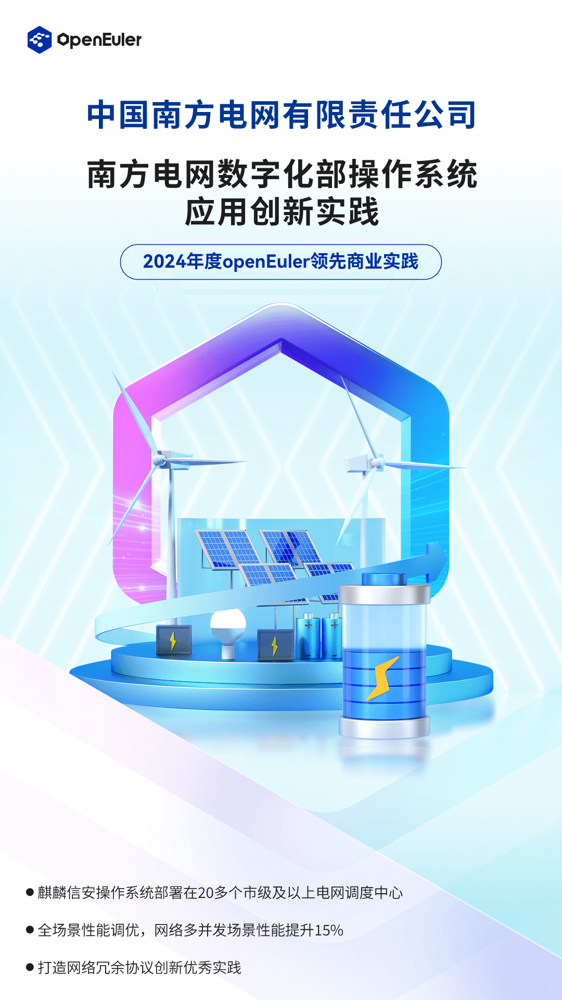
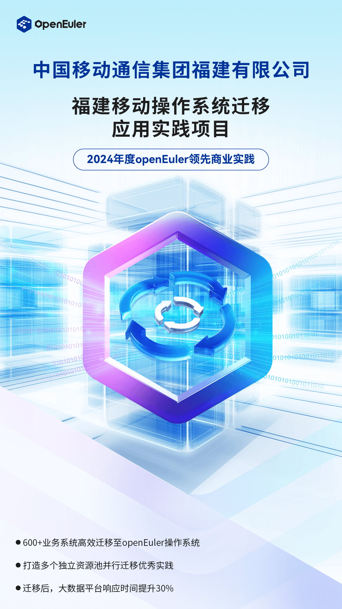
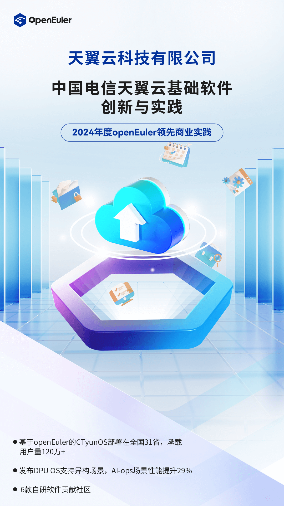
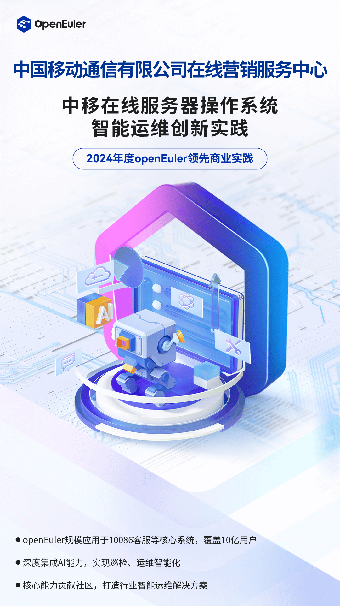
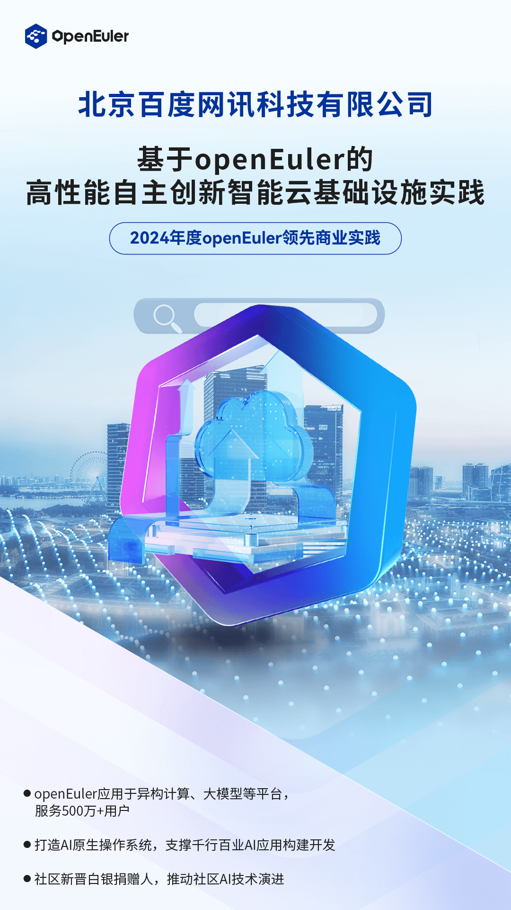

近日，以"以智能，致世界"为主题的操作系统大会2024在北京中关村国际创新中心召开。本次大会由开放原子开源基金会孵化及运营的openEuler社区协同产业伙伴共同主办，旨在汇聚全球产业界力量，推动基础软件根技术持续创新，共建全球开源新生态。

会上举行了"2024年度openEuler领先商业实践"仪式。25个openEuler年度领先商业实践项目揭晓，包括13个规模型项目与12个创新型项目。

2024年度openEuler领先商业实践遴选由国家工业信息安全发展研究中心牵头发起，携手资深学者、业界专家组成评审组，围绕技术创新性、示范推广价值、应用规模、运维服务能力、社区贡献等维度，对公开征集的商业实践成果进行多轮遴选和评审，最终评选出25项实践成果，主要分为规模型和创新型两类。

> 规模型商业实践：实践案例在特定行业应用规模大于1000套，已具备较强竞争力，重点考察技术创新性、示范推广价值、运维服务能力、社区贡献度等综合能力。

> 创新型商业实践：实践案例为新行业新领域的突破性应用，具备较高发展潜力，重点考察技术创新性、行业应用新特性、示范推广价值、社区贡献度等成长性指标。

**一起来看看这些项目的领先之处**

**规模型**

**创新型**

