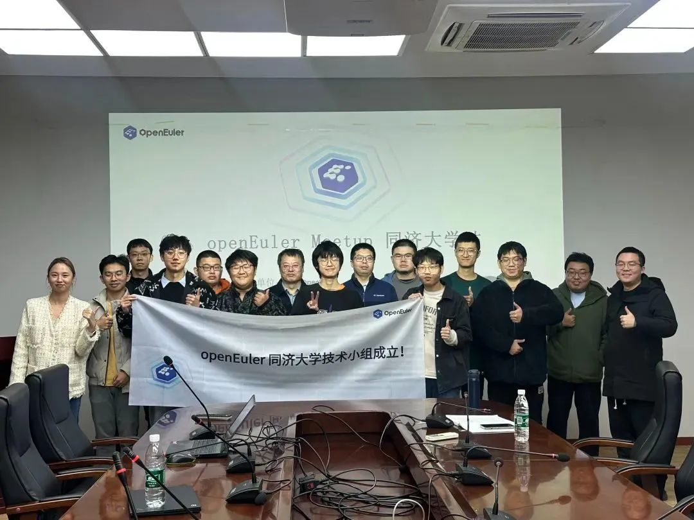
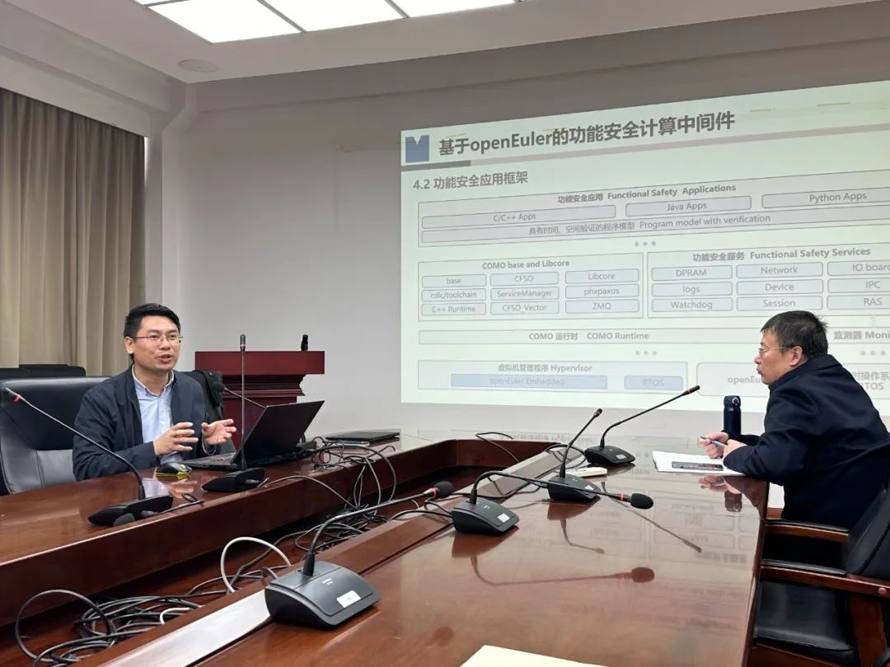
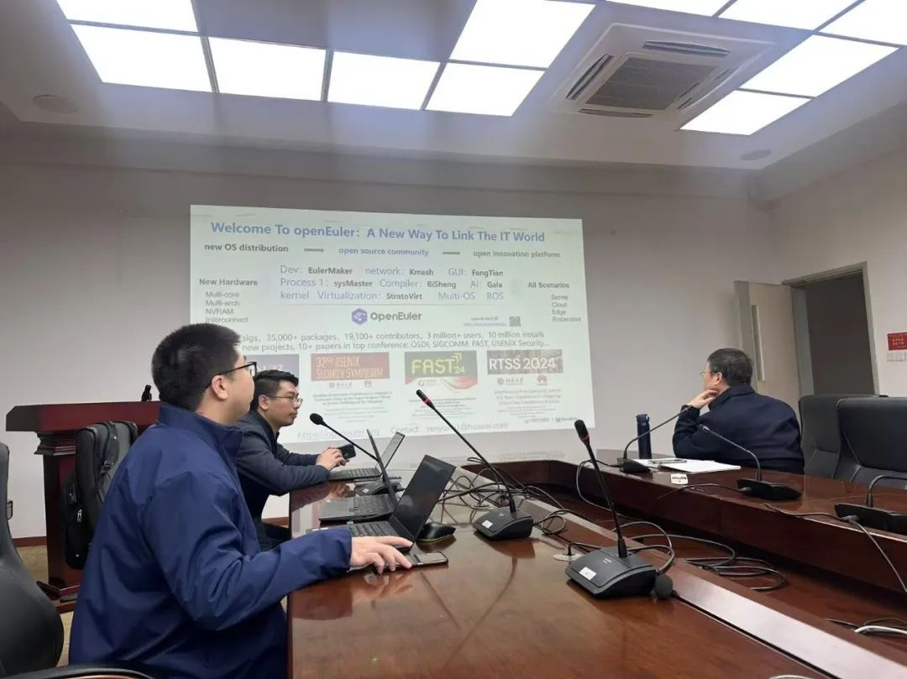
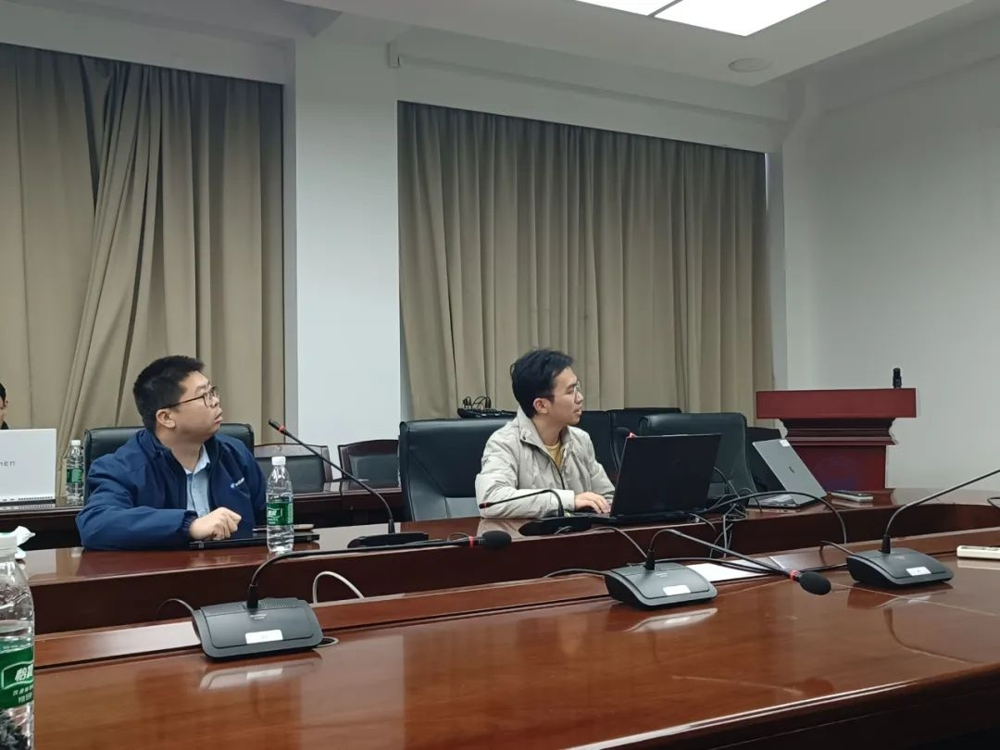
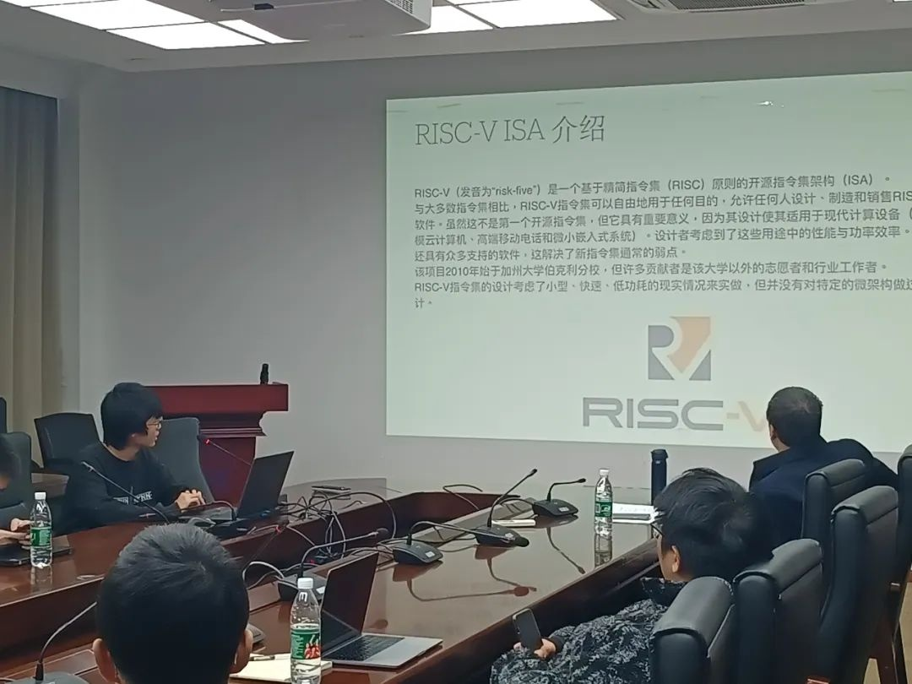

11月30日，OpenAtom
openEuler（简称\"openEuler\"）2024走进高校Meetup在同济大学成功举办。本次Meetup由openEuler社区、同济大学联合主办，中国科学院软件研究所协办，本次活动围绕XuWare中间件功能安全计算操作系统、openEuler学术进展及RISC-V技术进行分享，同时借此次相聚之机，正式成立了openEuler同济大学技术小组。

下面就让我们来回顾本次 Meetup 的精彩内容。

**开场致辞**

**同济大学电子与信息工程学院副院长黄新林与裴喜龙老师**出席本场活动并进行了开场致辞，黄新林老师发表《**基于openEuler的功能安全计算中间件**》演讲，提出了一种融合通用计算平台和增强型软硬件技术的创新解决方案。该方案通过实施冗余设计、防护性编程和容错算法等策略，旨在实现功能安全目标。

演讲重点介绍了功能安全中间件[XuWare]{.underline}，该中间件依托于openEuler操作系统，采用冗余、多样性和沙箱机制，以支持多核异构计算和容器化部署。XuWare中间件的设计确保了功能的高效性、灵活性和安全性。这项技术不仅满足了严格的任务安全需求，还显著降低了开发成本，为功能安全计算领域带来了突破性的解决方案。

**openEuler学术研究合作及成果介绍openEuler Valuable
Professional、华为操作系统研究专家
任玉鑫博士**在会议上多方位介绍openEuler在性能优化、安全、AI等领域的技术突破及学术影响力，包括openEuler已在国际顶级学术会议上发表多篇论文。同时还重点介绍了openEuler社区正在做的动态链接/加载技术优化实现应用透明性能提升和加速，以及新型系统溯源架构在系统安全性中的创新，最后还提到openEuler社区通过开源合作和实习比赛推动科研与产业结合，促进与高校人才培养共同发展。在会议上我们也邀请了来自中科院软件所、openEuler社区
RISC-V
SIG组的两位学长给在座学子们带来自己关于接触开源、熟悉开源、参与开源经验的分享。**蓬莱TEE-RISC-V：openEuler下的安全底座来自上海交通大学IPADS实验室的赵熙**介绍基于RISC-V架构的蓬莱TEE（可信执行环境）及其在openEuler系统中的应用。在机器学习领域，蓬莱TEE通过内存隔离技术（GPT、PMP等）实现模型和数据的安全保护，并提供数据加密存储和加载时认证的功能。结合Tensorflow
Lite，蓬莱TEE可在隔离环境中安全运行模型推理，确保隐私数据不被窃取或篡改。蓬莱TEE是国内首个开源且商用的RISC-V可信执行环境，已整合至openEuler主线，展示了安全技术与开源生态结合的创新成果。**openEuler on
RISC-V创新版本快速滚动计划来自台湾中央大学的中科院软件所实习生、Eulaceura发起人王弈桥**向大家介绍openEuler
on RISC-V SIG 负责完善 openEuler 系统在 RISC-V
架构上的软硬件生态建设等工作。Eulaceura
项目面向多类用户提供服务器和桌面版系统映像档，其对 RISC-V 架构支持处于
Tier - 1
级别，已发布多个版本，目标是提供稳定发行版、长期维护、良好用户体验等。未来将保持核心组件同步，开发分支用
master，提供最新安装档，快速落地新标准，该计划预计 10 月底启动，12
月提供首个 General Availability
发布，之后至少每周发布一次。最后openEuler社区运营雅芝向同学们介绍社区开展的高校活动，openEuler
近期与麒麟信安联合举办第二届开放原子大赛，设有openEuler应用软件开发赛和openEuler系统迁移场景应用挑战赛，欢迎所有新老开发者报名参与！15万元奖金来袭！开放原子大赛openEuler应用软件开发赛等你来挑战！[20万元奖金来袭！开放原子大赛openEuler系统迁移场景应用挑战赛等你来挑战！]{.underline}在本次活动上同时正式宣布成立了**openEuler同济大学技术小组**，后续将在院校内围绕openEuler进行学习、科研及参与社区项目的交流阵地，同时社区及社区生态伙伴整合资源为技术小组的学习与科研提供支持和赋能。

