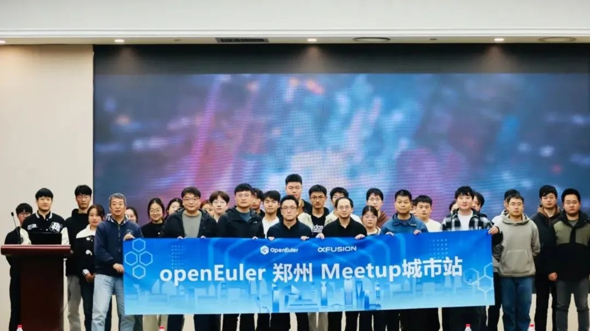
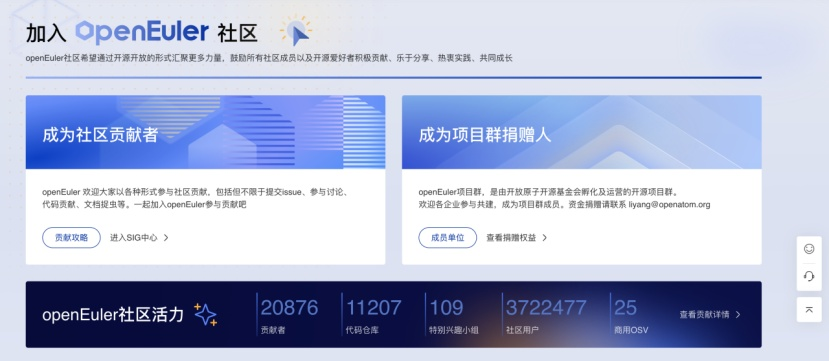

**概述**

2024年11月，OpenAtom openEuler(简称:
openEuler)社区迎来了重要的发展里程碑。在开放原子开源基金会的运营孵化下，openEuler在商业、技术等生态上实现了全面进步。

开源5年openEuler系操作系统累计装机量超过1000万套，树立了操作系统产业新的里程碑。openEuler从企业主导发展到社区共建，从跨越生态拐点到市场领先，不断加速前行。未来，openEuler将沿着智能化、可持续和全球化三个方向努力，以智能、致世界，共建数智基础设施最佳开源操作系统。

在技术发展方面，openEuler推出了首个面向开发者设计的Devstation工作站，该服务预装了VSCODE，大幅提升开发者效率。此外，Devstation计划年底推出oeDeploy工具和开发插件，以实现从部署、编码、编译到构建和发布的全流程自动化。openHiTLS密码库正式纳入openEuler社区发行版(24.03-LTS-SP1)，提供更加安全、可靠的密码服务。

为帮助开发者更好地进行社区工作，openEuler基础设施团队就代码质量维护、PR审查效率等方面推出了基于LLM大模型的PR
review智能检视功能、大文件存储服务LFS
Server、openEuler消息中心等服务，并优化了社区官网、论坛的体验。其中，PR
review智能检视功能可通过AI自动识别和总结PR中的代码改动，提供优化建议，提升审查效率。LFS
Server支持大容量文件存储，单个文件上传上限为
5G，且无仓库体积总大小限制。openEuler消息中心整合了来自不同Gitee、论坛等不同平台的关键信息，帮助开发者高效管理社区消息。在其他方面，Backup
SIG持续完善open-eBackup开源备份软件首个社区发行版，新成立的异构融合SIG也正在筹备社区工作例会。

openEuler致力于打造国际化开源协助平台，当前openEuler已打通与Linux、OpenInfra、Apache、CNCF、Intel、openHPC
等的技术合作支持，覆盖主流应用场景；并与OpenChain、OpenSSF、SPDX
等三家达成深度合作，共筑开源软件供应链安全。在开放原子开源基金会的支持下，openEuler携手OpenChain、CHAOSS
共建全球可信开源社区规范。同时，openEuler与国际主流软件供应链安全组织共建开源安全标准，和源译识翻译社区联合翻译并发布SPDX3.0中文版，与中金金融认证中心（CFCA）联合发布安全启动代码签名服务平台。

11月，openEuler在YouTube上的订阅者突破十万；知名开源媒体It\'s
FOSS发布了openEuler 24.03
LTS版本的详细评测视频；这些事件不仅是对openEuler技术实力的肯定，也显著提升了openEuler在全球开源领域的影响力和认可度。

本月报阅读时长预计25分钟。

欢迎细品。

**社区规模**

截至2024年11月30日，openEuler
社区用户累计超过372万。超过2万名开发者在社区持续贡献。社区累计产生
198.9K个PRs、104.4K条Issues。目前，加入openEuler
社区的单位成员1876家，本月新增63家。

社区贡献看板（截至2024/11/30）

**社区事件**

**操作系统大会 & openEuler Summit 2024 圆满落幕**

2024年11月15-16日，操作系统大会 & openEuler Summit
2024（下文简称：本次大会） 在北京中关村国际创新中心举行。

本次大会从商业、技术、生态、全球化等方面全面展示openEuler发展5年的成果。openEuler从企业主导发展到社区共建，从跨越生态拐点到市场份额领先，不断加速前行。未来，openEuler社区在开放原子开源基金会的孵化及运营下，将沿着智能化、可持续和全球化三个方向努力，以智能、智世界，共建数智基础设施开源操作系统。

**openEuler系累计装机量突破1000万，树立操作系统产业新里程碑**

openEuler社区在开放原子开源基金会的运营孵化下，商业、技术等生态获得全面发展。2024年openEuler系操作系统新增装机量超过500万套，五年累计装机量突破1000万套。openEuler已广泛应用于互联网、金融、运营商等各行业核心应用场景，实现规模商业落地。在引领产业技术创新方面，
openEuler社区发起的原创子项目已累计超过500个，覆盖了系统内核到AI使能全场景。在繁荣产业生态方面，openEuler坚持开放共赢的协同合作，汇聚从处理器到行业应用及云服务等超过1800家全产业链伙伴。发展至今，openEuler为千行万业数智化提供坚实可靠的基础软件底座，成为中国行业数智化的中流砥柱。

**openEuler 推出AI机密计算解决方案**

面向AI时代的数据安全需求，openEuler
社区联合处理器厂商、行业客户联合推出AI机密计算解决方案，在多种计算架构上迅速构建起保护大模型训练、推理的机密计算环境，保障用户个人隐私和企业的数据安全。

openEuler从标准遵从者到推动者、制定者，与全球伙伴共建行业标准，服务更广泛的行业用户。

**openEuler & Friends 5.0使能AI场景创新**

在本次大会的环节openEuler & Friends
5.0上，5位开发者通过基于openEuler打造的AI编程工具，现场零失误完成海报生成应用，展示了openEuler智能计算领域软件包的丰富应用，体现了openEuler基础设施在上游软件实时监测、软件包自动化升级、智能Review等方面的可靠能力。这也意味着openEuler具备了OS
for AI的软硬件生态和易用性。

**8家伙伴基于openEuler 24.03 LTS发布商业发行版**

在伙伴们的持续努力下，openEuler已经持续迭代发布多个商业版本。本次大会上，麒麟软件、麒麟信安、统信软件、超聚变、润和软件、软通动力、凝思软件、中科方德领先发布基于openEuler
24.03 LTS的商业发行版。openEuler 24.03
LTS版本汇聚了产业链上下游软硬件厂商技术共识，集合众多开发者的智慧，将成为未来几年中国IT基础设施的坚实基础。

**9家单位参与openEuler项目群创新项目贡献签约仪式**

本次大会上，来自天翼云、联通数科、华为、麒麟信安、金蝶天燕、中科院软件所、北京大学与北京大学长沙计算与数字经济研究院、同济大学、厦门大学的9家单位的12个项目与openEuler项目群签订贡献意向，进一步增强社区技术创新能力，促进社区生态繁荣。

**openEuler携手国际开源组织共建全球开源新生态**

openEuler致力于构建国际化的开源协作平台，吸引了海外43个国家和地区的2000余名贡献者加入，已获得OpenStack、Ceph、Spark、OpenCV等数十款全球主流开源项目的原生支持，并与Linux
Foundation、OpenInfra等全球性基金会开展深度合作。在应用服务方面，openEuler已在AWS等全球五大公有云、三大容器仓全面上线，未来还将联合伙伴面向全球提供服务支持。

去年，openEuler携手7家全球开源组织开启全球化新篇章，本次大会上，openEuler宣布与CNCF、OpenInfra、openHPC三家开源基金会建立深入合作，后续这些开源组织将原生支持openEuler，进一步加速
openEuler 全球化进程。

**openEuler携手产业伙伴发布全球可持续化发展倡议**

在本次大会上，openEuler联合业界标准机构与认证组织、全球生态伙伴及客户一起讨论社区可持续化发展趋势，并发出《openEuler
全球可持续化发展倡议》，倡议表示"持续增强社区安全治理，通过安全技术创新，保障数据与模型安全，融入上游社区漏洞处理生态，运维更可靠"。

该倡议由openEuler社区、DEKRA、Bureau
Veritas、移动云、天翼云、联通云、中金金融认证中心有限公司（CFCA）、SPDX、全球计算联盟（GCC）、电信终端产业协会（TAF）共同发起，旨在通过技术创新，从开发态、运行态、维护态构建全周期数据安全保护方案，从标准遵从到参与国际标准的制定来保障社区全球可持续化发展，共建AI时代数据安全生态。

**openEuler联合SPDX共同发布开源软件供应链安全新标准：SPDX3.0中文版**

 openEuler与国际主流软件供应链安全组织共建开源安全标准，和源译识翻译社区联合翻译并发布SPDX3.0中文版。

该版本由开放原子开源基金会旗下源译识社区、openEuler 社区G11N
SIG团队共同完成，译者还来自国家工业信息安全发展研究中心、中国赛宝实验室、OpenHarmony社区、美的集团等组织。

SPDX
是全球许多行业和政府正在广泛使用的标准，随着3.0版本的演进，能够为一系列软件提供正确的软件物料清单（SBOM）。中文版上线后，数百万中文开发人员可以与SPDX标准进行原生交互，改进标准，以确保全球软件供应链安全。

Gopi Krishnan Rajbahadur，Co-Lead of SPDX AI and Dataset Profile,
Ambassdor

**openEuler 2024年度项目之星&贡献之星在本次大会上揭晓**

子项目是openEuler社区发展的推动力，开发者是社区可持续发展的发动机。在本次大会上，openEuler社区评选出20个"openEuler
2024年度社区项目之星"和28名openEuler 2024年度贡献之星。

**Kernel SIG Maintainer加入Linux内核社区的CVE漏洞检视组**

近期，openEuler内核SIG的核心贡献者龚睿奇、章昌仲和郭寒军成功加入Linux内核社区CVE漏洞检视组，并从Linux
6.10.7版本开始参与Linux内核社区的CVE检视工作。

今年年初，Linux内核社区被赋予CVE编号管理机构（CNA）的角色。这表示内核方面的CVE编号将由Linux内核项目组进行分配并发布。作为
Linux
根社区的重要贡献组织，openEuler核心贡献者加入Linux内核CVE的检视工作中，将大大提升openEuler
社区在CVE的感知和响应能力，进一步推动和完善 openEuler
社区在信息安全领域的规范建设。

**openEuler在YouTube上的订阅者突破十万**

openEuler在YouTube上的订阅者突破十万，视频观看人次超过612万，内容观看时长累计超过6万小时。自频道创建以来，每一个点赞和新订阅者都是对openEuler的极大认可和鼓励。同时，在LinkedIn、X(Twitter)等国际社交平台上，openEuler也吸引了众多开发者加入，为社区注入了多元化活力和全球视野，推动openEuler的全球化进程。

**It\'s FOSS发布openEuler 24.03 LTS版本评测视频**

It\'s
FOSS是开源行业垂直的数字媒体，其门户网页屡获行业殊荣，为全球开发者用户提供了丰富详细的教程，并配有截图和详细步骤。

本月，It\'s FOSS发布了openEuler 24.03
LTS评测视频，为操作系统的桌面用户提供指导和借鉴。在Summit举办期间，它还发布了详细openEuler使用入门教程，并对本次大会的盛况进行了新闻报道。据了解，It\'s
FOSS计划年底将发布openEuler 24.09的评测视频。

欢迎前往It\'s FOSS查看：https://itsfoss.com/ 

**openEuler Meetup在郑州举办**

11月22日，由openEuler主办，超聚变协办的openEuler
Meetup在郑州举办。活动围绕"能力全面升级
AI赋能产业"，汇聚产学研各领域专家与创新力量，分享与探讨openEuler社区在AI领域的能力升级与实践案例。

**openEuler Meetup在北京举办**

11月20日，openEuler Talent-and-Service SIG Meetup在北京举办，openEuler
Talent-and-Service
SIG专家全爱国为现场来自北京工业大学计算机学院的近90名师生进行了openEuler从入门到实践的课程讲解及openEuler操作系统的实操演示。

**社区治理**

**2023-2024年openEuler技术委员会会议在北京召开**

2024年11月16日，2023-2024年openEuler技术委员会线下会议在北京召开。本届技术委员会各委员在本次会议上完成了2024年社区工作的述职，共同探讨了各委员在社区工作的优化和后续规划，就社区未来发展方向提出了指导建议。

**openEuler 技术委员会11月会议摘要**

在11月的技术委员会例会上，经 openEuler
技术委员会委员们审定，同意开发者在社区成立异构融合SIG(sig-Long)。

异构融合SIG致力于构建异构融合计算基础设施框架，以实现算力的统一接入、异构融合内存、异构融合虚拟化、算力切分、资源优先级配置和弹性迁移等关键能力。该SIG组将负责维护openEuler社区中的相关软件组件，通过使能应用利用异构融合计算基础设施，降本增效，逐步完善基于openEuler的未来软件生态。

此外，异构融合SIG希望通过汇聚社区开发者和爱好者，共同探索相关技术，充分发挥不同硬件设备的优势，最大程度地满足不同应用负载的需求，降低开发门槛和成本。感兴趣的朋友可以添加小助手（微信号：openeuler123）好友，加入专属技术交流群。

异构融合SIG组：

https://gitee.com/openeuler/community/tree/master/sig/sig-Long

**技术进展**

**openEuler推出首个面向开发者设计的Devstation工作站**

openEuler首个面向开发者的工作站Devstation正式发布。该服务预装了VSCODE，大幅提升开发者效率，欢迎访问Devstation体验这一全新工具：https://repo.openeuler.org/openEuler-24.09/DevStation

此外，Devstation计划年底推出oeDeploy工具和开发插件，以实现从部署、编码、编译到构建和发布的全流程自动化。开发者将能够利用oeDeploy轻松部署AI和云原生软件栈，通过oeDevPlugin插件一键拉取代码库、一键使用AI4C编译器进行编译、一键调用EulerMaker，从而简化软件开发流程，提升开发效率和便捷性。

**openEuler社区推出PR智能检视功能，提升代码质量和审查效率**

为了提高代码质量，帮助减轻Maintainer和Committer的审查工作，openEuler推出了基于LLM大模型的PR
review智能检视功能。该功能可通过社区机器人激活，具体包括以下三个方面：

1.  **代码意图总结**

> 通过在PR下评论/summary-message命令，AI将自动分析PR的改动内容，总结代码意图和潜在问题，并输出优化建议及PR评分为开发者提供参考。

2.  **代码检视与坏味道识别**

> 通过在PR下评论/pr-review
> zh命令，AI将自动识别PR中的代码改动，利用LLM大模型的代码分析能力，为不合理的变更提供修改建议，为开发者提升代码质量提供参考。

3.  **基于openEuler和昇腾NPU的全栈AI能力**
 

> 基础设施团队已经为openEuler提供基于昇腾NPU硬件的AI大模型能力，现已完成Qwen2.5、Qwen2.5-Coder、bge-m3等模型的本地部署，并通过AI
> app服务提供统一大模型服务接口，支持openEuler社区智能化发展。

欢迎体验PR智能检视功能，参考示例链接：\
https://gitee.com/openeuler/iSulad/pulls/2538

**大文件存储服务LFS Server介绍**

LFS
Server是openEuler社区倾力打造的一款开源、高效且便捷的大文件存储服务。自建LFS
Server规避了Gitee对LFS容量和速度的限制，支持多种类型文件的存储，单个文件上传上限为
5G，且无仓库体积总大小限制，为开发者准备了充裕的空间。此外，LFS Server
基于标准LFS协议，打通LFS
Server到Gitee的身份识别，减少了文件上传下载流程对开发者流程的影响。

LFS Server采用GO语言实现的轻量级接入服务，它全面支持Git
LFS通用方案，能够借助对象存储来有效完成大文件管理工作。凭借其海量的存储空间以及出色的下载速度，使得开发者在进行开发时，无需为仓库中存在的大文件而烦恼。

使用指南：https://github.com/opensourceways/BigFiles/blob/master/docs/QuickStart.md\
项目地址：https://github.com/opensourceways/BigFiles

**openEuler消息中心上线**

openEuler官网现推出消息中心服务，旨在帮助开发者高效地管理和处理来自不同平台的社区消息。开发者登录openEuler账号后，通过官网右上角的用户头像进入，即可访问消息中心。

在消息中心，开发者可以一站式查看来自Gitee、社区论坛、线上会议以及openEuler用户软件仓（EUR）等多个渠道的通知，涵盖会议提醒、CVE漏洞、EUR构建状态、Issue更新和PR消息等关键信息。此外，消息中心还提供了多种筛选条件，帮助开发者迅速定位重要信息，提升工作效率。

欢迎体验openEuler消息中心：

https://message-center.openeuler.org

如果您有任何反馈或建议，请通过 infra@openeuler.org 联系。

**openHiTLS纳入openEuler社区发行版**

密码库作为操作系统安全的核心组件，对于保障系统安全和数据完整性具有至关重要的作用。openHiTLS开源密码套件作为密码技术领域的一项重要创新成果，正式纳入openEuler社区发行版(24.03-LTS-SP1)，为openEuler操作系统的安全性提供了强有力的保障。

openHiTLS通过轻量级、可剪裁的软件技术架构，满足了各行业不同场景的多样化需求。它支持国际主流及中国商用密码算法和协议，可根据场景需求选择合适的密码算法和协议，从而确保数据传输和存储的安全性。

[原文阅读：\
https://mp.weixin.qq.com/s/2wVaa0k78L-D-KPST\_zSdw]{.underline}

**Backup SIG工作进展**

Backup
SIG持续完善open-eBackup开源备份软件首个社区发行版，该项目为主流数据库、虚拟化、文件系统、大数据等应用提供E2E的数据备份、恢复等能力。

2024年11月通过SIG例会和Bilibili直播，为广大的开发者深入解读open-eBackup技术的白皮书、编译部署的快速入门教程、以及开发指南等关键核心文档，助力开发者更快掌握open-eBackup相关技术。

**openEuler官网与论坛优化**

为提升开发者的使用体验，openEuler社区官网与论坛进行了一系列优化：

**社区官网：**

> a)官网导航栏：围绕开发者使用路径「下载/学习/开发/支持/社区/动态」进行重构，并增加了快捷链接功能，以更结构化的交互方式帮助开发者更清晰、高效地获取所需信息。

> **b)官网首页**将开发者高频使用版块前置(如开发者日历)，同时新增社区功能模块。

**社区论坛：**

> **a)界面更简洁**：保留最新、热门和类别这三个常用部分，使得论坛外观更加简洁清爽。话题标题也做了长度限制，确保每个话题都能清晰地传达重点。

> **b)论坛语言切换**：针对帖子内容的语言切换问题，我们增加了一个翻译插件。开发者只需在帖子下方点击翻译图标，即可实现英文转化。具体操作可参考：

> https://forum.openeuler.org/t/topic/6029

> **c)背景模式可选**：考虑到不同开发者的使用习惯，论坛提供了暗色模式背景主题，开发者可以根据自己的喜好切换界面风格。

openEuler官网：

https://www.openeuler.org/zh/

欢迎使用论坛参与社区讨论：\
https://forum.openeuler.org/

**软硬件兼容性测试**

截至2024年11月30日，openEuler社区软硬件兼容性测试通过2438个，北向1657个，南向610个，OS
171个。11月新增 北向111个，南向33个, OS 3个。

社区兼容性列表：

https://www.openeuler.org/zh/compatibility/

**安全公告**

2024年11月，社区共发布安全公告197个，修复漏洞588个（其中 Critical
19个，High 191个，其它 378个）。

**重点漏洞提醒**

如下漏洞评估影响较大，请重点关注。

在PHP 8.1版本中。\* 8.1.31, 8.2之前。\* 8.2.26,
8.3之前。在8.3.14之前，在32位系统上，不受控制的长字符串输入到ldap\_escape（）函数可能会导致整数溢出，从而导致写越界。**（CVE-2024-11236）**

CVSS评分为9.8分

公告链接：

https://www.openeuler.org/zh/security/cve/detail/?cveId=CVE-2024-11236&packageName=php

影响范围：

openEuler-20.03-LTS-SP4

openEuler-22.03-LTS-SP1

openEuler-22.03-LTS-SP3

openEuler-22.03-LTS-SP4

openEuler-24.03-LTS

HDF5库通过1.14.3在H5A\_\_close中有内存损坏，导致指令指针损坏并导致拒绝服务或潜在的代码执行。**（CVE-2024-32608）**

CVSS评分为9.8分

公告链接：

https://www.openeuler.org/zh/security/cve/detail/?cveId=CVE-2024-32608&packageName=hdf5

影响范围：

openEuler-20.03-LTS-SP4

openEuler-22.03-LTS-SP1

openEuler-22.03-LTS-SP3

openEuler-22.03-LTS-SP4

> **漏洞防护**

openEuler社区针对在维版本例行修复漏洞，发布安全补丁。建议用户关注openEuler官网安全公告，及时安装漏洞补丁进行防护。

openEuler 安全公告：

https://www.openeuler.org/zh/security/security-bulletins/

**感谢每一位朋友、开发者的支持**

因为大家的辛勤贡献，openEuler
的每一天都发生着好的事情。小编限于视野和能力，难免有所遗漏，在此表示歉意。同时，衷心感谢社区朋友、开发者们以及openEuler
SIG组成员的贡献：

\* 以上不分先后顺序

如果您希望在月报中增加您的工作内容，或对内容有任何改进建议，请联系wengqiaozhen@openeuler.sh。
