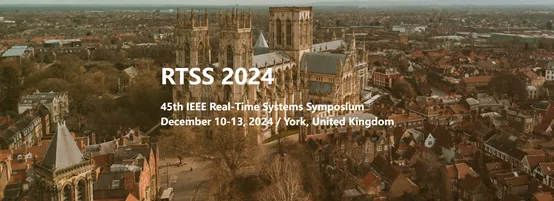

第45届IEEE实时系统学术会议（RTSS：45th IEEE Real-Time Systems
Symposium）于2024年12月10日-13日在英国约克召开。RTTSS是实时系统领域历史最为悠久也最为权威的学术会议，RTSS展示了该领域在理论和实践方面的创新，涵盖实时系统设计、分析、实现、评估和经验的各个方面。 OpenAtom
openEuler（简称\"openEuler\"）一篇关于改进操作系统内核实时性的论文被录用，并在会议上做报告。

随着自动驾驶、航空航天、IoT等广泛应用，软件系统的实时性越来越重要。而Linux内核自身由于设计缺陷和实现复杂，存在很多CPU之间时延干扰，严重影响了整体系统的实时性。openEuler通过多年积累，发现并改进了多个Linux内核实时性问题，其中改动涉及WorkQueue、ASID等内核核心模块。大部分代码已经合入上游社区，并全部集成在openEuler发行版，显著改善了全系统的实时性。实验评估表明，相比于未集成openEuler优化补丁的内核，**openEuler最高降低时延抖动达8.67倍，提升应用端到端最差响应时间1.64倍。**openEuler社区聚焦操作系统的技术创新和研究突破。openEuler的论文入选RTSS展示了openEuler社区与国际学术界的广泛联系和学术影响力。

**论文具体信息如下**：

**题目**：Interference-free Operating System: A 6 Years' Experience in
Mitigating Cross-Core Interference in Linux

**作者**：第一作者为北京大学计算机学院博士生邓朝萌（在华为实习期间完成），作者还包括北京大学张子琪、李锭老师和郭耀教授，华为高级技术专家叶云峰，华为高级技术专家贾宁，openEuler
Valuable Professional 任玉鑫，openEuler 技术委员会主席胡欣蔚。
