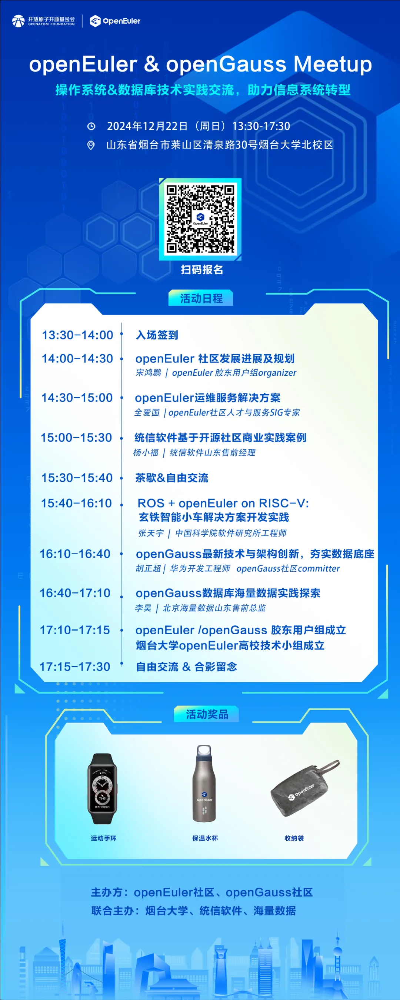

OpenAtom
openEuler（简称\"openEuler\"）与openGauss社区**将于2024年12月22日在山东省烟台市莱山区清泉路30号烟台大学举办一次以"操作系统&数据库技术"为主题的技术交流Meetup。**本次Meetup面向山东胶东地区用户与高校，就操作系统与数据库两大基础软件技术底座进行分享和交流，包括openEuler社区发展、运维服务、商业实践案例、openEuler在机器人与RISC-V领域的创新应用，以及openGauss技术特性与实践案例分享。欢迎报名\~**山东
Meetup **

**活动信息**

**时间**：2024年12月22日 13:30-17:30

**地点**：山东省烟台市莱山区清泉路30号烟台大学北校区

**活动议程&报名**

活动现场事务联系人：宋鸿鹏 18368896989
