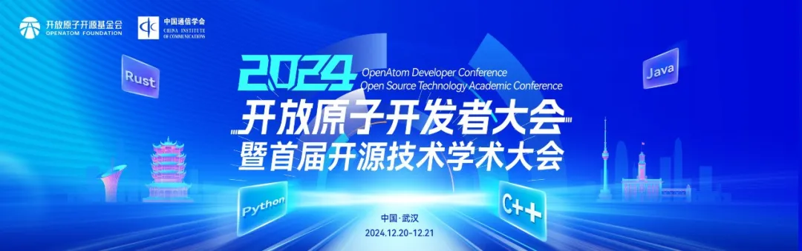
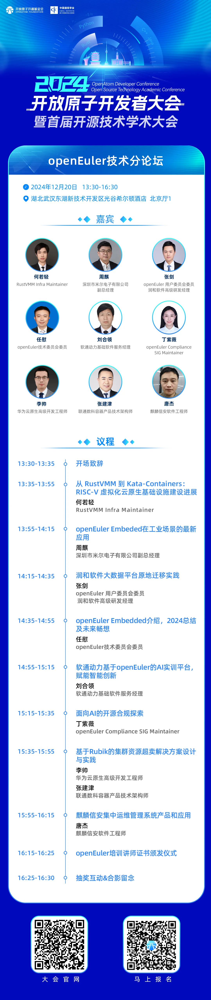
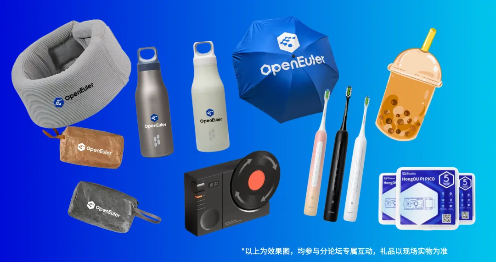
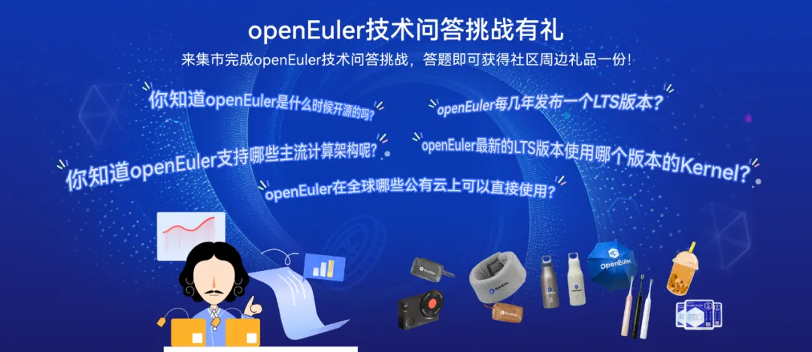
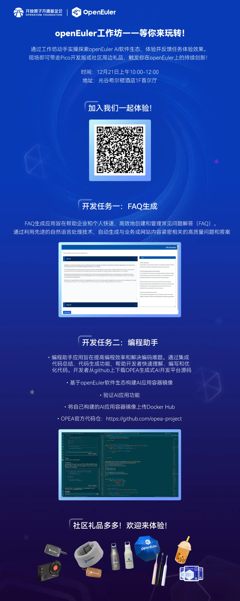

2024开放原子开发者大会暨首届开源技术学术大会将于2024年12月20日-12月21日在武汉举办，大会汇聚众多开发者生态，集聚政、产、学、研、用等各方力量，云集全球技术专家和行业大咖，持续推动开源生态蓬勃发展，将打造属于开发者的年末盛典。

**openEuler参会指南**

**Step 01：openEuler技术分论坛**

作为大会的一部分，openEuler技术分论坛汇集了来自openEuler社区的众多技术专家，他们将分享在**云原生、嵌入式、AI、安全、Linux内核**等技术领域的最新研究成果和实践经验。不管你是初入门的技术小白还是资深开发者，我们都欢迎你来到线下与行业专家面对面交流，解答技术困惑，拓展技术圈。

**报名通道**

**2024开放原子开发者大会暨首届开源技术学术大会-openEuler技术分论坛**报名通道已开启，速速扫描下方海报二维码报名，这个冬日一同相约武汉感受技术的热情吧

**时间**：2024/12/20 周五 13:30-16:30

**地点**：武汉光谷希尔顿酒店北京厅1

**参会福利**

**报名（现场签到）即享**：提前报名及现场签到，任君选择的**openEuler精美定制周边礼品**，每一款都安排在开发者的心趴上！

**冬日能量热饮**：冬日一杯热呼呼的奶茶是不是和技术交流更配呢，分论坛开场前13:30抢先签到，openEuler将贴心为每位参会者准备**霸王茶姬暖手茶～

惊喜抽奖：分论坛的最后还将安排惊喜抽奖，奖品包含开发版、热门电子产品等！请务必点燃你的技术热情，畅享技术魅力到最后一刻～

名额有限，速来报名抢占席位！这么给力的专属福利还不码住呼朋唤友一同报名！

**Step 02：openEuler开源集市**除了openEuler技术分论坛外，openEuler社区还在开源集市（12/20-12/21）为大家准备了有趣的互动，来openEuler开源集市，参与openEuler技术问答挑战，即可获得社区周边礼品一份！

现场还可报名适合各大高校学生的第二届开放原子大赛\--openEuler应用软件开发赛与系统迁移场景应用挑战赛，通过这一挑战将提升你们的技术实力和实践经验。欢迎各大高校学子踊跃报名！凭有效报名截图即可获得礼品一份，先到先得！

（PS：请选择一个互动参与，两个互动中仅可选其一哦。）

**Step 03：openEuler开源工作坊**

openEuler开源工作坊（12/21上午）将为现场开发者带来有趣丰富的动手实践挑战。在openEuler工作坊，开发者可以现场动手实操openEuler
AI
软件生态，还有Pico开发板等社区礼品，欢迎各位前来，拓展开发者的技术交流圈！探索openEuler的无限可能～

