2024年12月12日，由OpenAtom openEuler（简称\"openEuler\"） 社区和OpenAtom
openKylin（简称\"openKylin\"）社区联合举办的AI及云原生技术交流Meetup在北京顺利召开。本次会议旨在促进开源技术的创新与应用，在分享openEuler社区和openKylin社区创新技术的同时，了解AI在业务场景中的部署优化，探索云原生架构的高效开发和企业级部署应用。

麒麟软件服务器研发部总经理刘涛总代表举办方开场致辞。郑振宇、郭鹏飞、王麟、罗雨佳、马杰、张衍顺、曾昭荣、何若轻等来自多个公司、SIG组的专家就AI与云原生的深度融合、智能漏洞治理与安全防护、容器与虚拟化技术的新突破、高效计算平台助力AI技术应用等多方面议题亮点出发进行技术分享。

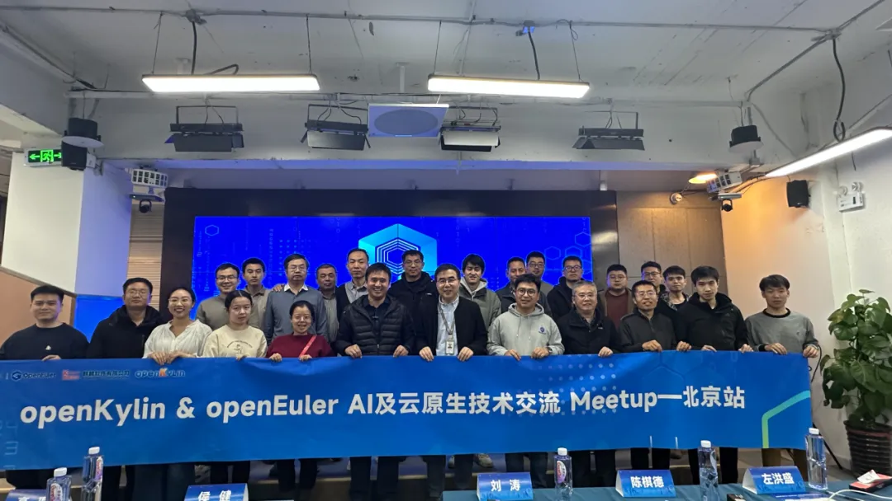

**精彩回顾**

"**开场致辞**

刘涛总进行开场致辞，欢迎各位专家及社区爱好者的到来，并介绍openEuler社区与openKylin社区在AI和云原生领域所做的贡献。openEuler社区被视为中国具有全球影响力的开源操作系统社区，通过系统内核创新与AI使能全场景，引领产业革新；openKylin社区被视为中国领先的开源桌面操作系统根社区，并在国内操作系统社区中占据重要地位，致力于将AI技术融入操作系统中，以提升系统的智能化水平和用户体验。

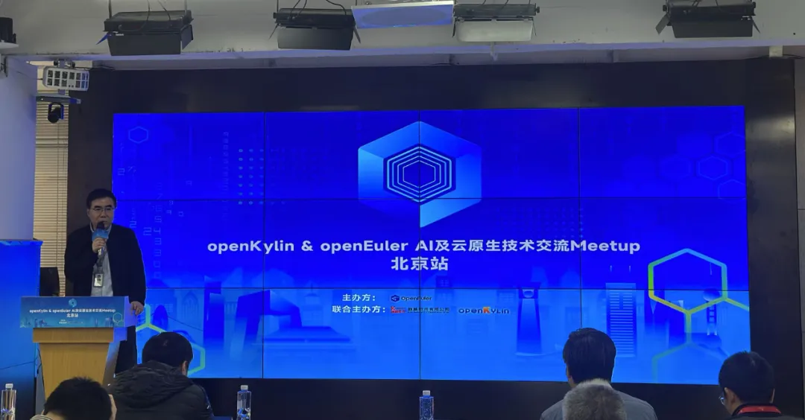

"**openEuler社区发展进展以及未来规划**

openEuler社区Maintainer郑振宇分享了《openEuler社区进展以及未来规划》，对openEuler
24.03 LTS 的特性进行阐述，此版本在基础设施、Linux
6.6内核、智能解决方案以及全场景体验四大方面实现了全面升级，为用户和开发者带来了高性能、高可靠、高灵活的开发体验，特别是其AI原生支持和创新的操作系统设计理念，以及内核、文件系统、安全等方面的多项技术创新，为数字基础设施的全场景应用提供了坚实的基础。

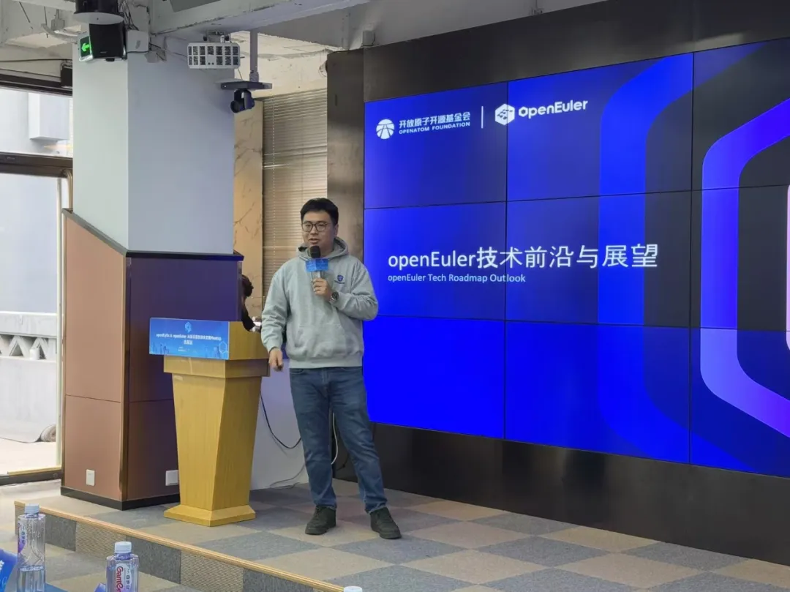

"**基于openKylin操作系统的AI融合探索**

openKylin AISubsystem SIG
Maintainer郭鹏飞专家分享了《基于openKylin操作系统的AI融合探索》，介绍了AIOS当前的现状与挑战，分享了AISubsystem
SIG组在openKylin上关于融合AI能力所做的一些探索和尝试，包括记忆地图、数据管家、智能模糊搜索和AI助手等系统组件和应用，同时详细介绍了AI子系统的整体架构和优势。

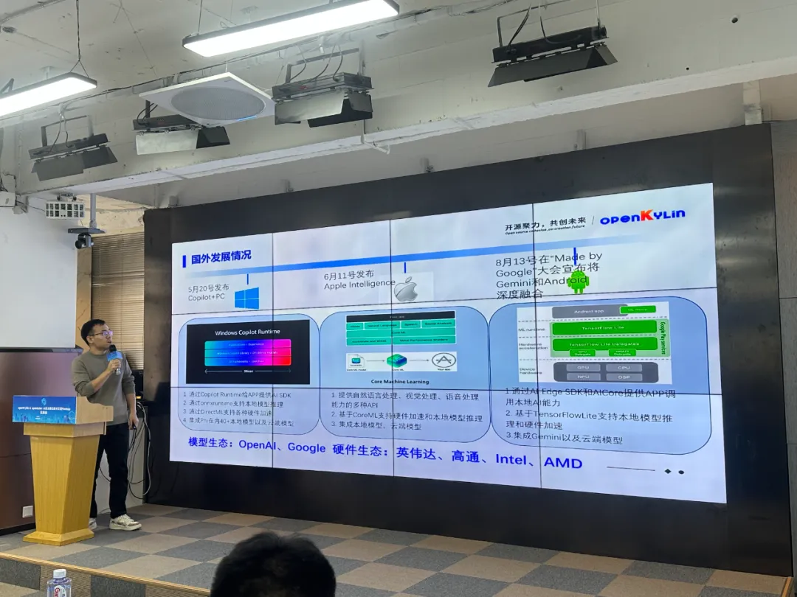

"**智能化安全漏洞感知与验证技术-openKylin社区安全漏洞治理实践**

openKylin Security Governance SIG
Owner罗雨佳专家分享了《智能化安全漏洞感知与验证技术\--openKylin社区安全漏洞治理实践》，描述安全治理SIG组在openKylin社区的相关目标与贡献，针对目前AI的大背景下，从攻防实战的视角给安全治理工作带来的挑战进行了相关的解析，同时针对这些挑战提出了未来的解决方案和思路。

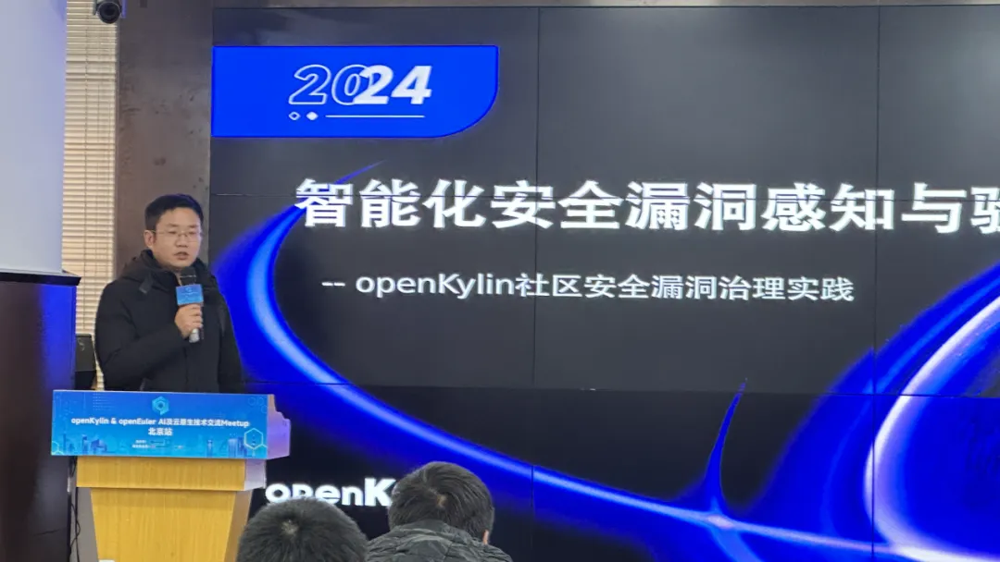

"**云原生基础设施的安全规范与AI智能运维**

天翼云基础架构软件总监王麟专家分享了《云原生基础设施的安全规范与AI智能运维》，从安全更新、CVE漏洞更新、基线更新和自动化编译发布与重构等几个方面出发阐述云原生基础设施的安全规范。AI智能运维实现自动按时调优，可以在页面做人工微调能扩展能力，体现了云原生与AI技术的深度融合。

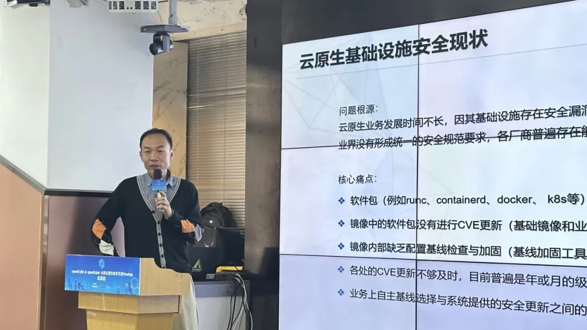

"**新一代基于人工智能和溯源分析的终端入侵检测系统 A-SysArmor**

华为工程师马杰老师带来议题《新一代基于人工智能和溯源分析的终端入侵检测系统A-SysArmor》，由于APT攻击已成为当前网络安全环境面临最为严峻的挑战，而作为新一代端点入侵检测系统的A-SysArmor成为防御APT攻击的重要工具，在本次议题中，重点介绍了A-SysArmor的功能，为网络安全筑起了一道坚实的防线。

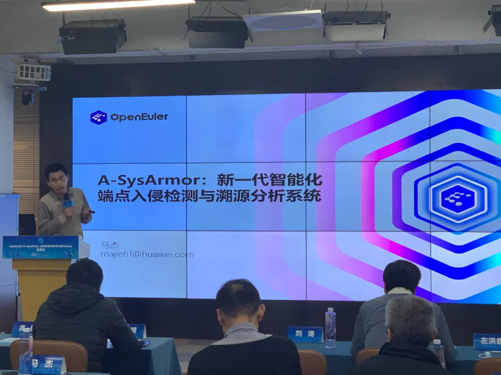

"**openKylin-Embedded 介绍**

麒麟软件有限公司工业操作系统研发部资深研发工程师张衍顺专家带来议题《openKylin-Embedded
介绍》，向与会者介绍了Embedded
SIG组的主要工作内容、工作成果以及未来规划。在2024年8月8日，openKylin
2.0嵌入式版本发布，支持 X86、ARM和RISC-V
架构多个CPU板卡，集成了可以运行在低资源SoC的轻量桌面，并提供了openKylin-Embedded构建工具等应用。

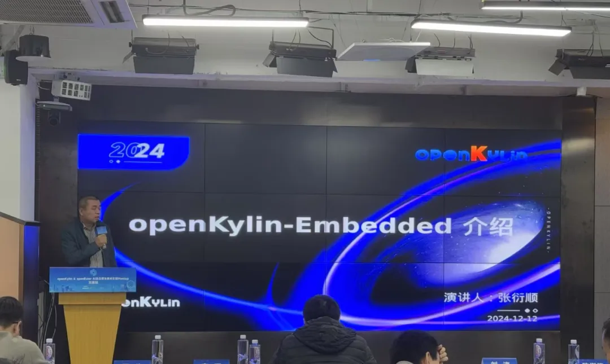

"**New Xeon 6 Advanced Technology Introduction**

openEuler kernel & Intel Arch SIG Maintainer曾昭荣专家分享了《New Xeon 6
Advanced Technology Introduction》，此议题主要涵盖 Intel Xeon
6在内核和虚拟化的新特性和新技术的介绍，以及在AI和云场景的应用情况的分享，从高效计算出发助力AI和云原生技术。

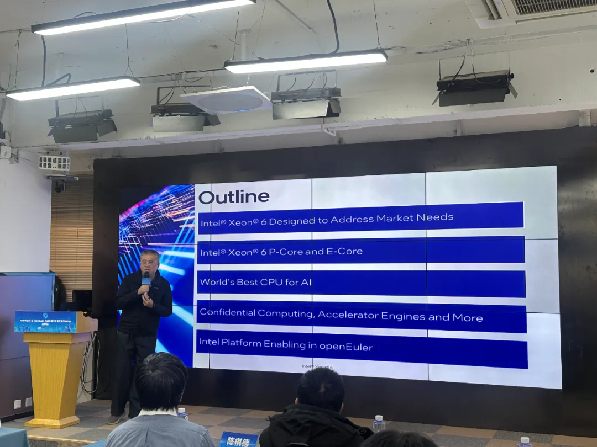

"**从 RustVMM 到 KataContainers:RISC-V 上的安全容器解决方案**

中国科学院软件研究所工程师、RustVMM Infra
Maintainer何若轻专家带来议题《从RustVMM 到kataContainers：RISC-V
上的安全容器解决方案》，为了实现 RustVMM 对 RISC-V 的支持，openEuler on
RISC-V SIG 虚拟化小组首先攻克了基础设施难题，并将 RISC-V
的架构支持工作扩大至依赖于它的 Cloud-Hypervisor、Dragonball 和
StratoVirt，加速 RISC-V 平台上虚拟化应用的落地与发展，推动 RISC-V
在虚拟化领域的全面支持。并基于已经完成的虚拟机管理器，向上使能
Kata-Containers，推动安全容器解决方案在 RISC-V 平台的落地，让 RISC-V
架构可以被用于机密计算场景。

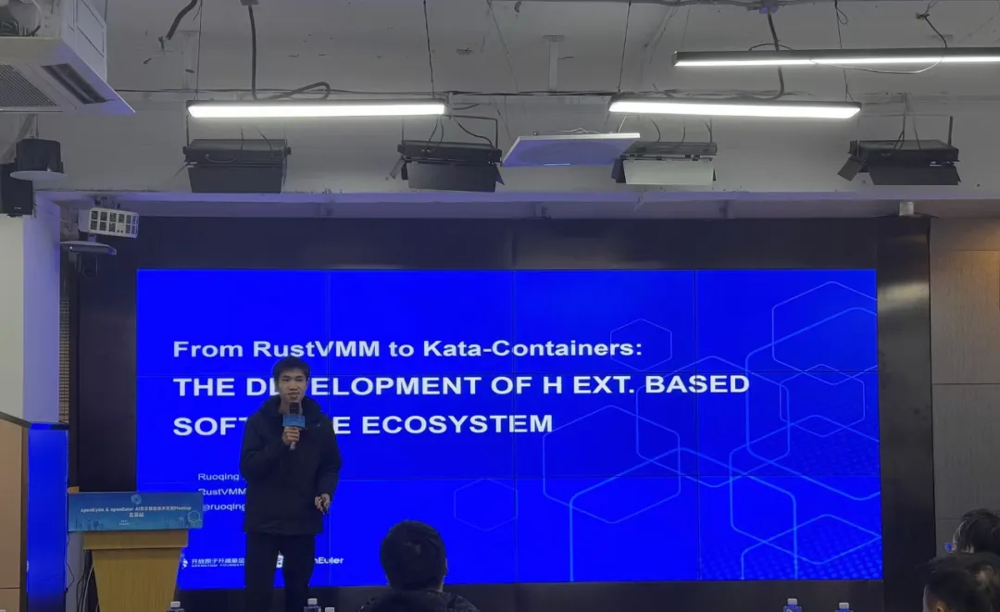

"**KubeOS 容器热迁移-大数据Flink实践**

华为工程师马杰专家带来议题《KubeOS
容器热迁移-大数据Flink实践》，解决大数据处理场景下传统平台维护不灵活的痛点，通过创新方案设计实现了Flink作业在KubeOS容器中的高效部署与热迁移。未来将进一步优化资源调度，提升系统整体性能与稳定性。

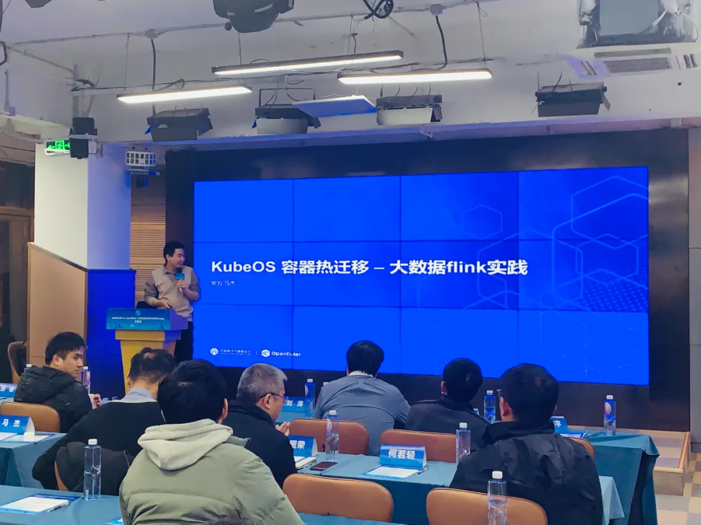

在本次AI及云原生技术交流Meetup会议上，各领域专家齐聚一堂，分享了最新的研究成果与实践智慧，生动展现了openEuler社区和openKylin社区底层创新技术的蓬勃生机。这个改成作为通用计算基础软硬件开源生态的重要组成部分，openEuler社区和openKylin社区汇聚了众多技术专家与单位，他们勇往直前，引领时代潮流。本次线下Meetup不仅彰显了国内底层核心开源社区的强大技术底蕴，更预示着在社区成员的不懈创新与积极参与下，openEuler与openKylin社区将不断拓展技术影响力，朝着成为全球领先的Linux原生OS开源社区的目标稳步迈进。
