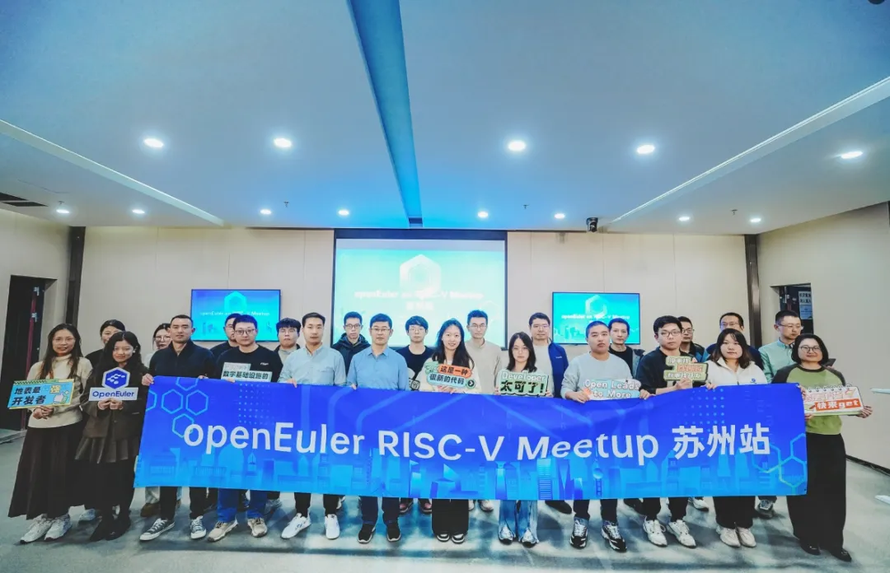
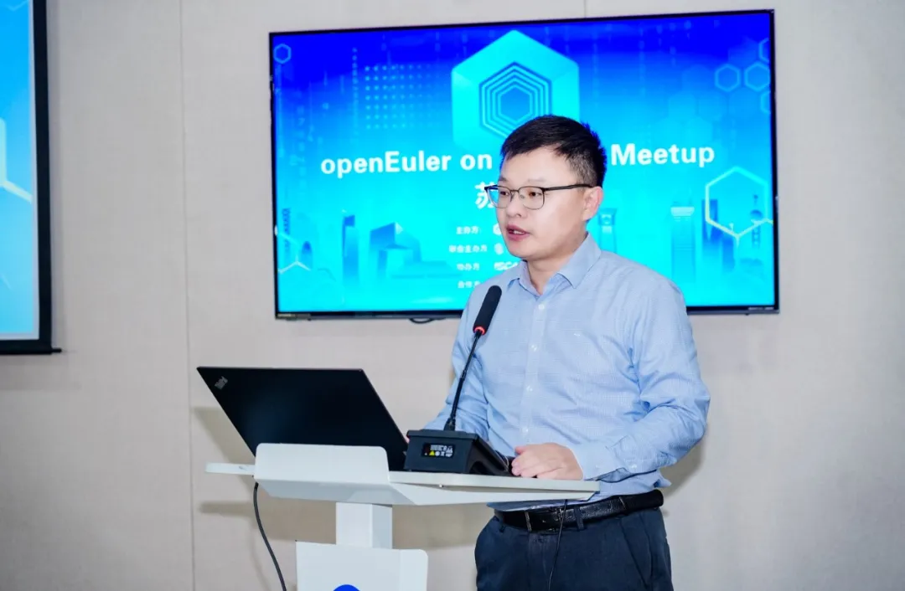
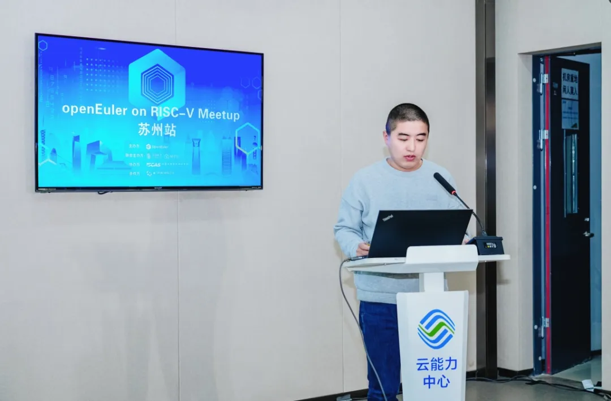
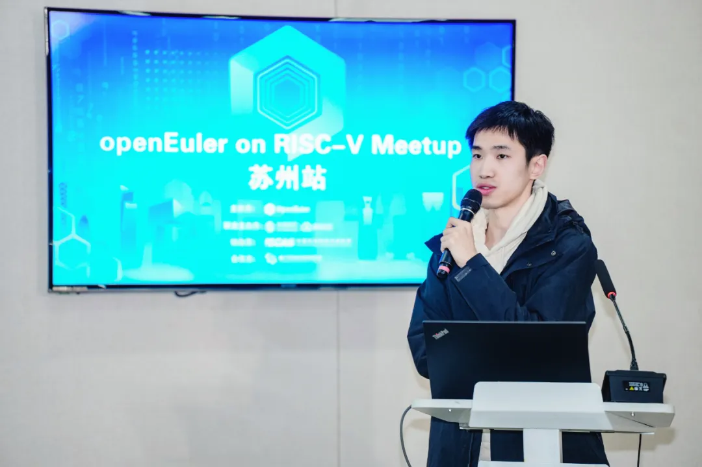
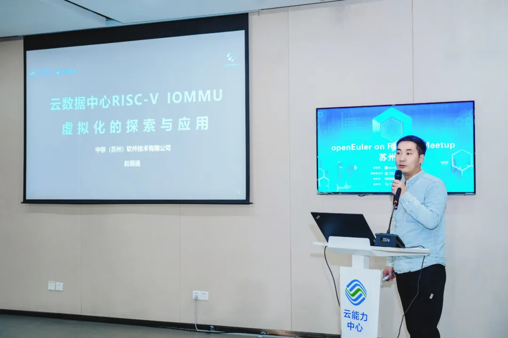
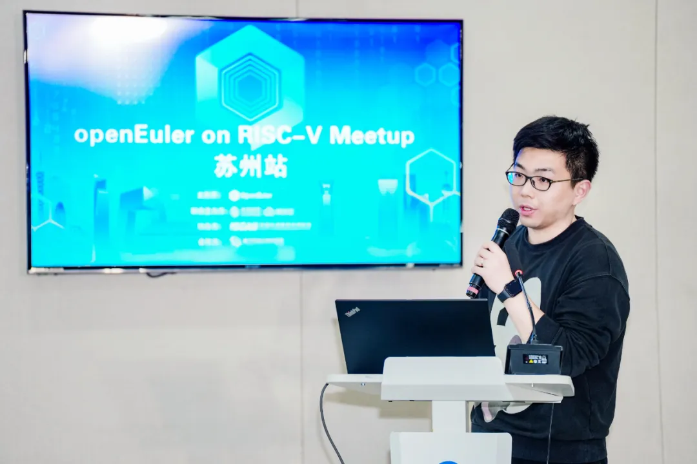
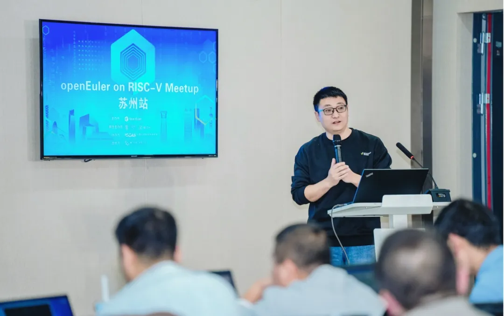

12月6日，OpenAtom
openEuler（简称\"openEuler\"）社区与移动云联手，在中国移动云能力中心举办了一场以RISC-V为主题的Meetup活动。本次活动邀请了来自移动云、中国科学院软件研究所及进迭时空的行业专家来共同分享及探讨RISC-V的前沿技术成果与实战经验。

**精彩回顾**

**开场致辞**

openEuler委员会委员/移动云计算产品部副总经理张胜举为本次活动致辞。他表示，自2010年RISC-V诞生以来，凭借其开放特性迅速赢得了全球的关注。政府对此高度重视，并出台了一系列政策来支持RISC-V的发展，进而促进了其生态体系的完善。在云计算领域，RISC-V展现出了独特的优势。作为该领域的领先者，移动云基于RISC-V技术进行了深度定制，并成功打造了业界首个全栈软硬件虚拟化解决方案。同时，openEuler社区也为RISC-V的应用提供了强有力的支撑，进一步推动了其生态的发展。

**移动云RISC-V操作系统的探索与应用**

移动云操作系统专家唐彬概述了RISC-V的产业现状、市场趋势，并指出了其开源性、灵活性等优势，以及在物联网、云计算等关键计算领域所展现的巨大潜力。他围绕技术预研、基础设施构建、功能开发、版本构建及厂商适配等多个方面，详细介绍了移动云在RISC-V操作系统领域的研发进展。同时，唐彬还阐述了其中的关键技术，包括版本深度定制、虚拟化框架构建及实现完整虚拟化支持等。最后，他通过具体案例，充分展示了RISC-V操作系统在云计算领域的实际应用成果。

**从 Rust-VMM 到 KataContainers: 基于 H 扩展的虚拟化软件生态**

RustVMM Infra
Maintainer/中国科学院软件研究所工程师何若轻，介绍了从RustVMM到Kata-Containers的RISC-V虚拟化软件生态系统发展。他指出，因缺乏支持H扩展的系统芯片（SoC），现有虚拟化软件在RISC-V暂时未能在真实的硬件上验证。RISC-V
SIG
虚拟化小组的目标是与硬件供应商合作，确保相关软件得到充分测试，并向上游贡献。他展示了RISC-V上基于虚拟化技术的安全容器路线图，并强调了RustVMM对RISC-V虚拟化软件栈的重要意义。RustVMM
对 RISC-V
架构的支持，为开发者提供了高效、安全、可靠的虚拟化基础库，是RISC-V虚拟化生态的重要里程碑。"未来，RISC-V
SIG 虚拟化小组会在 openEuler 社区发行并维护 RustVMM 相关组件。"

**面向云数据中心的RISC-V IOMMU技术探索与应用**

移动云硬件专家赵顺通，介绍了移动云云数据中心RISC-V
IOMMU虚拟化的探索与应用。内容涵盖云计算需求与RISC-V的优势、现状及虚拟化方案，重点展示了RISC-V
IOMMU虚拟化解决方案的软硬件架构与实例。通过联合国内头部RISC-V芯片厂商，研发高性能CPU原型，并搭载自研磐石DPU
4.0，形成了业界首个虚拟化全栈软硬件解决方案。此外，还通过具体实例展示了RISC-V虚拟化在云计算中的应用成果，并对未来RISC-V虚拟化的规划与展望进行了阐述，包括支持SR-IOV功能及打造智能芯片实验室等。

**openEuler on RISC-V上的Java生态**

openEuler Java SIG Maintainer/OpenJDK RISC-V Port
Committer/中国科学院软件研究所工程师张定立介绍了openEuler在RISC-V架构上的Java生态发展概况。他首先回顾了Java在RISC-V上的上游发展历程。随后，他展示了Java在RISC-V平台上的性能对比数据以及中国科学院软件研究所在OpenJDK主线的相关贡献。接着，他详细阐述了openEuler主线JDK
LTS版本在RISC-V架构上的支持现状，包括所有LTS
JDK版本及整体进展。此外，他还介绍了24.03分支新增的软件包，并讨论了遇到的问题及其解决方案。最后，他提出了未来的计划，包括联合相关SIG及平行宇宙计划在RISC-V上率先进行升级System
JDK版本的探索等，旨在进一步丰富和完善openEuler在RISC-V架构上的Java生态环境。

**UEFI on RISC-V**

进迭时空的UEFI技术专家梁辉，详细介绍了UEFI在RISC-V架构上的必要性及其实施进展。他首先强调了UEFI对于推动RISC-V标准化的关键作用，具体体现在硬件抽象、生态系统支持以及增强系统的安全可靠性等方面。随后，梁辉展示了RISC-V
UEFI的启动流程，并深入解析了RISC-V
UEFI所需满足的各项要求，包括BRS-I配方、ACPI和SMBIOS等标准。接着，他报告了SpacemiT在RISC-V
UEFI领域的最新进展，特别是在RISC-V Virt Qemu和V100
FPGA平台上的成功支持，以及Grub2引导Linux的实现。最后，通过现场演示，他生动展示了SpacemiT
V100
FPGA原型平台上UEFI的支持情况。整个介绍全面而深入地展现了UEFI在RISC-V架构上的当前发展状态及其广阔前景。

**彩蛋**

本次 Meetup 的分享材料已上传至 **openEuler
Gitee仓库**。欢迎前往下方链接获取，期待您的下次参与！链接：[https://gitee.com/openeuler/presentations/tree/master/meetup]

本次
Meetup 直播回放已上传至 openEuler
视频号。如果您错过了本次线下活动，可前往**视频号（OpenAtom-openEuler）**查看活动回顾，期待您的下次参与！
