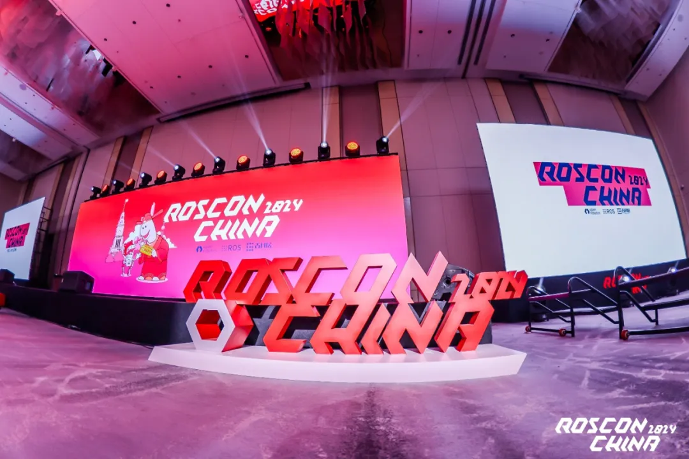
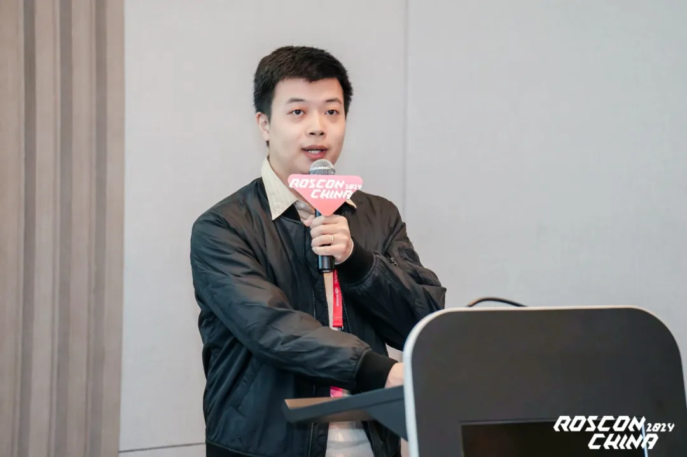
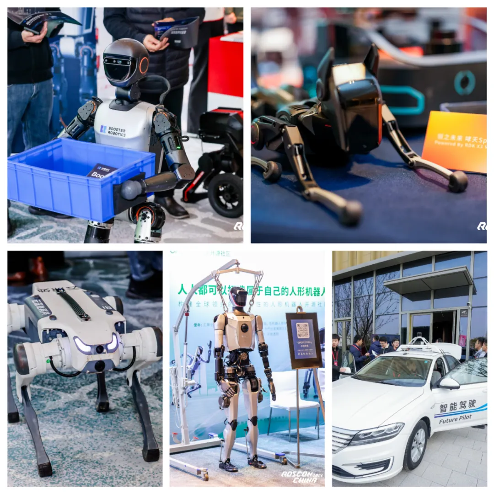

12月8日，为期两天的 ROSCon China 2024
在上海宝山伊敦康得思酒店圆满落幕。本次大会由古月居、ROS及Open Robotics
联合主办，作为聚焦机器人操作系统（ROS）及相关技术的国际性大会，ROSCon（Robot
Operating System
Conference）在中国大陆的首次举办备受瞩目，吸引了来自全球的机器人技术精英、开发者与爱好者共同分享机器人领域的尖端科技与创新成果，为与会者奉上了一场顶级科技盛宴。

OpenAtom
openEuler（简称\"openEuler\"）社区开发者参与本次大会并发表主题演讲。中国科学院软件研究所工程师、openEuler
ROS SIG Maintainer王晓云，openEuler Embedded SIG Maintainer
方林旭在本次大会上围绕"机器人操作系统新纪元: Global ROS
与自研系统"主题进行了《ROS 在 openEuler 与 RISC-V
上发展与应用》的议题分享。

王晓云在演讲中表示，其总体目标是推动 ROS
在更多操作系统上的应用与验证。其中 openEuler ROS SIG 主要负责 ROS
通用软件包的移植、适配和维护；openEuler RISC-V SIG 则专注于 RISC-V
架构的系统优化和软件包优化；openEuler Embedded SIG
致力于开发态与嵌入式实时运行场景的支持与应用。王晓云还详细分享了
openEuler ROS SIG
在软件包移植和适配过程中采用的开源工具及面临的挑战，并总结了团队在软件包移植适配、维护发版、生态扩展以及真机应用方面取得的成果。截至目前，团队已发布
ROS2 Humble 软件包超过 860 个，ROS1 Noetic 软件包超过 300 个，支持通过
"yum install" 一键安装方式实现基本功能部署。

方林旭在演讲中聚焦于 openEuler 嵌入式生态的总体愿景，以及嵌入式 ROS
面临的挑战与探索。他指出，嵌入式 ROS
在定制化难度和实时性要求方面存在诸多技术难点。对此，方林旭分享了openEuler
Embedded SIG
的技术路线，包括开发态与运行态解耦、交叉编译工具支持、分级实时部署，以及底层实时通信优化等。他还介绍了团队设计的完整嵌入式
ROS 框架以及部分已开源的工具，为解决嵌入式 ROS
的关键问题提供了有力支撑。

甲辰计划培养的乘风小队实习生顾嘉琪、叶李双、林鸿宇同导师王晓云一起来到了大会现场，切身体验这场科技与创新交织的盛会。他们感叹到："
ROSCon China 的规模远超预期，现场甚至还有 10
岁出头的小朋友流连于各个体验区。在体验区近距离接触那些功能强大的机器人时，我第一次感受到，过去看似遥不可及的技术竟然已经如此贴近我们的日常生活了。"

除了丰富的演讲，形态各异机器人的出现也使现场的体验区成为了现场的热门打卡点。机器狗、多自由度机械臂、人形机器人以及智能驾驶技术的亮相，将科技感与新奇感推向高潮。各家机器人同台竞技，三台机器人"共舞"的场景格外引人注目：人形机器人举着小箩筐分发传单和小礼品，机器狗与双足机器人在受到外界干扰后，仍能稳定完成行走、奔跑、跳跃等多种动作，展现出了极高的稳定性与灵活性。

或许，当一个人递给你传单时，你会犹豫是否接下；但当一个小巧灵活的人形机器人抱着一筐传单走到你面前时，这种新奇的体验是否会让你难以拒绝呢？

聚是一团火，散是满天星。大家因为热爱相聚在 ROSCon China
2024的会场，随着大会的圆满落幕，与会者也将回到各自的领域中继续发光发热，相信在不久的将来，openEuler
ROS SIG与openEuler Embedded SIG将借助 ROS
这一平台做出更多的创新与突破。这片土壤如此广大，未来充满无限可能，我们期盼下一次相聚时，能够共同书写更多精彩的篇章。
