2024年12月20日，2024开放原子开发者大会暨首届开源技术学术大会圆满落幕。作为开放原子开源基金会重点打造的明星项目，OpenAtom
openEuler（简称"openEuler"）深度参与本次大会，不仅成功举办了openEuler技术分论坛，还带来了充满活力的openEuler开源集市和动手实践的工作坊，让开发者们零距离感受开源的魅力，为与会者提供了深入交流和实践操作的平台。

**openEule技术分论坛**

作为此次大会的重磅内容之一，openEuler技术分论坛针对开发者关心的Linux内核、云原生技术、嵌入式系统等重要议题，进行了精彩纷呈的主题分享与成果展示。

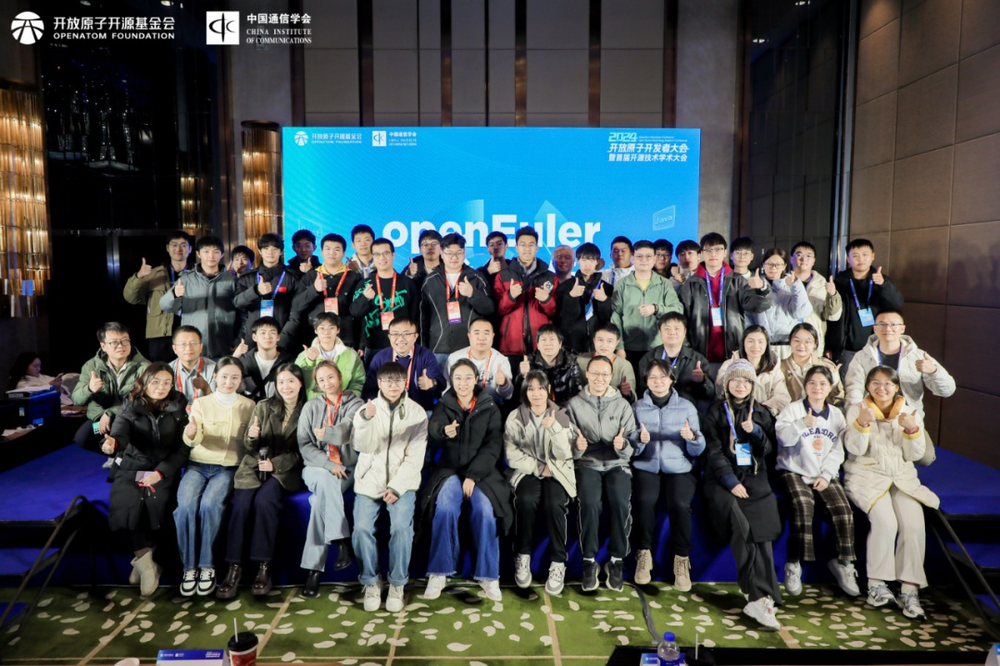

**开场致辞**

开放原子开源基金会TOC副主席兼openEuler委员会执行总监熊伟在致辞中表示：openEuler自2021年11月9日正式贡献给开放原子开源基金会以来，吸引了大量开发者加入，至今已有21,000名贡献者，日均活跃开发者超过4000人。社区鼓励创新，孵化了500多个子项目，覆盖从嵌入式到云服务器的全场景应用。同时，openEuler正向AI领域迈进，开发openEuler
Copilot
System等工具，以实现更自然的交互方式。未来openEuler将重点推进国际化进程。

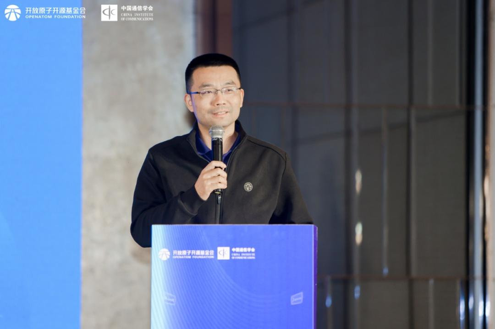

**从 RustVMM 到 Kata-Containers:RISC-V 虚拟化云原生基础设施建设**

RustVMM Infra
Maintainer何若轻老师介绍了基于RISC-V的虚拟化云原生基础设施建设进展，以及从RustVMM到Kata-Containers的全栈技术发展。强调了与硬件供应商紧密合作、专注于上游贡献以及提供基于虚拟化的RISC-V平台的安全解决方案的重要性。RISC-V虚拟化路线图分为两个阶段，第一阶段是构建一个在RISC-V上工作且可靠的软件栈，第二阶段是打造一个完全支持的、操作的、繁荣的RISC-V虚拟化软件生态系统。RustVMM在2024年10月正式宣布完全支持RISC-V架构，成为第三个官方支持的架构，为RISC-V虚拟化生态系统填补了空白。

**openEuler Embedded在工业场景的最新应用**

深圳市米尔电子有限公司副总经理周麒老师带来分享《openEuler
Embedded在工业场景的最新应用》。他表示openEuler
Embedded专注于为嵌入式设备提供定制化版本。与服务器产品不同，嵌入式设备形态多样，广泛应用于工业等众多领域。openEuler
Embedded的架构为工业设备提供了必要的软件特性、中间件和功能扩展，支持多种处理器架构，并通过MICA框架实现不同操作系统间的高效任务调度和通信。openEuler
Embedded具备高安全可靠性、硬实时性的优点，已在EtherCAT主站、人机界面、机器视觉AI和多路视频采集等场景中得到应用。

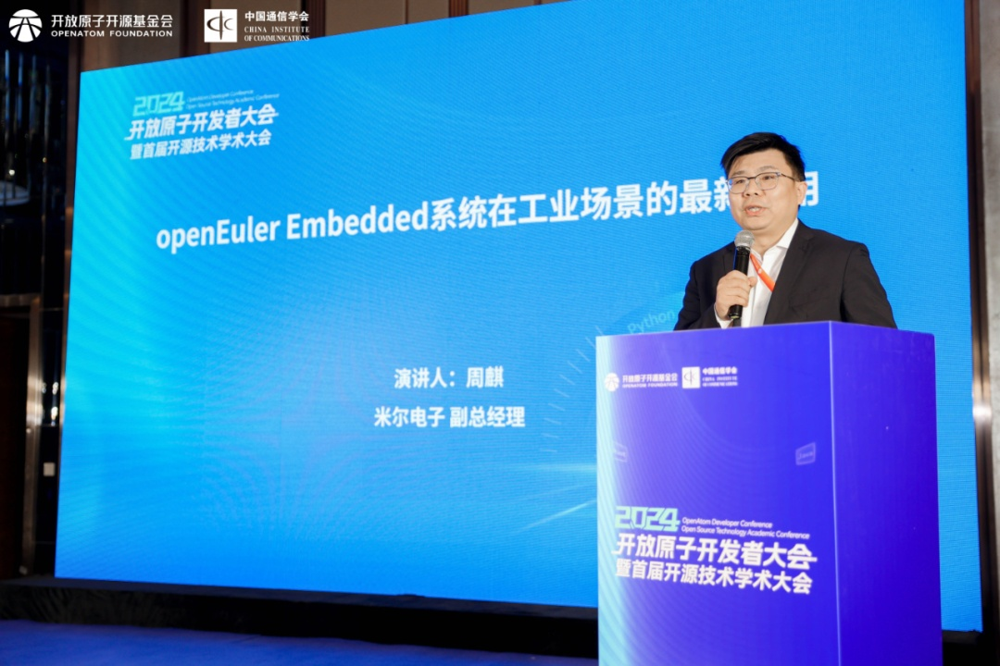

**润和软件大数据平台原地迁移实践**

openEuler用户委员会委员、润和软件高级研发经理张剑老师带来《润和软件大数据平台原地迁移实践》的分享，张剑老师深入探讨了大数据平台在系统迁移过程中面临的版本众多、平台差异大、依赖关系复杂等一系列痛点，重点介绍了为解决大数据平台用户迁移痛点，润和软件针对性推出的大数据平台原地迁移解决方案，该方案支持x86和ARM架构，实现FusionInsight、HDP、CDH等主流大数据平台一键式迁移，助力企业顺利完成核心业务信创迁移，确保业务连续性和数据安全。

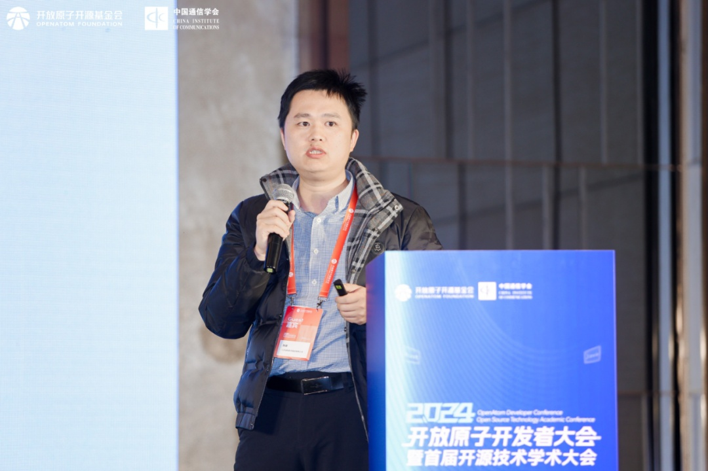

**openEuler Embedded2024总结及未来畅想**

openEuler技术委员会委员任慰老师为我们分享《openEuler
Embedded2024总结及未来畅想》。他表示openEuler
Embedded支持IT、CT、OT，覆盖工控、机器人等领域，采用1+X+1技术框架，提供高质量的嵌入式Linux框架和基础设施，支持新特性如分布式软总线、混合关键系统等。包括高质量基础软件、混合关键性、定制化、垂直整合能力和丰富生态五大竞争力。未来，openEuler
Embedded将聚焦智能汽车、机器人和航空航天领域，持续推动嵌入式技术发展。

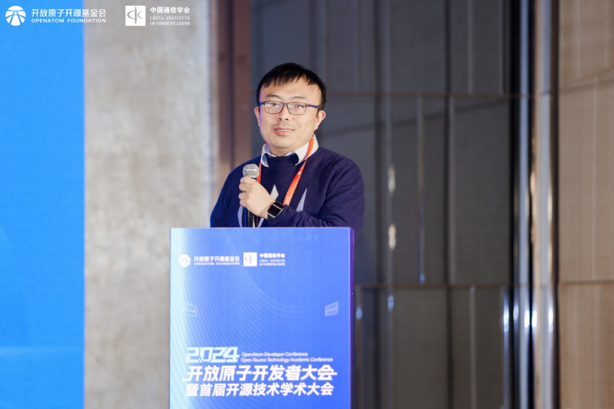

**软通动力基于openEuler的AI实训平台，赋能智能创新**

软通动力基础软件服务经理刘合领老师带来分享《软通动力基于openEuler的AI实训平台，赋能智能创新》，他表示软通动力深入了解高校对AI技术的关注度及对实训平台的需求。针对这种情况，软通动力利用其丰富的高校资源，推出定制化解决方案。该方案紧贴高校课程需求，打造综合性实训环境，支持模型和算法平台。在教学管理层面，提供全流程管理，注重培养学生兴趣和能力考核。技术层面，以openEuler为基础，集成开源AI框架和模型，实现实训场景支撑。平台还考虑了学生作品管理、监控和与高校现有系统的集成。

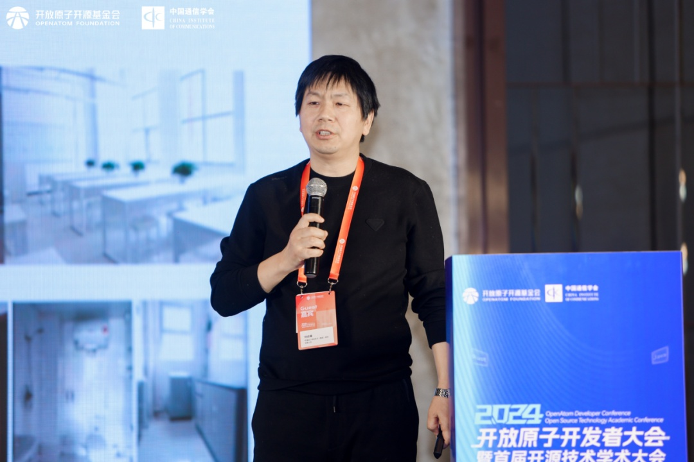

**面向AI的开源合规探索**

openEuler Compliance SIG
Maintainer丁紫薇老师带来分享《面向AI的开源合规探索》，深入探讨了AI开源的现状、挑战以及合规关注方向。她表示在《2024年开源发展现状》报告数据中显示：开源AI、大数据和云原生技术是当前开发者关注的焦点，其中69%的开发者已在日常中使用AI工具。开源AI面临的挑战包括质量控制、安全风险、滥用风险和知识产权问题。AI合规涉及法律、伦理和技术三个层面：法律合规关注知识产权、数据保护和出口管制；伦理合规强调公平性、透明度和责任归属；技术合规侧重于代码质量、数据标注和滥用防范。演讲最后强调，开源能促进AI技术发展，但需警惕其风险，确保AI项目的健康发展。

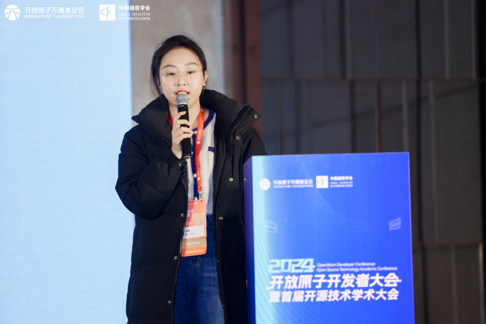

**基于Rubik的集群资源超卖解决方案设计与实践**

联通数科容器产品技术架构师张建津老师和华为云原生高级开发工程师李帅老师一起带来分享《基于Rubik的集群资源超卖解决方案设计与实践》。李帅老师从三个方面介绍了离线混部技术：技术背景、解决方案概述、混部场景实现。混部技术背景强调了云资源利用率低的问题，特别是在业务波峰波谷时的资源浪费。解决方案基于openEuler
Rubik特性，实现了资源隔离。混部场景实现涉及业务类型分类、节点能力配置和调度器协调。分享还介绍了混部的使用场景，包括自动部署、工作负载属性修改和手动部署。整个混部方案旨在提高资源利用率，保证在线业务的服务质量。

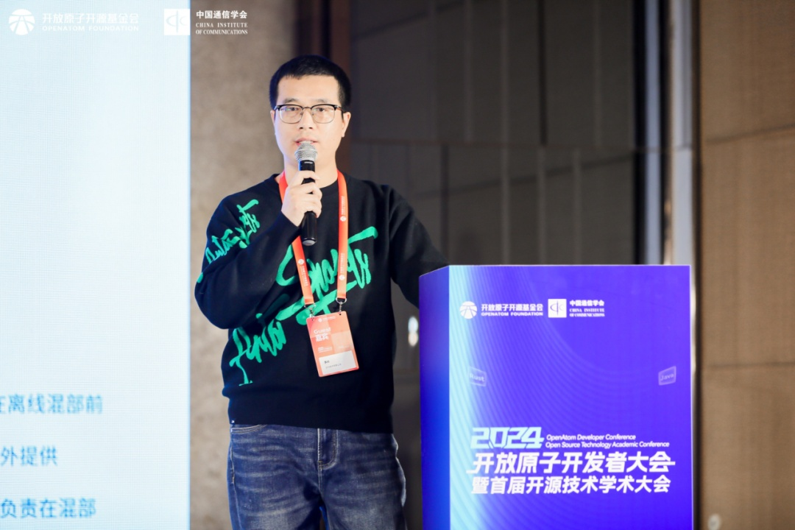

张建津老师介绍了方案旨在解决资源利用率低的问题。通过分析生产中的典型情况，指出资源申请与实际使用不一致、业务时间聚合性导致的平均利用率不高等问题。超卖方案通过新增业务Pod类型、划分Pod优先级、制定资源预测画像和定制Pod调度器等措施，重新适配和分配浪费的资源。联通CSK
Turbo版本基于CULinux和Kubernetes，通过非侵入方式实现了离线超卖和在线业务Pod的调度，显著提升了CPU和内存利用率。这一方案展示了通过超卖技术提高资源效率的潜力。

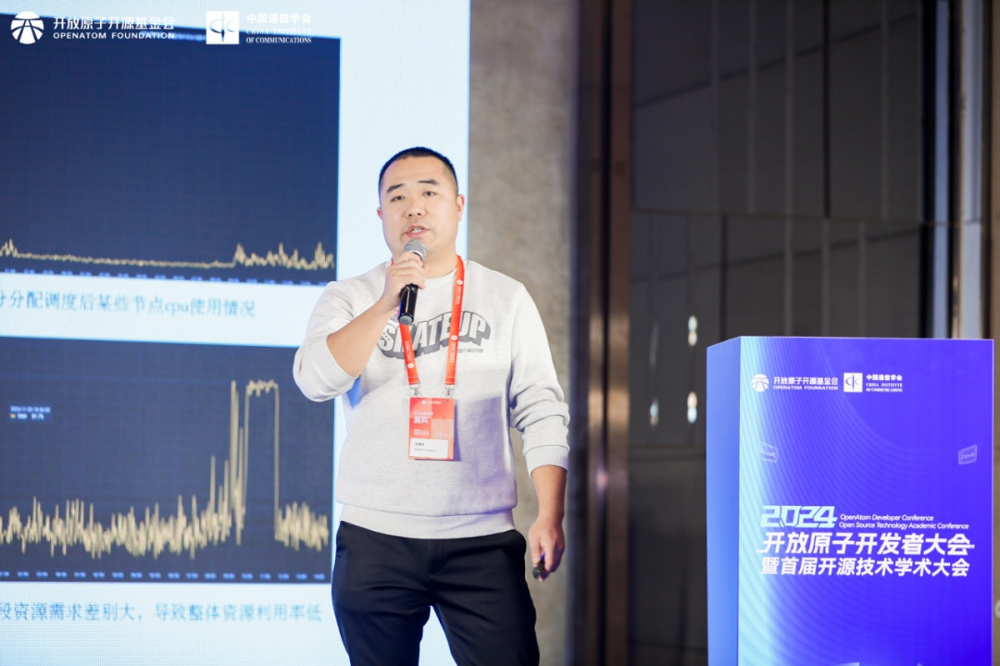

**麒麟信安集中运维管理系统**

麒麟信安的唐杰老师分享了麒麟信安集中运维管理系统，这个系统专门为电网运维团队打造，能应对复杂的网络环境和多种操作系统。它用起来安全、方便，还能根据需要定制功能。系统的核心是保证电网运行的安全和稳定，通过监控硬件状态、设置警报、管理软件更新等方式，让运维工作更高效。已在湖北、新疆、黑龙江等电力公司部署，反响良好。未来，系统将集成大模型、智能运维技术，提升故障诊断和根因分析能力。

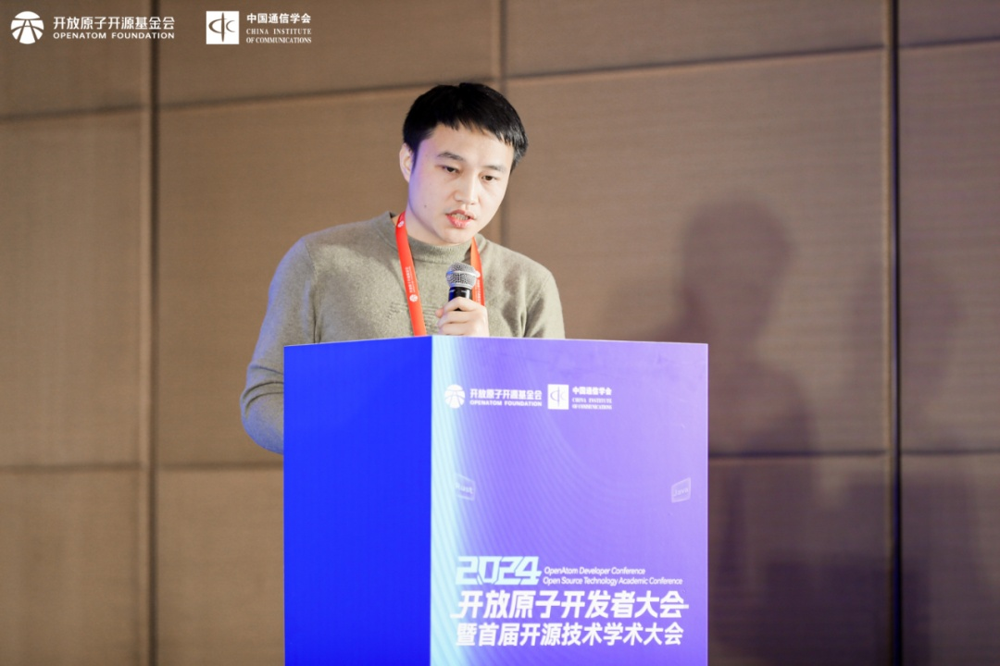

**openEuler培训讲师证书颁发仪式**

大会分论坛中还进行了首批openEuler培训讲师证书颁发仪式，这是对讲师个人能力的认可，培训讲师将成为连接openEuler与用户之间的桥梁，为openEuler社区持续培养更多人才，为推广和应用openEuler操作系统贡献力量。

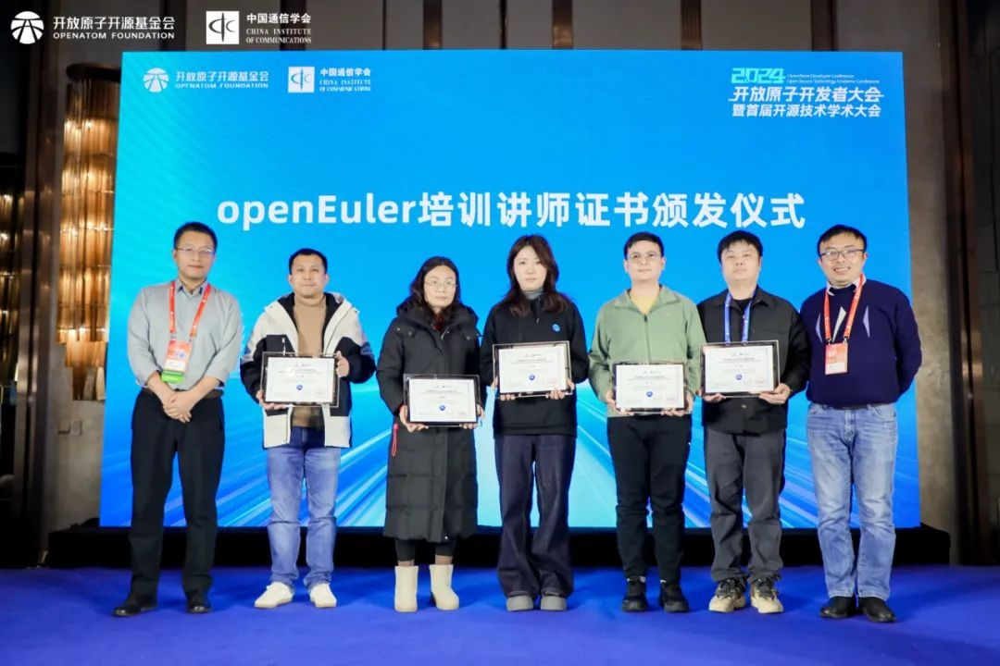

**开源集市**

作为此次大会的重要环节，**开源市集**深受开发者的欢迎。openEuler在开源市集设置了**openEuler技术问答挑战**等活动，吸引了众多参会者的目光。来自各地的开发者、科技爱好者与现场工作人员进行了深入的交流与互动，充分感受到了社区的活力和创造力。

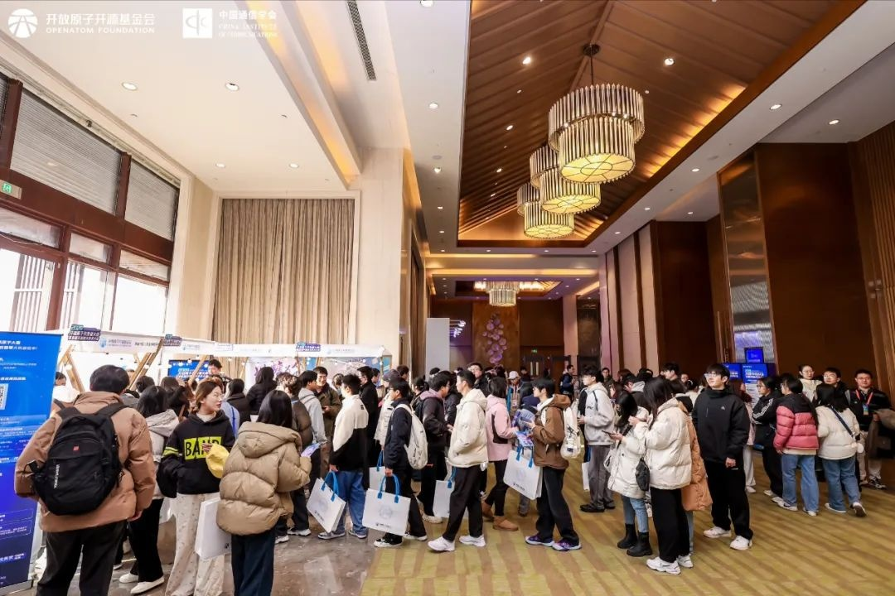

**openEule开源工作坊**

**openEuler开源工作坊**为现场开发者带来有趣丰富的动手实践挑战，依托openEuler指南与文档，让开发者了解openEuler的特性和软件生态，通过实践让参与者构建
AI
应用容器镜像，体验openEuler云原生AI应用的全流程开发实践过程。活动当天，**20+**开发者来到现场参与openEuler实践挑战，围绕openEuler实际开发进行深入讨论。

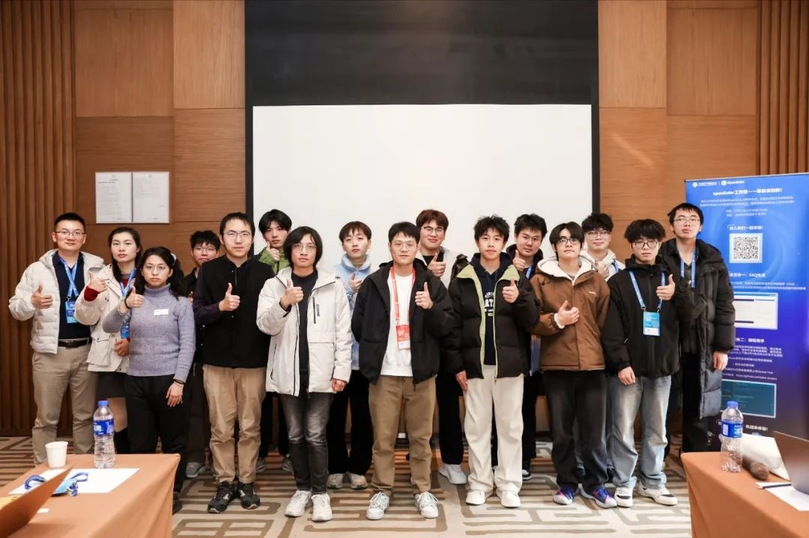

本次活动圆满结束，欢迎各位参与者的到来，与我们一起探索openEuler的无限可能～本次
Meetup 的分享材料已上传至 openEuler
Gitee仓库。欢迎前往下方链接获取，期待您的下次参与！\
**链接：**[https://gitee.com/openeuler/presentations/tree/master/meetup]

本次
Meetup 直播回放已上传至 openEuler
视频号。如果您错过了本次线下活动，可前往视频号（OpenAtom-openEuler）查看活动回顾，期待您的下次参与！
