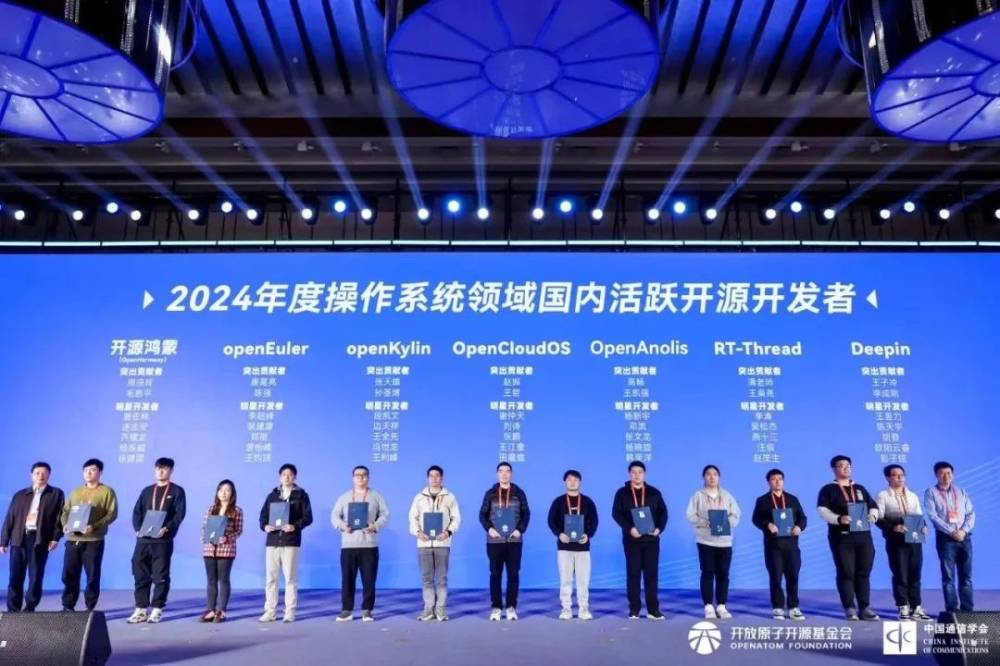

12月20日，**2024开放原子开发者大会暨首届开源技术学术大会**在武汉举办，会上举办了备受开发者关注的2024年度国内活跃开源项目&开发者致谢仪式，**OpenAtom openEuler（简称"openEuler"）荣获"2024年度操作系统领域国内活跃开源项目"**。

活跃的开源项目是开源生态核心驱动力，是汇聚各方智慧的结晶，目前国内已经涌现一批优秀的开源项目。openEuler在开源技术领域，凭借多项先进技术的卓越贡献，脱颖而出，荣获**"2024年度操作系统领域国内活跃开源项目"**，为开源技术发展做出了具有深远影响力的贡献。此外，openEuler的繁荣离不开众多开发者的参与和贡献，大会现场还颁发了**2024年度操作系统领域国内活跃开源开发者**，以表彰他们为开源社区发展贡献的重要力量。**openEuler社区7名开发者荣获"突出贡献者"、"明星开发者"等荣誉。**

活跃的开源项目是开源生态核心驱动力，而开发者则是推动这些项目不断前进的引擎。展望未来，openEuler致力于与全球开源社区紧密合作，通过不断的技术革新和更加活跃的社区参与，为开源世界献上一份卓越的贡献。我们诚挚邀请更多的行业伙伴和开发者加入我们的行列，携手推进开源技术的发展和生态的完善。
