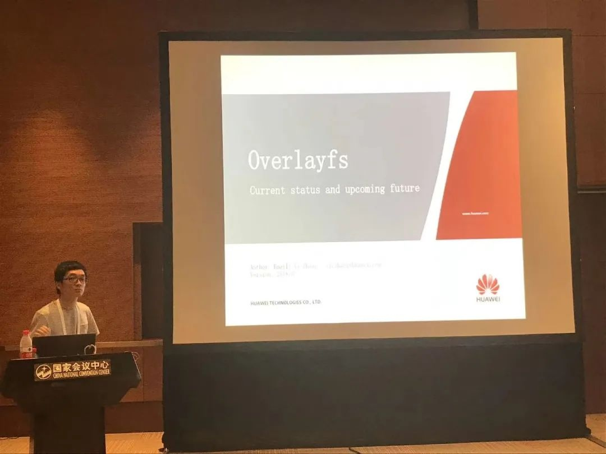

Linux Kernel
社区采用分层管理的方式，按照各个子系统不断向下细分，每一层级/子系统都由各自模块的
Maintainer/Reviewer
负责把关来自全球各地开发者的提交，确保代码的可靠与稳定。因此这些角色通常由经验丰富且责任心强的开发者担任，他们的存在对整个
Linux 生态的发展起到了至关重要的作用。OpenAtom
openEuler（简称"openEuler"）内核开发者团队的重要贡献单位华为同样重视对上游
Linux Kernel
的投入，华为团队围绕存储领域在稳定性与高性能方面进行突破，24 年内新担任
3 个关键席位：bfq 模块 Maintainer\[1\]、软 raid 模块
Maintainer\[2\]、ubifs/ubi 模块 Reviewer\[3\]。

**openEuler 内核在存储领域稳定性与性能上的实践效果**
----------------------------------------------------

openEuler
面向数字基础设施提供开源操作系统，支持服务器、云计算、边缘计算、嵌入式等应用场景，其中安全、稳定与高性能是关键，存储栈作为核心模块之一，如何提高这些方面同样重要。openEuler
内核重要贡献单位华为从很早就不断深入该领域，作出一系列扎实的突破与贡献。

ext4/jbd2 模块是 openEuler 预装文件系统，openEuler
内核团队从稳定性上入手，围绕多因素导致的故障场景下的数据损坏和内核 panic
问题进行分析，发现 jbd2 流程与 ext4
中各并发流程存在诸多不合理逻辑，并围绕此进行大规模重构，累计向上游社区贡献
370+多个高质量 bugfix/特性补丁，受社区 Maintainer 认可。在最新版本的
openEuler-24.03 中，openEuler 内核团队围绕性能方面同样做出深入探索，将
ext4 IO 流程由 buffer head 切换至 IOmap，在 lmbench
等基础测试场景下达成一倍以上性能提升\[4\]。

围绕服务器领域另一常见文件系统 xfs，openEuler
内核团队同样从稳定性上进行深入剖析与测试，发现在磁盘IO不稳定、系统突发断电、内存压力大等场景下同样存在较多历史遗留已久缺陷，在一系列加固后，openEuler
使用者之一向内核团队反馈相较其他发行版 xfs 损坏概率大大降低。

类似工作在存储领域其他模块中同样存在。针对 CT 领域常见文件系统
ubifs，openEuler 内核团队一方面不断进行内核层面质量加固与优化（优化
fastmap 特性带来的器件损耗，寿命最高提升 10
倍\[5\]），另一方面针对离线修复工具这一空白完成设计与开发，已完成并在
openEuler 开源\[6\]，成果同步上游社区开源\[7\]。整个openEuler
内核团队围绕存储领域累计完成
1700+个上游社区补丁贡献，模块覆盖业界厂商涉及的大部分通用存储栈，包括
ext4/jbd2 模块约 370+个，ubifs 65+个，bfq 40+个，block 通用层
180+个，xfs 25+个，raid 100+个，device mapper 65+个。openEuler
内核贡献者在上游社区多核心模块担任关键角色，如：软 Raid
Maintainer、Ubifs/ubi Meviewer、Bfq Maintainer、Libsas
Reviewer\[8\]。同时围绕相关产出在国内外开源大会上进行了多次分享，旨在不断促进存储领域的可靠性与性能提升。

**参加 2018 LC3 分享 overlayfs 当前设计与未来演进**

**参加 2024 CLK 介绍 ext4+iomap 设计与效果**

参加 2024 中国香港 Linux Kernel Maintainer Meetup

围绕内核存储栈的稳定性保障与性能优化是个永恒的话题。openEuler
内核团队在该领域不断提升自身广度与深度，积极发现潜在风险点并解决，并不断结合实际业务进行性能优化，这将不断提升
openEuler
操作系统本身的竞争力。同时随着团队成员不断担任上游社区关键席位，也会进一步推动
openEuler 社区在国内外的影响力与品牌度。

**参考内容**
------------

\[1\].
https://git.kernel.org/pub/scm/linux/kernel/git/torvalds/linux.git/commit/?id=f55d3b82ac2fe8e12fe784702a7a39ab36b7d4e1

\[2\].
https://patchwork.kernel.org/project/linux-raid/patch/20241108014112.2098079-1-song@kernel.org/

\[3\].
https://git.kernel.org/pub/scm/linux/kernel/git/torvalds/linux.git/commit/?id=eb54235315f4577b035c89a10ca3eb48caab0445

\[4\]. https://gitee.com/openeuler/kernel/pulls/6632

\[5\].
https://lore.kernel.org/linux-arm-kernel/20230828063845.3142561-1-chengzhihao1@huawei.com/T/\#u

\[6\].
https://gitee.com/src-openeuler/mtd-utils/pulls/22/files?skip\_mobile=true

\[7\].
https://lore.kernel.org/linux-mtd/20240607042615.2069840-58-chengzhihao1@huawei.com/n

\[8\].
https://git.kernel.org/pub/scm/linux/kernel/git/torvalds/linux.git/commit/?id=21b382460d659fc4ac0c86c1b3a02e6bf8ef2418
