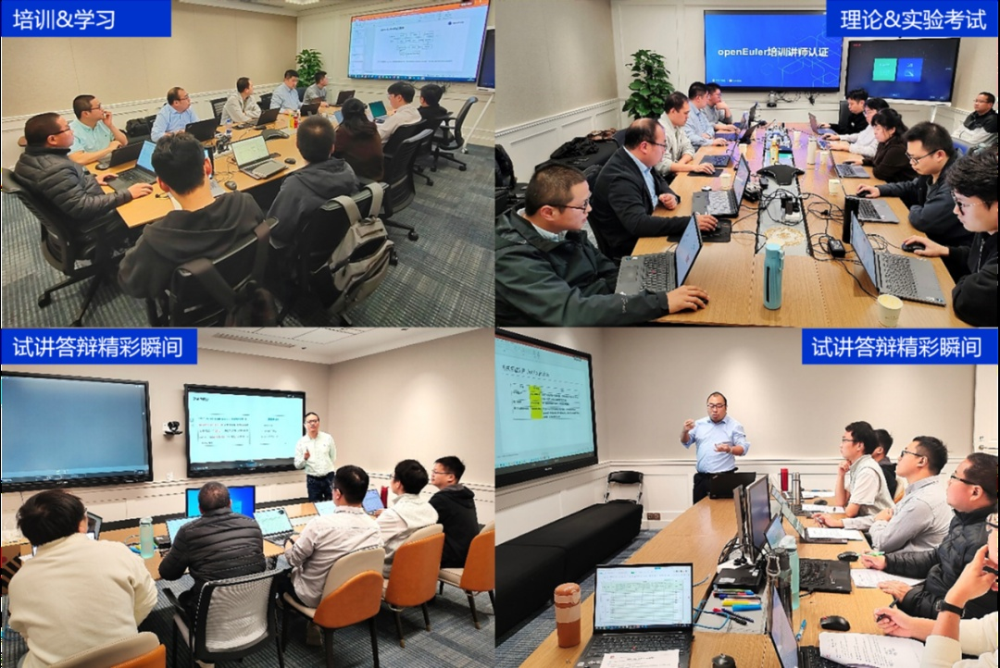
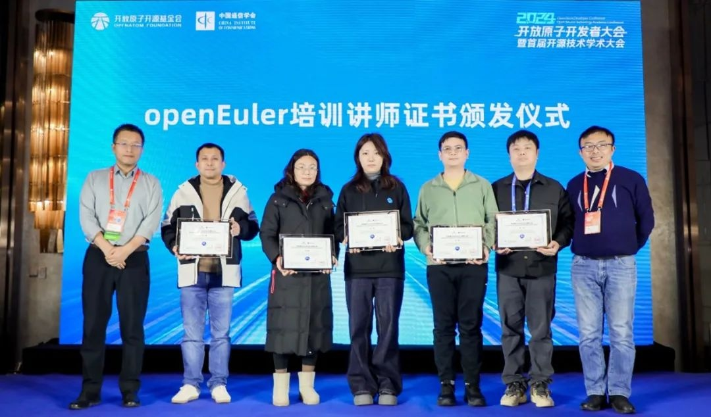

随着信息技术的快速发展，操作系统作为计算机系统的核心软件，在信息化建设中扮演着至关重要的角色。OpenAtom
openEuler（简称\"openEuler\"）作为一个开源操作系统，致力于构建开放、多元和包容的生态体系。为了进一步推动openEuler在各行各业的应用和发展，培养更多专业的技术人才，openEuler教育工作组于2024年12月7-8日组织了首批openEuler培训讲师认证。

本次讲师认证活动严格按照既定流程进行，涵盖了理论知识考核、实验操作考核、课程片段试讲及专业知识答辩等多个环节。

经过严格严肃的考核与评价，最终，来自5家openEuler授权培训单位共计10名学员中，有8名学员通过认证考核，成为第一批openEuler培训讲师。他们分别是（按姓名拼音排序）：

      安巍       南京柯普瑞信息技术有限公司

      高伯建     软通动力信息技术（集团）股份有限公司

      李恬       北京凝思软件股份有限公司

      毛庭捷     南京柯普瑞信息技术有限公司

      田维       中软国际科技服务有限公司

      薛萌       软通动力信息技术（集团）股份有限公司
  
      杨旭       中软国际科技服务有限公司

      张阳       湖南麒麟信安科技股份有限公司

这些讲师不仅具备专业知识和实践经验，还展现了出色的沟通技巧和教育热情。他们将成为连接openEuler与用户之间的桥梁，为推广和应用openEuler操作系统贡献力量。

为了鼓励越来越多的专业人才加入openEuler队伍，推广openEuler技术，特此在2024开放原子开发者大会暨首届开源技术学术大会上为首批通过认证的培训讲师举行了证书颁发仪式。通过openEuler培训讲师认证，不仅能够提升参培学员的个人技术水平和教学能力，而且对于促进openEuler社区的发展具有重要意义。
