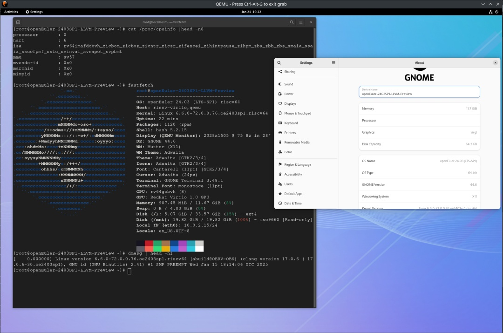
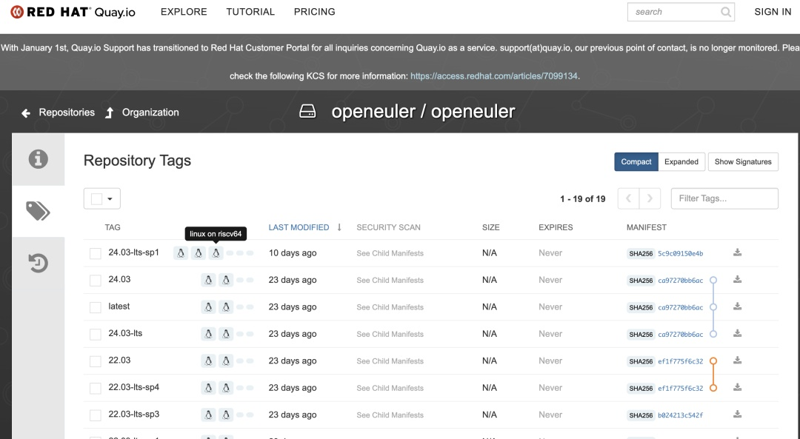
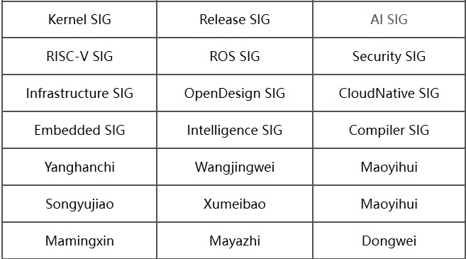

**概述**

在刚过去的2024年，OpenAtom
openEuler（简称\"openEuler\"）迎来了五周年纪念。在2025年1月发布的openEuler
2024 社区年报中，展示了openEuler
在技术创新、生态建设与国际合作等领域的卓越成果。这些成就离不开 1900
多家成员单位和 2
万多名开发者的辛勤付出和贡献。感谢大家的支持。未来，openEuler将持续参与到全球的开源生态的建设中，欢迎更多热爱开源的伙伴加入，携手共建更好的openEuler。

在近期技术发展方面，基于 KV 存储的高性能文件系统 He3FS、LLM
异构融合推理框架
sysHAX和专注于软件供应链安全的自动化扫描工具析灵SBOM等相继在社区建仓并投入运作。此外，openEuler
LLVM 平行宇宙计划 发布了 openEuler 24.03 SP1
预览版，不仅扩展了版本发布范围，还升级了 RISC-V
架构的软件基线。同时，RISC-V SIG 与 Infra SIG 联合完成了 openEuler
RISC-V 对上游容器镜像社区（包括
DockerHub、Quay.io）以及中科院软件所支持的 OEPKGS 软件仓
的推送，实现了云原生系统级别的基座支持。

本月报阅读时长10分钟。

**社区规模**

截至2025年1月31日，openEuler
社区用户累计超过391万。超过2.1万名开发者在社区持续贡献。社区累计产生
205.4K个PRs、109.2K条Issues。目前，加入openEuler社区的单位成员1971家，1月新增34家。

社区贡献看板（截至2025/01/31）

**社区事件**

**openEuler 2024 社区年报发布**

在刚过去的2024年，openEuler
迎来了五周年纪念。这5年来，openEuler社区从无到有，由小到大，由弱到强，实现了跨越式的发展。2023年，openEuler系实现了中国新增市场份额第一，这是中国基础软件发展历史上的标志性里程碑。2024年，openEuler系累计装机量突破1000万套，全球下载量超过385万次，覆盖155个国家和地区、2000多个城市，成为全球开源操作系统领域的重要力量。

这份漂亮的成绩单背后，离不开openEuler社区成员单位以及开发者们的持续贡献，感谢大家的支持。未来，openEuler社区将持续参与到全球的开源生态的建设中，欢迎更多热爱开源的伙伴加入，携手共建更好的openEuler！

**openEuler社区应邀出席中泰数字经济合作论坛**

2025年1月18日，openEuler社区应邀出席在泰国曼谷举行的第二届中泰数字经济合作论坛。该论坛由中国工业和信息化部与泰国数字经济和社会部联合主办，是中泰建交50周年系列活动之一。openEuler委员会执行总监胡正策发表主题演讲，介绍openEuler在智能时代赋能数字化转型的能力，强调其在软硬件生态上的优势以及开源社区的共建共治共享理念。

**技术进展**

**社区新吸纳基于KV存储的文件系统-He3FS**

由中移（苏州）软件技术有限公司开发的项目He3FS，近期已在社区完成建仓工作，并持续开展相关开发任务。

He3FS是一款高性能的POSIX文件系统，专为云原生环境优化设计。它无需修改代码，即可让用户像使用本地存储一样高效地使用分布式KV存储，特别适用于对存储吞吐性能要求较高的系统。

He3FS是一款基于KV存储实现的用户态文件系统。它实现了常用的FUSE接口，将文件系统元数据和文件均以键值对的形式存储在KV存储上，并且实现了本地优先队列机制。

在后续的开发工作中，我们将持续优化He3FS本地队列功能，通过实现数据冷热分层，进一步提升存储效率与性能表现，同时持续丰富KV存储适配种类，以满足更多场景需求，推动openEuler与移动云数据库生态的深度融合。欢迎感兴趣的开发者关注。

项目地址：

https://gitee.com/src-openeuler/he3fs

**析灵SBOM工具在openEuler社区完成建仓**

析灵SBOM工具（xLin-SBOM）是一款专注于软件供应链安全的自动化扫描工具。该项目由北京凝思软件股份有限公司发起，并已在openEuler社区开源。

析灵SBOM工具通过深度分析ISO镜像或单个RPM软件包，能够快速生成标准化的SBOM（Software
Bill of
Materials）清单，帮助开发者和企业更好地管理软件供应链中的组件信息，确保合规性并降低开源法律风险。

主要功能与特点包括：

1.  支持多种格式的SBOM生成：析灵SBOM工具能够对ISO镜像和单个RPM包进行深度扫描，生成符合SPDX标准的SBOM清单。

1.  自动化提取软件包元数据：工具能够自动提取软件包的元数据，包括名称、版本、架构、供应商、许可证信息以及完整性校验值。

1.  依赖关系追踪与管理：析灵SBOM工具不仅能够识别软件包的元数据，还能够追踪和管理软件包之间的依赖关系。

1.  兼容主流Linux发行版：工具兼容多种主流Linux发行版，支持多种部署方式，用户可以根据需求灵活选择运行环境。

1.  许可证合规管理：工具实现了SPDX许可证名称的规范化与合规初判，能够自动将常见的许可证变体名称转换为标准的SPDX标识符。

1.  遵循国家标准GB/T 43698-2024：析灵SBOM工具的设计和输出符合国家标准GB/T
43698-2024的管理要求，确保其在企业级应用中的合规性。

应用场景：

> 开源项目合规性检查：开源项目维护者可以使用该工具来检查项目的依赖关系和许可证合规性，确保项目符合开源社区的标准和规范。

> 安全审计与漏洞管理：通过生成SBOM清单，安全团队可以更好地识别软件中的潜在漏洞，并及时采取措施进行修复。

项目地址：

https://gitee.com/openeuler/xlin-sbom

**LLM 异构融合推理框架sysHAX在社区完成建仓**

由AI SIG维护管理的 sysHAX 项目已在社区完成建仓并持续推进开发。sysHAX
是一个大模型推理服务加速工具，通过 CPU 和 XPU 的合理配合，使能 CPU
能力，降低大模型的算力需求，提高大模型推理服务负载能力。

sysHAX 通过以下技术手段实现大模型推理服务加速：

1.  调度优化：大模型推理请求在不同算力之间的合理调度和KV
Cache在多级缓存间的搬运和复用。

1.  KV Cache管理：管理Kv Cache在不同存储介质之中的分布，高效的搬运KV
Cache。

1.  CPU 算力填充技术：a) 解码过程的 CPU offload；b) 基于大模型属性使能 CPU
算力。

欢迎感兴趣的朋友关注。

项目地址：

https://gitee.com/src-openeuler/sysHAX

https://gitee.com/openeuler/sysHAX

**LLVM平行宇宙计划发布24.03 SP1预览版**

openEuler LLVM 平行宇宙计划近期发布了面向openEuler 24.03
SP1预览版，这一新版本主要有以下特点：首先是版本发布的范围扩展到了
Everything + Epol，使其与 openEuler 的正式版本范围保持一致。其次是升级了
RISC-V 架构的软件基线，扩大至接近 RVA22
范围并在此基础上使能了向量扩展，为后续版本的演进奠定了基础。同时，新版本中还使能了
mold 链接器用于大部分软件包的编译，实现了系统构建过程的加速。

**RISC-V SIG 完成镜像推送，推动云原生生态建设**

RISC-V SIG 联合 Infra SIG 完成 openEuler RISC-V 对上游容器镜像社区
DockerHub 、Quay.io 和中科院软件所支持的 OEPKGS
软件仓的推送，完成云原生系统级别基座支持，RISC-V SIG 计划后续配合
openEuler 的云原生支持软件范围，推动对 RISC-V 的软件级的 Docker
镜像支持，以充分支持 RISC-V 服务器级别云原生虚拟化生态。

**软硬件兼容性测评**

2025年1月，openEuler软硬件兼容性测评新增40个，其中北向（ISV）新增23个，南向（IHV）新增15个，OSV新增2个。

openEuler OSV技术测评完成并通过6个OS。

兼容性列表：\
https://www.openeuler.org/zh/compatibility/\
OSV技术测评列表\
https://www.openeuler.org/zh/approve/

**安全公告**

2025年1月，社区共发布安全公告89个，修复漏洞222个（其中 Critical
1个，High 56个，其它165个）。

**重点漏洞提醒**

如下漏洞评估影响较大，请重点关注。

在 rsync
守护进程中发现了一个基于堆的缓冲区溢出漏洞。该问题源于代码中对攻击者控制的校验和长度（s2length）处理不当。当
MAX\_DIGEST\_LEN 超过固定值 SUM\_LENGTH（16 字节）时，攻击者可以在 sum2
缓冲区中进行越界写入。**（CVE-2024-12084）**

CVSS评分为9.8分

公告链接：

https://www.openeuler.org/zh/security/cve/detail/?cveId=CVE-2024-12084&packageName=rsync

影响范围：

openEuler-24.03-LTS

openEuler-24.03-LTS-SP1

HarfBuzz 是一个文本整形引擎。从 8.5.0 版本到 10.0.1 版本，在
hb\_cairo\_glyphs\_from\_buffer
函数中存在基于堆的缓冲区溢出漏洞。**（CVE-2024-56732）**

CVSS评分为8.8分

公告链接：

https://www.openeuler.org/zh/security/cve/detail/?cveId=CVE-2024-56732&packageName=harfbuzz

影响范围： 

openEuler-24.03-LTS

openEuler-24.03-LTS-SP1

openEuler社区针对在维版本例行修复漏洞，发布安全补丁。建议用户关注openEuler官网安全公告，及时安装漏洞补丁进行防护。

openEuler 安全公告：

https://www.openeuler.org/zh/security/security-bulletins/

**感谢每一位朋友、开发者的支持**

openEuler
社区的每一步发展、每一次焕新，都离不开大家的积极贡献与热忱支持。小编限于视野和能力，难免有所遗漏，在此表示歉意。同时，衷心感谢社区朋友、开发者们以及openEuler
SIG组成员的贡献：

\* 以上不分先后顺序

如果您希望在月报中增加您的工作内容，或对内容有任何改进建议，请联系：wengqiaozhen@openeuler.sh
