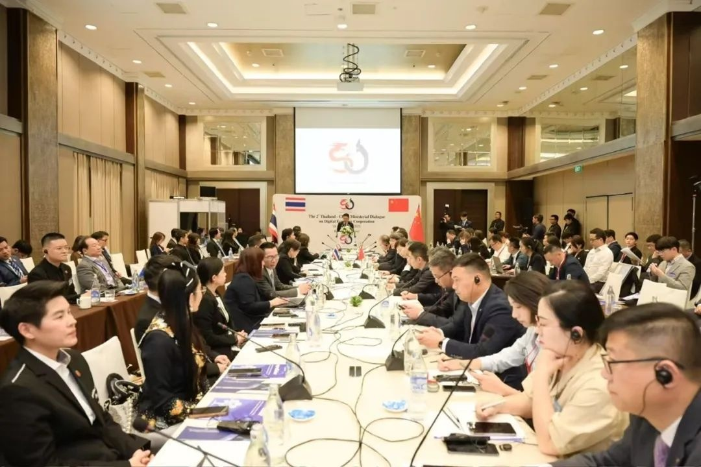
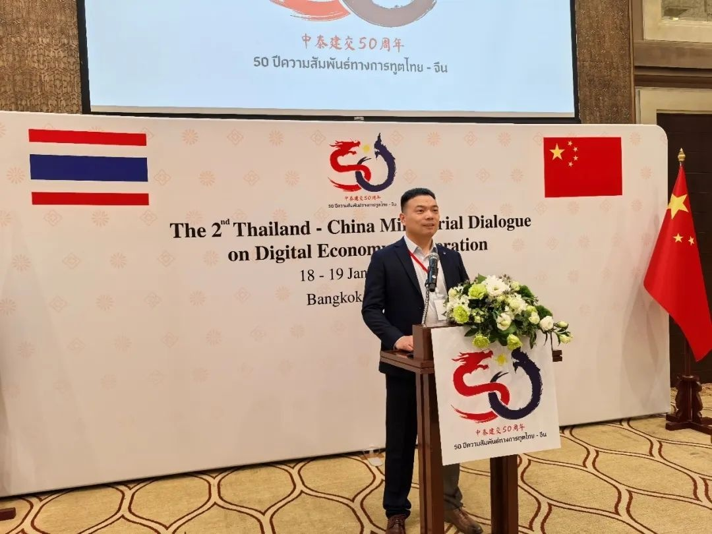
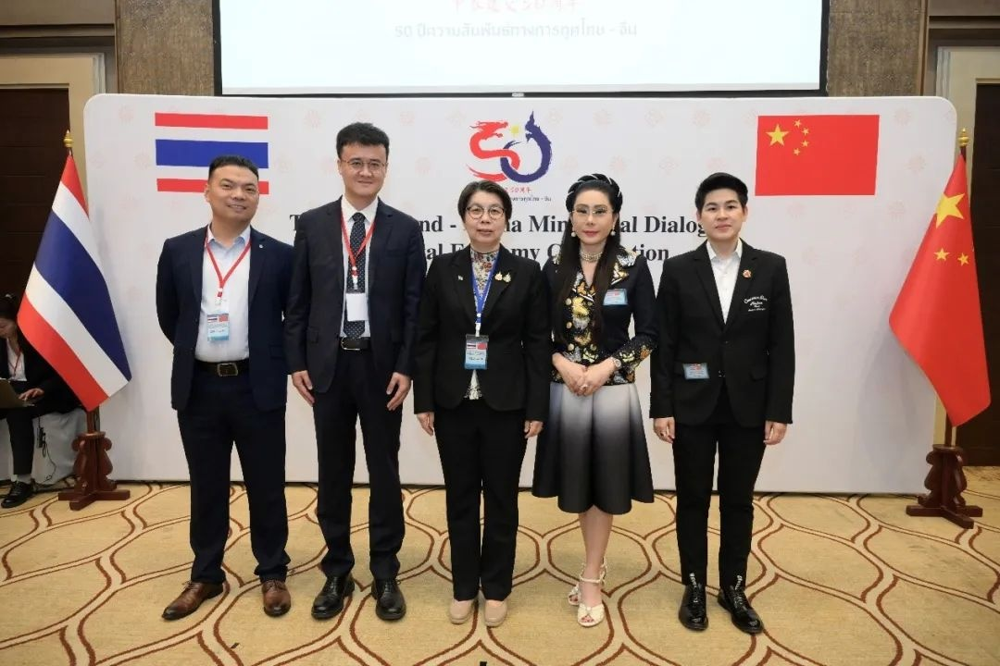

第二届中泰数字经济合作论坛于2025年1月18日在泰国曼谷举行，此次合作论坛由中国工业和信息化部与泰国数字经济和社会部联合主办，探讨中泰数字经济合作的重点领域与方向，泰国副总理兼数字经济和社会部部长巴瑟、中国工业和信息化部副部长张云明出席论坛并致辞。本次论坛是中泰建交50周年的系列活动之一，中泰两国数字经济主管部门及相关机构、企业代表约150人参会。

会上**开放原子开源基金会openEuler委员会执行总监胡正策应邀发表题为《openEuler：打造智能时代OS，赋能数字化转型》的主题演讲**。

他表示，随着智能计算时代的到来，操作系统等基础软件将会成为"新型基础设施"，操作系统不仅要支持多样性算力，而且要支持上层应用软件实现智能化，从而成为全场景的创新引擎。OpenAtom
openEuler（简称\"openEuler\"）是面向智能时代打造的全新操作系统，在硬件生态上，不仅能够在数据中心、云上使用，而且能够在边缘服务器、工业控制设备上使用；在软件生态上，不仅支持云计算、大数据、数据库、存储等通算场景，而且也支持大规模的AI大模型训练和推理的智算场景。正是由于openEuler操作系统有这些卓越的特性，openEuler开源社区成为全球开源操作系统领域的重要力量。openEuler开源社区保持共建、共治、共享的理念，不仅得到了战略捐赠人华为公司的持续投入，而且也得到来自麒麟信安、麒麟软件、统信软件、超聚变、润和软件、软通动力、英特尔、南方电网等头部企业的大力支持和投入，大家致力于将openEuler社区打造为一个共同的平台、将openEuler操作系统打造为一个公共的基础设施。

在泰国，openEuler已经支持当地公有云服务商业务实现快速增长，为泰国1000多家企业客户、350多家合作伙伴提供服务，同时发展1万名开发者。在未来，openEuler希望能够通过开源社区的形式，助力泰国成为整个东盟的数字中枢。

会后泰国数字经济和社会部常务副秘书长 Piyanuch Wuttisorn
博士与openEuler社区代表等亲切合影。

