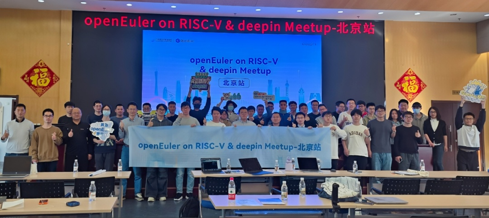
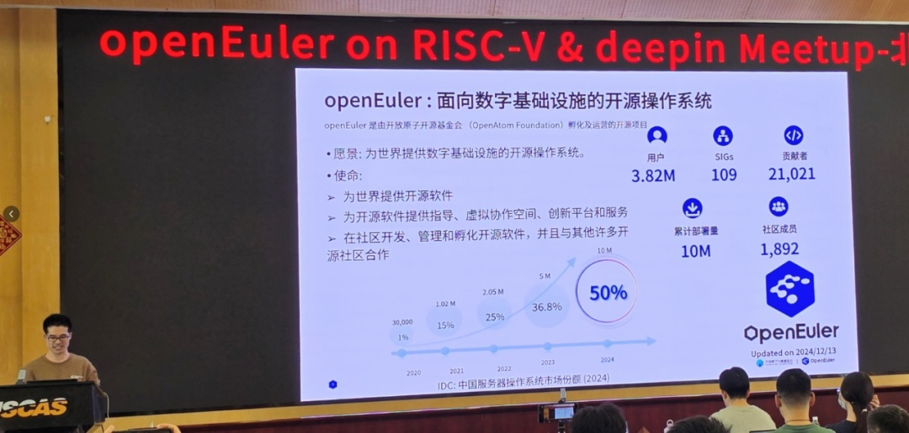
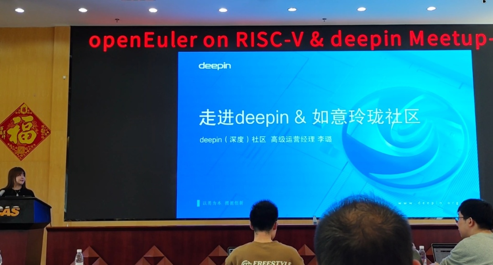
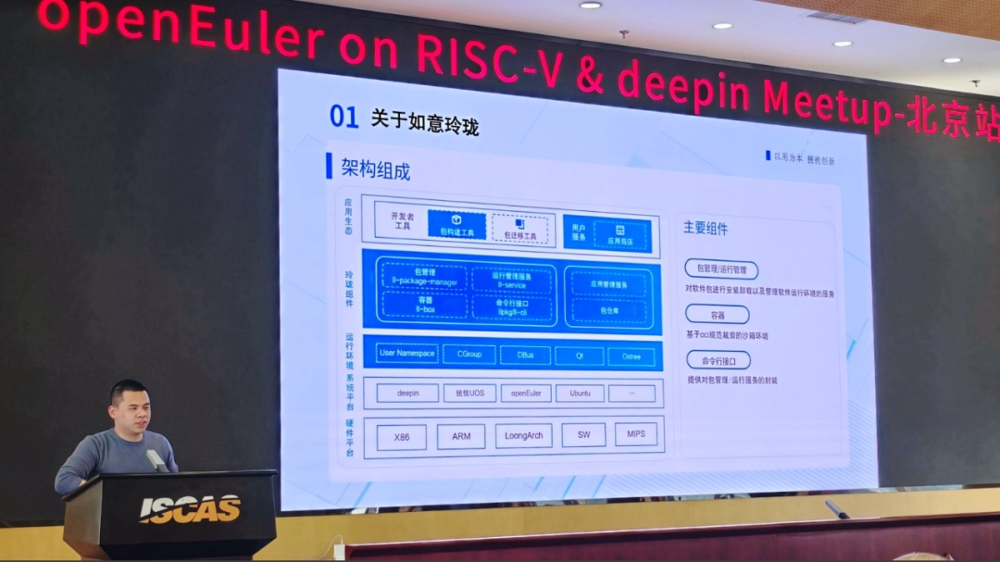
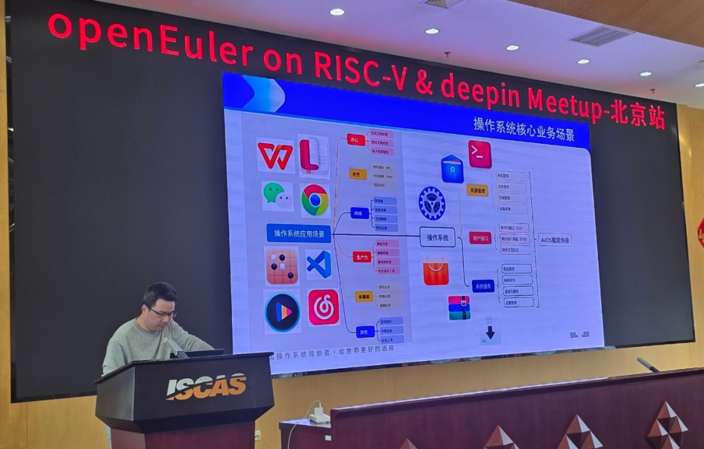
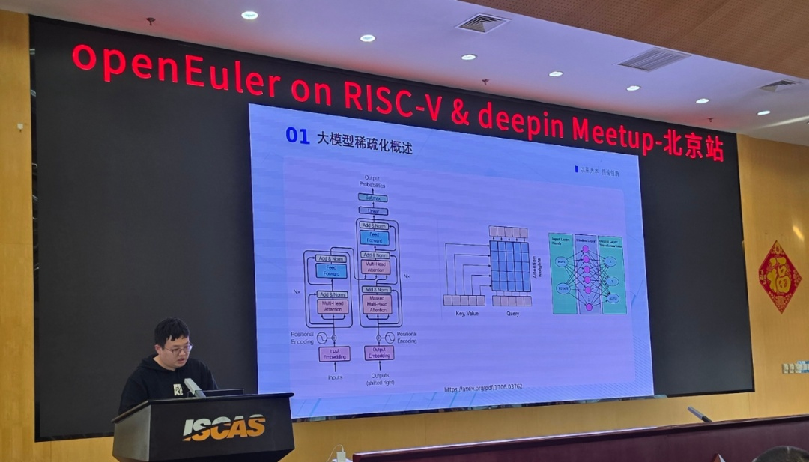
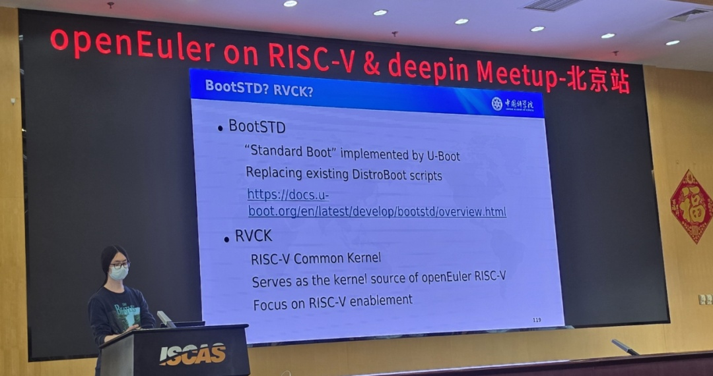
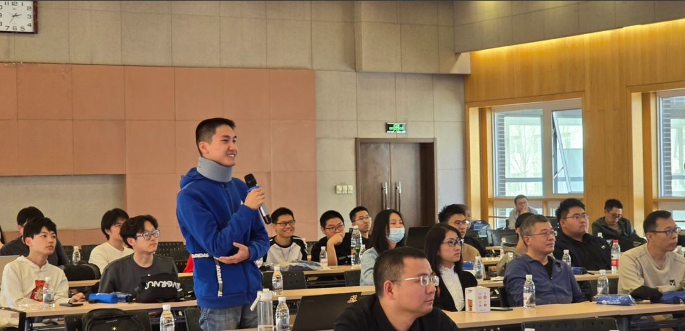

2025年3月22日，由OpenAtom
openEuler（简称\"openEuler\"）社区和deepin（深度）社区联合主办的"openEuler
on RISC-V & deepin
Meetup-北京站"在北京成功举办。活动旨在促进技术交流与合作，共同推动开源技术的发展。内容聚焦于AI
OS、大模型、RISC-V等前沿技术领域，邀请了多位行业内的技术专家进行现场分享，吸引了众多技术爱好者和专业人士参与。

**Next for openEuler on RISC-V------rolling & devstation**
----

作为openEuler on RISC-V
SIG的Maintainer，刘鑫首先为我们展示了openEuler的宏伟蓝图与发展使命，并介绍了社区建设的整体情况。当前，openEuler已拥有399万用户，已成立109个SIG，五年累计装机量突破1000万套。刘鑫还为我们详细阐述了openEuler
on RISC-V的最新进展。openEuler on RISC-V
SIG致力于完善openEuler在RISC-V架构上的软硬件生态，他分享了在openEuler on
RISC-V上实现滚动发行能力的探索与实践，以及适配社区最新的图形化编程环境devstation所取得的阶段性进展。这一进展将为开发者提供更高效、更便捷的开发环境，推动RISC-V生态的进一步发展。

openEuler on RISC-V SIG Maintainer 刘鑫

相关网站：

openEuler 官网：https://www.openeuler.org/zh/

openEuler RISC-V SIG ：https://gitee.com/openeuler/RISC-V

**走近deepin&如意玲珑社区**
----

deepin（深度）社区高级运营经理李璐展示了深耕开源20年的deepin社区成果：全球累计下载量突破8000万次，覆盖140余国家及地区，贡献代码超2500万行，斩获60+国内外奖项。重点解读了开放原子开源基金会孵化及运营的如意玲珑项目（简称"如意玲珑"），新一代Linux应用治理方案，以分层架构、沙箱隔离与跨平台生态，破解Linux兼容性与安全难题，已在统信UOS等7大平台部署，保障3000+应用高效运行。

deepin（深度）社区高级运营经理 李璐

相关网站：deepin (深度)
社区官网：https://www.deepin.org/如意玲珑社区官网：https://linyaps.org.cn/"

**如意玲珑为Linux桌面应用带来的全新体验**
----

如意玲珑社区Maintainer陆子杰通过对如意玲珑项目的架构解读为我们介绍了如意玲珑为用户和开发者在Linux桌面带来的全新体验,
通过与传统包格式的对比表现了如意玲珑的独有魅力。通过社区成果展现为我们带来了精彩的如意玲珑社区介绍,
还通过实际案例展示了如意玲珑在openEuler上的运行效果，让我们直观地感受到了Linux桌面应用在服务器环境上的新体验。

如意玲珑社区Maintainer 陆子杰

相关网站：

如意玲珑项目：https://github.com/OpenAtom-Linyaps

**deepin AI OS融合之路**
----

统信软件未来实验室研发总监曹思源为我们分享了deepin AI
OS融合之路。随着AI浪潮的席卷，操作系统作为承载大模型推理和训练的底座，其AI能力变得至关重要。曹思源从传统交互方式的演进讲起，详细介绍了AI
OS技术架构的融合应用交互场景，揭秘deepin AI
OS：全局AI助手实现自然语言搜索、智能文件处理；异构计算框架融合CPU/GPU/NPU算力；端云协同机制支持端侧qwen2.5和云端
DeepSeek等按需调度执行，并展望了deepin AI
OS未来的发展方向，为我们开启了一个智能新时代的愿景。

统信软件未来实验室研发总监 曹思源

**稀疏化：通向更高效大模型的关键**
----

统信软件大语言模型研发工程师王朝晓聚焦于大模型的稀疏化技术，为我们解析了结构化稀疏方法如何突破算力瓶颈，实现效果与效率的平衡。王朝晓从注意力、前馈网络、激活值三大稀疏方向入手，结合最新研究，探讨了通过权重与激活值优化提升计算性能的方法，为端侧部署提供了创新解决方案。

统信软件大语言模型研发工程师王朝晓

相关网站：https://github.com/kvcache-ai/ktransformers.githttps://github.com/SJTU-IPADS/PowerInfer.git"

**One for All: RVCK & BootSTD on SBCs**
----

中国科学院软件研究所工程师李航帆为我们分享了openEuler on RISC-V
SIG如何结合现有BSP资源，借助U-Boot
BootSTD的实现和RVCK项目，推动openEuler
RISC-V在嵌入式设备（SBC等）的标准化与生态扩展。目标是实现启动流程统一、操作系统体验一致化以及与未来Server
Platform的兼容性，最终降低RISC-V生态的碎片化问题。此外，该议题还涉及如何应对并整合嵌入式板卡等端侧设备，以支持openEuler
on RISC-V的统一镜像。这一议题为我们展示了openEuler on RISC-V
SIG在布局于RISC-V高性能计算场景的过程中，如何兼顾嵌入式端侧设备支持的发展，以及如何提供去碎片化的RISC-V操作系统基座。

中国科学院软件研究所工程师 李航帆

相关网站：

https://images.oerv.ac.cn/闪电演讲：多领域的技术热点

在闪电演讲环节，中国科学院软件研究所软件开发工程师王智创聚焦RISC-V上AI应用与实践，指出其开源、模块化特性为AI部署提供了灵活高效的硬件基础，并通过大语言模型、视觉/语音AI等案例验证了RISC-V在边缘计算场景的可行性。RISCstar
中国区运营总监徐国栋则以ARM生态演进为借鉴，系统剖析RISC-V生态建设路径与挑战，强调需在硬件标准化、社区协作、应用场景扩展方面借鉴ARM经验，同时构建差异化发展策略。独立开发者龚志乐以\"如意玲珑\"为例，为我们介绍了如何将自由开源软件推向全球提出开源项目需以技术普惠为核心，通过社区驱动、本地化适配和文化兼容策略突破国际壁垒。互动交流：共话开源技术

活动结束后，参会者围绕多个技术议题展开深度探讨。openEuler on RISC-V
SIG实现滚动发行的稳定性方案及实际落地场景成为焦点，开发者们结合自身经验提出优化建议，并积极探讨社区贡献机制。参会者也就如意玲珑的性能调优策略、应用案例及文档完善等问题与分享者展开问答互动。同时，曹思源就AI
OS的技术架构设计逻辑、典型应用场景及未来演进方向进行系统性阐释，引发对智能操作系统发展路径的热烈讨论。活动尾声，李航帆现场演示了基于RISC-V架构的openEuler最新镜像运行实例，通过直观的技术呈现激发参会者对开源生态与硬件适配的深入思考，为讨论环节画上实践结合的创新注脚。

未来，deepin（深度）社区和openEuler社区将继续携手，共同推动开源技术的发展和普及。为全球开源事业的发展贡献更多力量。
