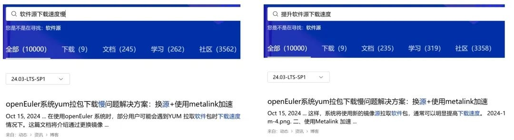

**概述**

3月31日，OpenAtom openEuler（简称: openEuler） 25.03
正式发布。该版本在系统基础能力、多样性计算、全场景支持、AI
推理和社区基础设施等方面发布众多创新特性，使 openEuler
的系统更智能、使用场景更广泛、开发更高效，成为社区首个高效创新开发版本。关于更多
openEuler 25.03 的特性解读，欢迎来 [openEuler Devloper Day
2025]{.underline} 现场了解！

在技术进展方面，openEuler 24.03 LTS引入ROS 2 Jazzy
Jalisco版本支持，不仅实现了Turtlesim仿真工具、rqt可视化工具链及全套ROS2命令行工具的适配，还自主开发了自动化移植工具ROT以提升适配效率。在提升开发者体验方面，openEuler社区官网搜索系统完成升级，结合多路召回与语义检索技术，大幅提升信息检索的精准度和用户体验。同时，openEuler论坛通知系统完成优化，开发者可以按需设置单帖追踪、分类订阅和邮件提醒，实现关键信息精准推送，避免信息遗漏。

此外，openEuler & MindSpore
DeepSeek全栈开源方案在华为伙伴大会上发布，该方案实现了端到端部署效率从天级缩短至分钟级的重大突破，显著提升了大模型推理性能。该方案在发布前已通过openEuler、MindSpore社区与北京大学的联合验证，成功完成生产环境测试。

在其他SIG组的工作进展方面，Embedded
SIG完善了KP920的XEN虚拟化支持，并与Zephyr
SIG完成架构重构实现端到端集成，同时推进了STM32MP257在TSN、嵌入式AI等领域的适配；大数据生态建设方面，BigData
SIG推动openAMDC、uadk-bigdata等创新项目取得阶段性成果，velox数据库加速库完成建仓。

兰州大学团队基于secGear的科研成果已被车联网权威期刊录用，该研究通过兼容Intel
SGX、ARM
TrustZone等可信执行环境技术，有效提升了车联网在高并发场景下的安全性和扩展性。

3月13日，2025-2026年openEuler技术委员会会议在苏州召开，会议重点审议版本规划、内核漏洞共建机制、AI
SIG技术路线等多项核心议题，并围绕包管理、虚拟化支持等技术方向制定发展路线，为下半年openEuler技术工作提供了明确指导。

本月报阅读时长15分钟。

**openEuler 25.03首个高效创新版发布**

3 月 31 日，openEuler 25.03
正式发布。该版本汇聚了产业创新力量，集合了众多开发者的智慧。1817
名社区开发者参与到版本特性的开发中，感谢大家的贡献。

openEuler 25.03 在系统基础能力、多样性计算、全场景支持、AI
推理和社区基础设施等方面发布众多创新特性，使 openEuler
的系统更智能、使用场景更广泛、开发更高效，成为社区首个高效创新开发版本。

关于更多 openEuler 25.03 的特性解读，欢迎来 openEuler Devloper Day 2025
现场了解！

立即下载：

https://www.openeuler.org/zh/download

**社区规模**

截至2025年3月31日，openEuler
社区用户累计超过400万。超过2.1万名开发者在社区持续贡献。社区累计产生
212.2K个PRs、112.9K条Issues。目前，加入openEuler社区的单位成员2007家，3月新增15家。

社区贡献看板（截至2025/03/31）

**社区事件**

**线上聊千遍，不如线下见一面！**

**openEuler Developer Day 2025 诚邀您共赴盛会**

openEuler Developer Day 2025 （简称 ODD
2025）将于4月11日，杭州萧山万怡酒店举办。

大会将全面展示全新发布的25.03创新版本特性、内核开发、多样性计算和全场景协同的技术成果、分享各行各业基于openEuler的商业实践。同时，ODD
2025也是社区的年度大型工作会议，协同讨论版本路线以及联合创新，期待大家莅临现场，一起深入研讨，碰撞更多的Idea，解决技术难题。

亮点剧透 \| openEuler Developer Day 2025来了

**openEuler & MindSpore DeepSeek全栈开源方案亮相华为伙伴大会**

2025年3月20日 -
21日，华为伙伴大会在深圳举办。openEuler社区联合MindSpore社区以生态共建者身份发布了openEuler与MindSpore
DeepSeek全栈开源方案，实现了端到端部署时长天级到分钟级，DeepSeek大模型推理性能开箱即优。现场演示&参与展台吸引了超100家行业龙头企业代表及产业专家围观。

值得关注的是，此方案正式发布前，openEuler社区、MindSpore社区与北京大学已经完成了场景验证，首次打通openEuler与MindSpore
DeepSeek全栈开源推理方案的生产环境部署实践。相关技术细节可浏览《北京大学联合openEuler与MindSpore发布DeepSeek全栈开源解决方案》。

原文阅读：

https://mp.weixin.qq.com/s/mPUYmDTEYWVpXB824gsq-w

{width="5.768055555555556in"
height="3.8875in"}

**兰州大学研究团队基于secGear的科研成果在车联网权威期刊上发表**

3月初，兰州大学研究团队的研究论文"A lightweight authentication scheme
for VANETs based on secGear"被中科院TOP期刊TVT（IEEE Transactions on
Vehicular
Technology）录取为长文（Regular）。该研究通过secGear对不同可信执行环境技术的兼容（Intel
SGX、ARM
TrustZone等）提升车联网高并发场景下的实用性与扩展性，为动态拓扑与资源受限的VANETs提供了兼具安全与效率的底层支撑。

论文链接：

https://ieeexplore.ieee.org/document/10906442

原文阅读：

https://mp.weixin.qq.com/s/GGlTXNUNguHgJUn\_LWIKqQ

**Zephyr Project Meetup在上海举办**

3月28日，openEuler Zephyr、Embedded
两个SIG组协同Linux基金会Zephyr项目、NXP在NXP上海办公室举办了Zephyr项目在国内的第一次Meetup。openEuler
TC委员会委员任慰、湖南大学教授谢国琪出席该活动，并与现场专家分享并交流社区与Zephyr项目的合作发展、嵌入式实时虚拟机ZVM(Zephyr-based
Virtual Machine)的最新进展。

**openEuler on RISC-V&deepin Meetup在北京举办**

3月22日，由 openEuler 社区和 deepin（深度）社区联合主办的"openEuler on
RISC-V & deepin Meetup"在北京成功举办。活动聚焦于AI
OS、大模型、RISC-V等前沿技术领域，邀请了多位行业内的技术专家进行现场分享，吸引了众多技术爱好者和专业人士参与。

原文阅读：

https://mp.weixin.qq.com/s/mPUYmDTEYWVpXB824gsq-w

**社区治理**

**2025-2026年openEuler技术委员会会议在苏州召开**

3月13日，2025-2026年openEuler技术委员会第一次线下会议在苏州召开。本次会议由中国移动云能力中心、中央企业算力网络创新联合体承办。感谢中国移动云能力中心的支持。

本次会议重点审议了2025年版本规划、内核漏洞共建机制、AI
SIG技术路线等多项核心议题，并就多版本包支持、epkg新型包管理工具、工具链选型以及Kata-Containers原生支持等关键技术方向展开深入研讨。这也为下半年openEuler社区的技术工作提供了明确指导，也为深度参与社区建设的成员单位在技术布局与战略创新方面明确了方向。

原文阅读：

https://mp.weixin.qq.com/s/CA6Q2RN4kEUj9sqAQMNEnQ

**技术进展**

**openEuler引入ROS2 Jazzy，推动操作系统与机器人技术的融合**

近日，ROS SIG开发者林鸿宇成功为openEuler 24.03 LTS引入ROS 2 Jazzy
Jalisco（以下简称 ROS2
Jazzy）版本支持，不仅实现了Turtlesim仿真工具、rqt可视化工具链及全套ROS2命令行工具的支持，还自主开发了自动化移植工具ROT以提升适配效率。

ROS2 Jazzy延续了 ROS2 的分布式架构设计理念，升级至 RTI Connext 6.1.1
以改善大规模节点通信时的延迟抖动，并首次引入 rmw\_zenoh
中间件预览版，为云端-边缘端的广域网协同提供了新选择。

• 图为 ROT 工具界面

原文阅读：

https://mp.weixin.qq.com/s/2ZInR6kzT\_Dk1Qmr7J4PRg

相关文档：

https://openeuler-ros-docs.readthedocs.io/en/latest/other-tutorials/openEuler-turtlesim-jazzy-example.html\#

交流邮箱：

hongyu.ros@isrc.iscas.ac.cn

**openEuler论坛通知系统升级，重要信息不遗漏**

为帮助开发者更高效地参与社区技术交流，我们优化了openEuler论坛通知系统，并整理了详细的论坛通知配置指南。开发者可以按需设置单帖追踪、分类订阅和邮件提醒，实现关键信息精准推送，避免信息遗漏。

此次论坛通知优化的关键点包括：

1.  精准可控：自由选择关注范围（单帖/分类）和通知频率

1.  多重保障：支持站内提醒+邮件推送双通道，重要信息零遗漏

1.  智能汇总：定期生成社区动态报告，高效回顾精华内容

欢迎大家完成通知设置，以确保及时获取社区最新动态和技术支持。如有任何疑问，请联系 contact@openeuler.io

查看完整配置指南：

https://forum.openeuler.org/t/topic/7298

**openEuler社区搜索系统性能突破**

作为openEuler社区的核心门户，openEuler官网承载着从社区治理、技术资源到动态消息等全方位信息。面对日益增长的内容体量，搜索功能的高效性与精准性是提升用户体验的关键之一。

针对搜索功能面临的语义理解不足、长尾词检索效果不佳等问题，openEuler基础设施团队对官网进行了一次架构升级，通过引入多路召回+语义检索的混合架构，显著提升了搜索精准性与用户体验。

比如，当我们在openEuler官网搜索\"软件源下载速度慢\"或\"提升软件源下载速度\"等多样化表述时，智能搜索系统能够精准识别真实需求，始终返回最相关的换源配置指导文档，有效解决传统搜索因关键词差异导致的\"搜不准\"问题。

官网搜索系统升级3个月以来，有效点击搜索占比提升30%+，用户搜索长尾问题的命中率显著提高。同时融合了CSDN、华为云博客等优质内容源，扩展结果多样性。本实践方案将在openEuler
Developer Day 2025（Poster session）中展示，欢迎现场交流。

**openEuler Embedded SIG 工作进展：**

本月，openEuler Embedded SIG
在基础架构适配与生态协作方面取得重要进展，主要涵盖以下内容：

完善了KP920的支持，包括XEN虚拟机的支持，显著增强虚拟化能力。

-   -   

联合Zephyr SIG完成架构重构，实现源码级端到端集成（openEuler Embedded +
Zephyr），同时Zephyr SIG也依托openEuler git
LFS功能实现了完整的镜像支持：https://gitee.com/src-openeuler/zephyr/tree/mirror

 

持续与米尔科技、意法半导体完善STM32MP257的支持，本月实现了TSN，Embedded
AI和嵌入式图形的适配。

**openEuler BigData SIG 工作进展：**

BigData
SIG持续构建和完善openEuler社区下的大数据生态，打造活跃的大数据交流平台，丰富和提升大数据组件功能和性能，发掘用户大数据需求，孵化有潜力的大数据组件。

本月，BigData SIG工作主要在以下几个方面：

【创新项目的进展】

1.  高性能的键值内存数据库openAMDC，兼容RESPv2/v3协议，支持所有Redis命令以及数据结构。本月已完成合入创新项目测试验证和产品文档编写。

项目地址：https://gitee.com/openeuler/openAMDC

1.  uadk-bigdata旨在为大数据领域构建一个从硬件到应用层的全栈加速解决方案。该项目整合了UADK的能力和OpenSSL
3.0建立一个有效的通路，并将JDK与OpenSSL
3.0连接起来，从而为大数据应用提供一个完整的硬件加速方案。目前，uadk-bigdata已经完成功能实现，代码和文档已合入。

1.  

项目地址：https://gitee.com/openeuler/uadk-bigdata

1.  velox是一个用C++编写的高性能数据库加速库，提供了可重用、可扩展且与具体语言无关的数据处理组件，用于构建、增强或替换现有数据管理系统中的执行引擎，旨在加速数据管理系统并简化其开发。本月已经完成建仓工作，后续将在openEuler社区中持续孵化发展。

项目地址：https://gitee.com/openeuler/velox

1.  【开源实习进展】

开源实习项目《Bigtop
Manager：完善单测部分》已由学生完成测试用例开发并通过验证，顺利结项。

BigData SIG链接：

https://gitee.com/openeuler/bigdata/wikis/bigdata

**软硬件兼容性测评**

截至2025年3月31日，openEuler软硬件兼容性测评新增64个，其中北向（ISV）新增52个，南向（IHV）新增11个，OSV新增1个。

兼容性列表：\
https://www.openeuler.org/zh/compatibility/\
OSV技术测评列表\
https://www.openeuler.org/zh/approve/

**安全公告**

2025年3月社区共发布安全公告123个，修复漏洞293个（其中 Critical 1个，High
68个，其它224个）。

**重点漏洞提醒**

如下漏洞评估影响较大，请重点关注。

应用程序调用SSL\_select\_next\_proto函数时，若传入的参数协议列表为0，则将返回无效的内存指针，如果应用程序将该指针发送至对端，则会发生机密性丢失。调用SSL\_select\_next\_proto函数时，若未检查参数有效性，则可能触发该漏洞，触发后可能会导致程序崩溃甚至255字节内存数据发送至对端，导致机密性丢失。此问题的严重性被openssl官方评估为"低"，此问题通常不受攻击者控制，不太可能发生主动利用。**（CVE-2024-5535）**

CVSS评分为9.1分 

公告链接：

https://www.openeuler.org/zh/security/cve/detail/?cveId=CVE-2024-5535&packageName=compat-openssl11

影响范围：

openEuler-24.03-LTS

openEuler-24.03-LTS-SP1

在PostgreSQL
PL/Perl中，错误的环境变量控制允许非特权数据库用户更改敏感的进程环境变量（例如PATH）。这通常足以允许任意代码执行，即使攻击者没有数据库服务器操作系统用户。影响PostgreSQL
17.1、16.5、15.9、14.14、13.17和12.21之前的版本。**（CVE-2024-10979）**

CVSS评分为8.8分

公告链接：

https://www.openeuler.org/zh/security/cve/detail/?cveId=CVE-2024-10979&packageName=postgresql-13

影响范围： 

openEuler-20.03-LTS-SP4

**漏洞防护**

openEuler社区针对在维版本例行修复漏洞，发布安全补丁。建议用户关注openEuler官网安全公告，及时安装漏洞补丁进行防护。

openEuler 安全公告：

https://www.openeuler.org/zh/security/security-bulletins/

**感谢每一位朋友、开发者的支持**

因为大家的辛勤贡献，openEuler
的每一天都发生着好的事情。小编限于视野和能力，难免有所遗漏，在此表示歉意。同时，衷心感谢社区成员单位、SIG组和开发者朋友们的贡献：

\* 以上不分先后顺序

如果您希望在月报中增加您的工作内容，或对内容有任何改进建议，请联系wengqiaozhen@openeuler.sh。
