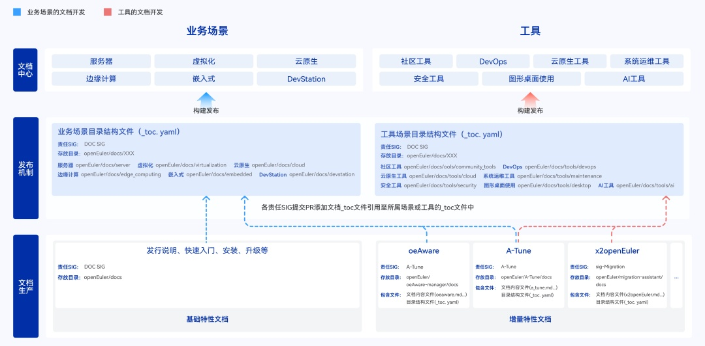
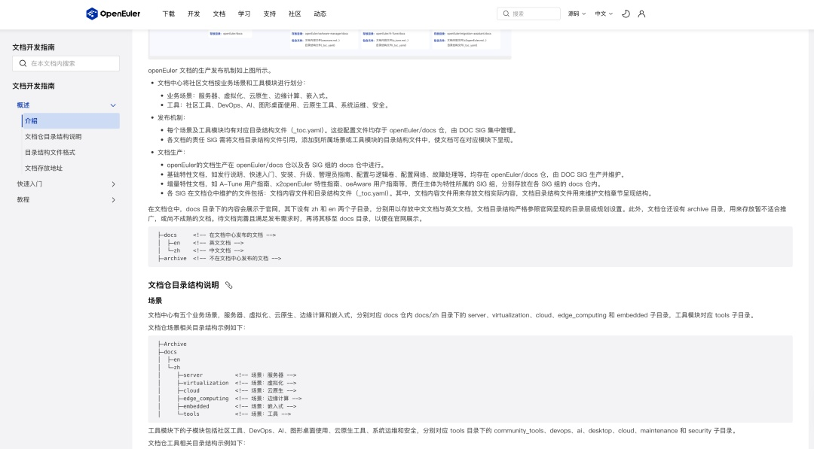
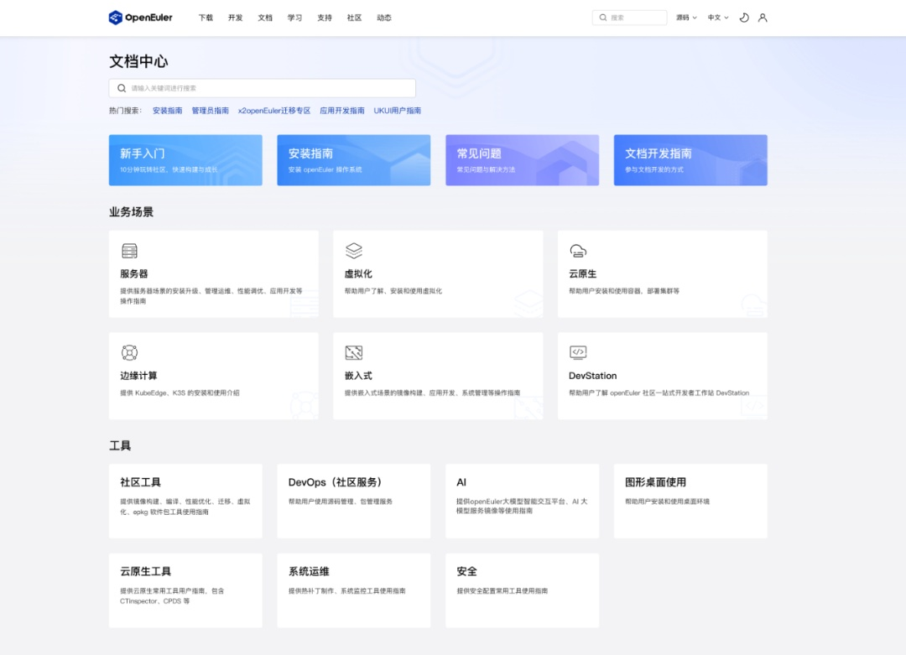
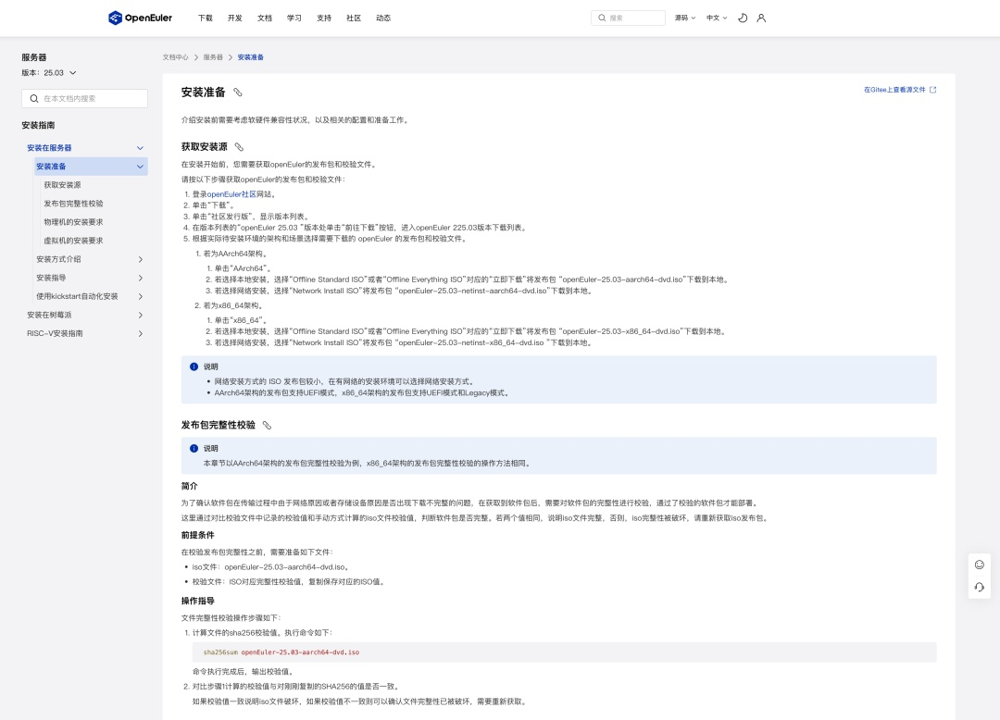
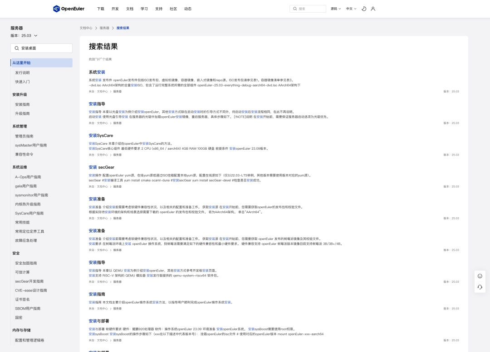
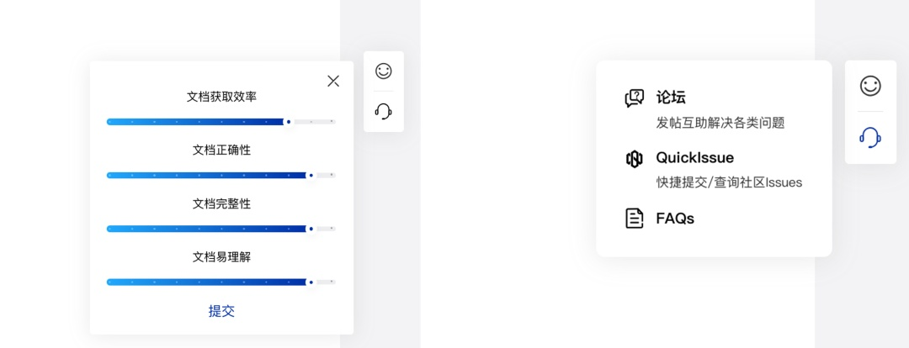

**背景**

OpenAtom
openEuler（简称"openEuler"）文档中心是面向产品使用者构建的一套围绕社区发行版，覆盖各业务场景与工具的文档体系。在去年社区满意度调研中收集到文档使用者们反馈"用户找指南找了很久才找到"，"现在的文档太复杂了，讲的太多了"
，"文档更新不及时"，"文档没有串联起来的逻辑，感觉像是堆砌"之类的反馈。

经过分析发现，当前的文档信息架构是一套文档包融合所有业务场景，文档堆砌、内容组织混乱，用户无法从当前文档体系中快速查阅自己关心的文档。并且由于当前的文档生产机制，存在沟通审批效率低、文档贡献门槛高等问题，导致文档更新不及时，内容不正确或不完整。

**问题解决**

针对这些问题，此次文档中心改版升级，提升了文档获取和使用体验。主要包括以下两方面的优化：

**① 文档生产机制建立**

建立开源文档的生产、发布机制，文档生产下沉到各SIG组，各SIG组协同分工，通过沉淀文档模版、写作规范，加强流水线门禁管理，保障文档质量。

**《文档开发指南》已上线官网文档中心**，文档开发者可以根据指南参与openEuler文档开发。

**② 文档中心重构**

按业务场景，分用户角色对产品文档架构进行重构，改变一套文档包融合所有内容的现状，将文档拆分成6大业务场景，7个工具模块，包括70+本手册，同时优化文档中心视觉效果、交互方式、搜索体验、评分机制等。

**文档中心首页**：按照业务场景和工具分开呈现

**手册介绍页**：信息架构上按照基础特性和增量特性进行划分，也便于文档贡献者、文档使用者（特别是新手用户）的使用

**提升文档内搜索的结果准确率**，**并增加文档评分和问题反馈入口**，随时可以对文档质量进行评价，同时也方便定位文档问题，提升文档质量

**访问地址**

改版后的文档中心已经上线openEuler官网，欢迎体验\~

文档中心：https://docs.openeuler.org/zh/

文档开发指南：https://docs.openeuler.org/zh/docs/common/contribute/directory\_structure\_introductory.html

**openEuler Developer Day 2025**

**现场体验**

也欢迎大家来 openEuler Developer Day 2025
展台和用户体验设计专题进行新文档发布机制的流程体验和讨论，会有神秘礼品等您\~！

**展台**：openEuler社区文档生成机制发布与体验升级

时间：全天

**SIG Gathering 用户体验设计专题**

时间：上午10:00\~12:00

地点：杭州萧山万怡酒店B1层秋月厅

**联系我们**

如果您在使用过程中有任何建议，可以通过以下方式联系我们，欢迎一起交流讨论：

邮件列表：doc@openeuler.org

 

doc仓：https://gitee.com/openeuler/docs

社区论坛：https://forum.openeuler.org

微信交流群

