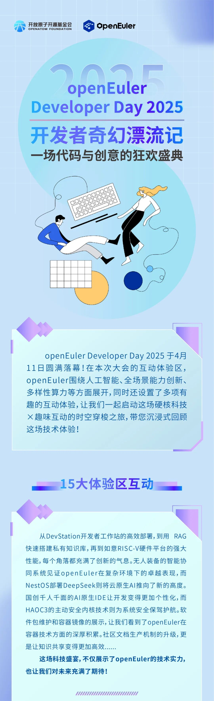
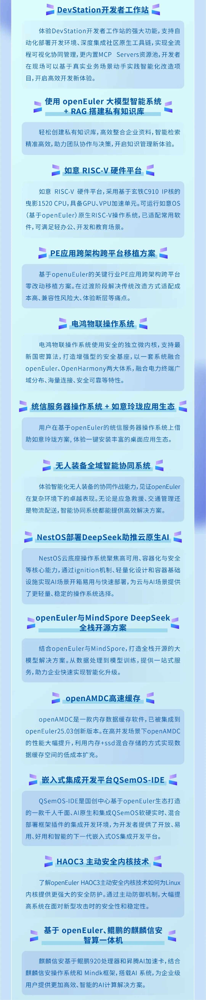

**本次互动体验区已圆满结束，若您还想体验这些精彩的Demo，可以前往以下链接：**

DevStation开发者工作站：https://www.openeuler.org/zh/download/\#openEuler%2025.03

NestOS：https://gitee.com/openeuler/NestOSHAOC3

主动安全内核技术：https://gitee.com/src-openeuler/kernel/blob/openEuler-25.03/0005-haoc-kernel.patchopenEuler

用户软件仓EUR：https://eur.openeuler.openatom.cn/

社区文档中心：https://docs.openeuler.org/zh/

统信服务器操作系统+如意玲珑应用生态：https://github.com/OpenAtom-Linyaps金蝶天燕openAMDC：https://gitee.com/openeuler/openAMDC
