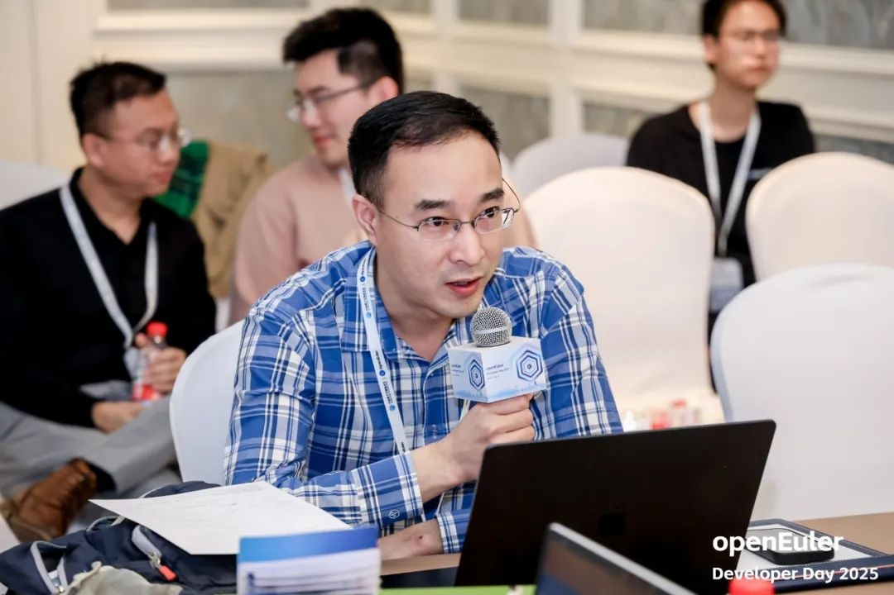

**OERV**.

中国科学院软件研究所 OERV 团队

> 2025 年 4 月 11 日，openEuler Developer Day 2025 在北京召开，RISC-V
> 分论坛由 RISC-V SIG
> 组主办，并且邀请了来自中国科学院软件研究所、北京开源芯片研究院、阿里巴巴达摩院、进迭时空、蓝芯算力和算能科技等目前主流
> RISC-V 硬件厂商专家，共同探讨了 RISC-V 在服务器领域的应用与发展。
>
> 本次会议围绕 OpenAtom openEuler（简称"openEuler"）  on RISC-V
> 的发展与规划与厂商实际生态诉求展开，重点介绍了 openEuler on RISC-V
> 基于服务器方向的 2025-2026 年版本演进计划、ROS on RISC-V
> 的发展规划、各家厂商关于 RISC-V
> 软硬件在服务器领域的演进思考与应用分享。
>
> **会议精华内容如下：**

**RISC-V 生态简述**
-------------------

> openEuler常务委员会委员、中国科学院软件研究所高级工程师屈晟首先回顾了
> RISC-V 架构在 openEuler
> 社区的发展历程，简要介绍了内核同源计划，并重点讲解了 RVCI
> 和基础设施平台的相关内容，分析了 RVCK
> 计划的难点与未来愿景。会议最后，介绍了今天的主要议题，并提出了未来的发展规划。

**openEuler on RISC-V 基于服务器方向的 2025-2026 年版本演进计划**
-----------------------------------------------------------------

> openEuler TC & RISC-V SIG Maintainer 王经纬首先介绍了 openEuler RISC-V
> 工作组的核心目标：打造为国际一流的 RISC-V
> 社区发行版，解决生态碎片化问题。介绍 RISC-V SIG
> 过去做了什么，之后要做的服务器生态是什么样的，展望 26.03
> 版本。通过\"上游优先\"策略推动内核标准化，完成 openEuler 24.03/25.03
> 版本（6000+软件包适配），支持香山等硬件。未来将联合厂商共建生态，重点优化高性能计算场景，并计划
> 2026 年发布首个支持标准 RISC-V 服务器平台的 LTS 版本。

**北京开源芯片研究院:香山如何支持 Server Platform 规范**
--------------------------------------------------------

> 北京开源芯片研究院产品经理张健介绍了香山处理器（昆明湖/南湖系列）对
> RISC-V 服务器规范的最新支持进展。服务器规范从指令集 IP
> 运行时固件和安全等维度定义了规范。这个规范的数量众多，达到几百条。几百条规范中又涉及到大量的选项。如何实现并不是一个很简单的工程问题。北京开源芯片研究院依托香山的开源方法，通过收集会员的分布式存储等业务场景，充分理解目标场景之下做了从业务自顶向下做出拆解。通过拆解识别出关键的测试场景以及核心的指令集实现。通过典型验证用例和业务验证用例的结合，实现对服务器场景的规范的支持。目前已经在
> RVA20 上测试通过 MySQL, Redis, Memcached 等存储业务用例，在 RVA23
> 上率先与 openEuler RISC-V SIG 完成基础软件包测试。

**达摩院: 共建 RISC-V 通用高性能软件生态**
------------------------------------------

> 阿里巴巴高级技术专家王云龙分享了 RISC-V
> 在高性能计算领域的进展与挑战。硬件方面，玄铁 C930 等 CPU IP
> 已发布，未来 1-2 年将涌现高性能 SOC
> 芯片；软件生态初步完善，但编译器、内核版本滞后，需升级以支持 RVA23
> 新特性。关键挑战包括基础设施薄弱、Server Platform
> 标准缺失（如电源管理、外设接口），需推动软硬件协同标准化，加速产品化落地，实现
> RISC-V 在数据中心等高性能场景的应用突破。

**openEuler RISC-V RVA23 扩展支持计划与展望**
---------------------------------------------

> RISC-V SlG Maintainer & Compiler SlG Committer 周嘉诚介绍了 openEuler
> 对 RISC-V RVA 23 规范的支持计划。RVA23 规范新纳入必选的
> Vector、Hypervisor
> 等一系列扩展的使能需要较新版本的核心软件包，因此团队正在密切关注
> openEuler
> 后续版本核心软件包的选型工作，若最终结果未能完全满足需求，则准备将所需功能从高版本内核回迁到
> openEuler 内核，同时基于早先验证工作取得的经验尝试换用 RVA23
> 支持较好的 LLVM
> 编译器套件进行系统的构建。团队未来还将基于位操作及向量等扩展分阶段优化存储、网络等场景的性能，实现虚拟化支持，并推动
> RVA23 及后续基线落地，提升 RISC-V 在服务器领域的竞争力。

**ROS 在 openEuler on RISC-V 的发展与规划**
-------------------------------------------

> ROS SlG Maintainer&中国科学院软件所工程师王晓云首先介绍了 ROS 在
> openEuler RISC-V 生态的适配进展，包括已完成 ROS 2 Humble 版本
> 860+，ROS 1 Noetic 版本
> 300+软件包的移植发版，并成功应用于无人车、无人机等机器人场景。随后重点展示了团队开发的自动化移植工具和详尽的openEuler
>  ROS
> 开发使用在线文档与视频教程，显著降低了开发者的使用门槛。最后提出未来规划，包括适配
> ROS 2 最新版本、25 年开源使用 RISC- V
> 处理器作为控制器的无人车软硬件等，并呼吁更多开发者、硬件厂商和机器人厂商加入共建
> RISC-V 机器人生态。

**UEFI on RISC-V 的重要性和落地探索**
-------------------------------------

> 在进迭时空 UEFI 开发负责人梁辉的分享中，其技术演讲首先介绍了 UEFI 和
> EDK2 的基本概念，强调 UEFI 通过标准化接口解耦硬件与操作系统、EDK2
> 开源框架的模块化与跨平台特性；随后探讨了 UEFI 在 RISC-V
> 架构落地的重要性，包括提升硬件兼容性、统一软件生态及推动安全技术创新；接着分析了
> RISC-V 服务器平台在指令集、SoC
> 设计、软件规范及安全模型的标准化需求；并详细阐述了 EDK2 PEILess 的
> RISC-V 启动流程实现，同时提及服务器端 BMC、SMBIOS、 ACPI
> 等功能的适配；以及展示了搭载该方案的 MUSE\_PI\_Pro 单板计算机，支持
> NVMe/USB 启动和 UEFI Shell 环境，为 RISC-V
> 生态的商用化提供可落地的技术路径。

**RVCK 开发树的最新进展和提交规范**
-----------------------------------

> 中国科学院软件研究所李航帆近日在技术分享中介绍了 RISC-V Common
> Kernel（RVCK）项目进展。作为 openEuler 官方在 RISC-V
> 架构的内核补丁提供方，RVCK-OLK 开发树聚焦于完善 RISC-V
> 生态支持，已实现对算能 SG2042、玄铁 TH1520 等硬件平台的适配，并完成
> AIA 驱动、内核态浮点支持等关键特性回合。项目当前正推进 RVA23 标准与
> Server Platform 规范落地，计划年内支持服务器级硬件方案，重点攻关
> SBI2.0/3.0 扩展、IOMMU 和 ACPI 适配等方向。在协作机制上，RVCK
> 采用强制推送的变基迭代模式维护补丁集合，通过 issue 需求追踪、三级 CI
> 验证（代码规范审查、硬件基线比对、自动化测试补充）保障代码质量，并建立标准化补丁合并流程，鼓励厂商、开发者通过测试用例贡献参与生态共建。目前该项目已支撑
> openEuler 24.03 等多个版本发布，未来将持续推动 RISC-V
> 服务器生态标准化进程。

**RISC-V 数据中心 CPU 面临的 RAS 挑战与前景**
---------------------------------------------

> 蓝芯算力软件与生态负责人许庆伟在演讲中系统剖析了 RISC-V 数据中心 CPU
> 的
> RAS（Reliability、Availability、Serviceability）技术发展路径，首先回顾了
> RAS 从基础硬件容错到 AI
> 预测隔离的两阶段演进历程，解析了其多层级协同的核心功能与数据中心场景下的关键价值；随后聚焦
> RISC-V
> 架构，指出其在错误检测工具链覆盖、生态碎片化、新型威胁应对等领域的技术瓶颈，并提出标准化协同、异构计算融合及开源工具链三大突破方向；最后展望
> RISC-V RAS 通过生态协同与 AI 驱动加速追赶 x86/ARM，未来将深度渗透 AI
> 大模型与高性能计算场景，构建高可靠、自愈式技术生态

**openEuler 24.03 LTS 在算能 SRA3 服务器实践**
----------------------------------------------

> 北京算能嵌入式软件工程师魏超详细展示了其 RISC-V 架构服务器 SRA3 与
> openEuler 24.03 的深度适配成果。该服务器搭载 64 核 SG2044 处理器，支持
> 128GB 内存及多精度算力，适用于 AI
> 推理、高性能计算等场景。技术团队系统解析了 SRA3 从 Bootrom
> 硬件初始化到 UEFI 固件、Grub2 引导及 Linux
> 内核启动的全栈软件流程，并重点实现了 ACPI 关键表项部署与 UEFI
> 运行时服务调用机制，通过虚拟映射与内存管理单元切换保障系统兼容性。同时，结合可信启动与安全启动技术强化系统安全性，现场演示了
> openEuler 24.03 在 SRA3 上的稳定运行。未来，算能计划推动 RISC-V
> 生态标准化，致力于实现 RV64
> 处理器与操作系统二进制镜像的跨平台互操作性，并积极参与 openEuler
> 内核同源计划，助力软硬件协同生态建设。

**服务于硬件测试的自动化测试系统 RAVA 的规划与展望**
----------------------------------------------------

> 中科院软件所工程师&openEuler QA SIG Committer 吴洁详细介绍了 RAVA
> 自动化测试系统，该系统旨在通过标准化测试流程加速生态适配与验证。RAVA
> 以构建统一兼容性基准为核心目标，为操作系统及内核提供多平台综合测试，并面向
> RISC-V
> 芯片厂商、内核开发者提供门禁测试、性能分析等开源服务，其架构基于
> Linaro LAVA 框架，支持 PR
> 触发与网页预约双模式自动化测试，覆盖内核功能、性能基准、安全漏洞等五大类测试套件，并实现硬件性能数据的智能对比分析。规划显示，RAVA
> 将于 2025 年初步完成基础框架与硬件适配，2026
> 年扩展至多设备测试资源开放，最终建成公共开放的权威硬件测评平台，持续推动
> RISC-V 生态的标准化与高性能演进。

**基于 RISC-V 架构和智算卡的 AI 实践**
--------------------------------------

> 中科院软件所软件工程师郑祖岭在题为《基于 RISC-V 架构和智算卡的 AI
> 实践》的报告中，系统介绍了国产化智能硬件\"如意
> AI-PC\"的创新突破与实践成果。该工作站以 64 核玄铁 C920 RISC-V 处理器与
> 48TFLOPS 智算卡为核心算力底座，搭载自主可控的如意 OS（openEuler
> 发行版），通过端侧大模型本地化运行、全栈开源技术架构（覆盖 RISC-V
> 芯片/开源 OS/AI 框架）及多模态 AI 支持（包含 DeepSeek、Llama2 等 LLM
> 及 Yolo 等 CV 模型），实现了数据安全与高性能 AI
> 推理的融合。报告重点展示了 RISC-V
> 架构在边缘智能场景的落地应用，包括基于本地知识库的 RAG
> 智能问答系统、集成系统设置/代码助手/语音交互等六大功能的通用 AI
> 助手，彰显了国产 RISC-V 平台在推动端侧 AI
> 技术创新与行业智能化转型中的关键价值。

**openEuler x RISC-V: 打造开源无人机与智能小车的探索与实践**
------------------------------------------------------------

> 中科院软件所 ROS-RV 乘风小队顾嘉琪展示了基于 openEuler 与 RISC-V
> 架构的开源无人机及 MiracRV 智能小车项目。无人机采用 RISC-V
> 开发板与飞控系统协同工作，通过视觉节点锁定目标坐标并驱动双轴 PID
> 控制器实时调整飞行姿态，形成\"视觉感知-动态修正-动作执行\"的闭环控制；智能小车以
> LicheePi 4A 搭载 openEuler 24.03
> 构建分层架构，依托建图导航算法包实现地图构建、路径规划与运动控制，通过
> MAVROS
> 协议桥接上层应用与底层硬件驱动。项目在推进过程中面临硬件适配、驱动支持与系统功能完善等挑战，包括
> RISC-V
> 版激光雷达驱动缺失、多开发板系统兼容性适配及传感融合精度提升需求，展现了开源生态与
> RISC-V 架构在机器人领域的落地能力与探索路径。

> **如果您对上述分享的内容感兴趣，或者想参与到项目当中**
>
> **欢迎扫描二维码加入 openEuler RISC-V SIG **

**openEuler TC & RISC-V SIG Maintainer
王经纬 ****加群请备注 OERV **
