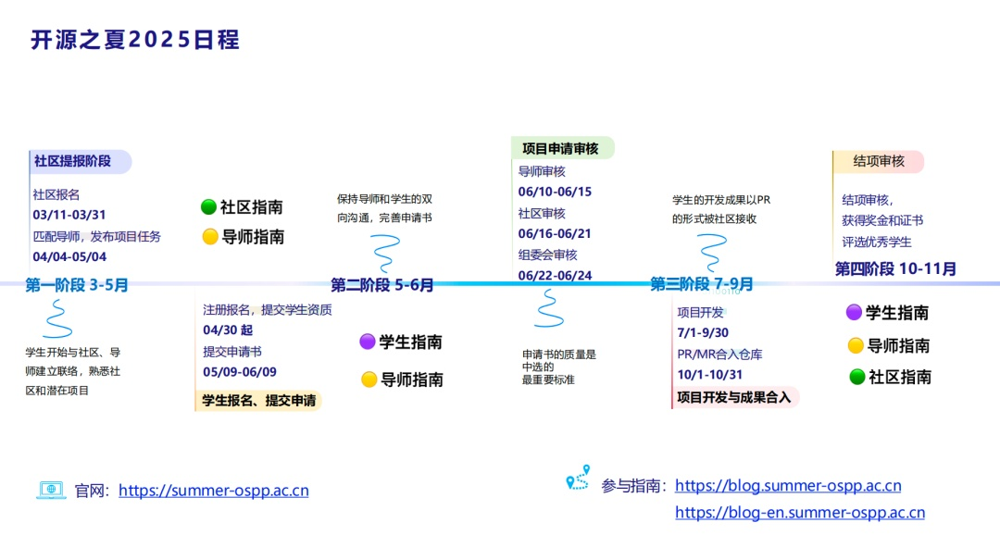
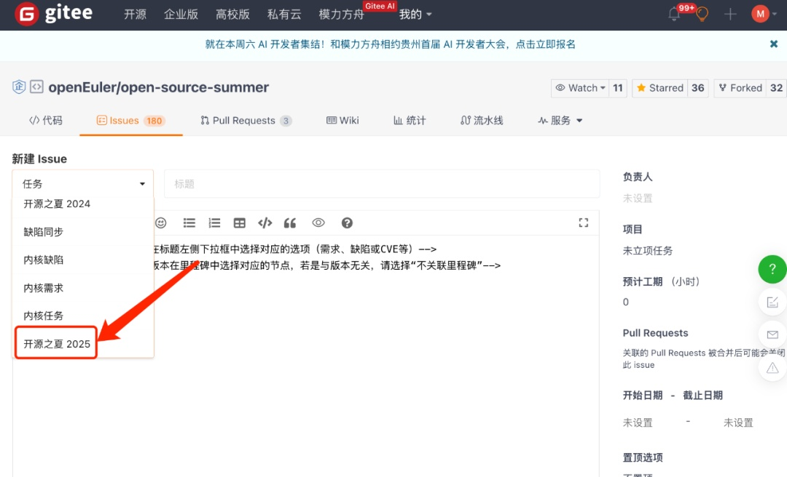
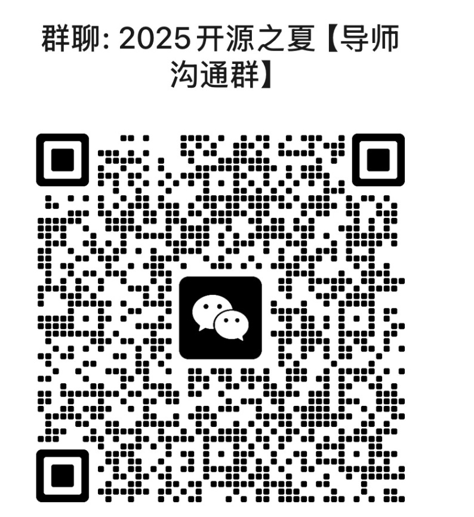
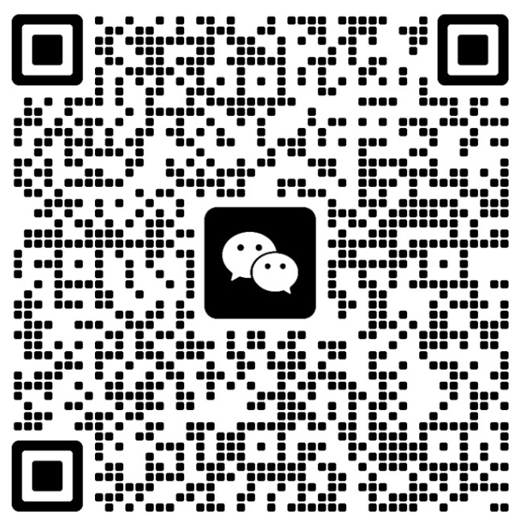

开源之夏是中国科学院软件研究所发起的"开源软件供应链点亮计划"系列暑期活动，旨在鼓励高校学生积极参与开源软件的开发维护，促进优秀开源软件社区的蓬勃发展。活动联合各大开源社区，针对重要开源软件的开发与维护提供项目开发任务，并向全球高校学生开放报名。2024
年OpenAtom
openEuler（简称\"openEuler\"）社区共上线96个项目，计收到319份申请书，最终产生95位中选学生；在经历了3个月的项目开发和1个月的代码合入期，最终82位同学通过了导师、社区和组委会的考核，项目得以成功结项。新的一年，我们将继续携手各位导师，为社区持续提供新生力量。

**Part 1**

**2025 开源之夏活动流程**

**Part 2**

**导师招募**

目前活动正在项目征集阶段，盛情邀请社区资深开发者成为【开源之夏2025】的项目导师。

**导师出题**：导师可结合openEuler社区的开发与维护设计mini任务，开放给全球高校学生报名申请。项目任务可以为openEuler的功能性完善，或者基于openEuler
做创新性开发等，结项标准以PR必须合入社区主仓库为目标。

**导师招募对象：**

● 在openEuler社区有贡献经验的社区开发者

● 高校老师

● 往届开源之夏优秀学生

具体详情可参考官网导师指南：

https://summer-ospp.ac.cn/help/mentor/

**导师报名通道：**

**[https://shimo.im/forms/N2A1gPzbB1cmxYqD/fill]**

（复制链接到浏览器即可报名）

**导师验证：**

报完名待社区审核导师信息后需点击系统邀请邮件中的链接登录系统、填写个人信息、完成身份验证。

**导师验证截止日期为 5 月 4 日
24:00**，未完成导师身份验证的项目无法在官网发布。

导师不得同时以学生开发者身份参加本活动，如在活动过程中发现此情况，组委会将取消其参与资格、导师奖金及学生奖金。

**导师出题：**

项目任务导师以新建issue的形式将任务提交到以下仓库

提交地址：[https://gitee.com/openeuler/open-source-summer/issues]

新建issue时选择类型"开源之夏2025"，会自动弹出模板

请按照最新模板出题。  

**注意：**

● 一个导师仅能出一个项目任务；

●
导师报名&项目任务提交截止时间：2025年4月27日18:00（需给社区项目上传时间）

●
开源之夏鼓励并优先支持开发类项目（功能性完善、创新性开发等），重点支持
操作系统、编译器等基础软件类项目，以及与 RISC-V 生态相关的关键项目；
一位导师指导一个项目。

**●新变化：遵循组委会要求，今年不再发放导师结项报酬。**

**导师交流群：**

欢迎扫码进群-2025 openEuler OSPP导师交流群；若群无法加入则联系 openEuler
小助手 （微信号：openeuler123）发送"导师"即可入群。

**Part 3**

**学生相关**

学生可自由选择项目，与社区导师沟通实现方案并撰写项目计划书。被选中的学生将在社区导师指导下，按计划完成工作，并将成果贡献给社区。社区评估学生的完成度，主办方根据评估结果发放资助金额给到学生。

**学生可获得的奖金：**

进阶：奖金人民币 12000 元

基础：奖金人民币 8000 元

难度分级由社区根据项目任务决定。

对openEuler开源之夏项目感兴趣的同学可扫码入群。

若群已满，可私戳小助手号备注"开源之夏"进入交流群。

**活动官网：**[https://summer-ospp.ac.cn/]

**官方邮箱：**[org@summer-ospp.ac.cn]
