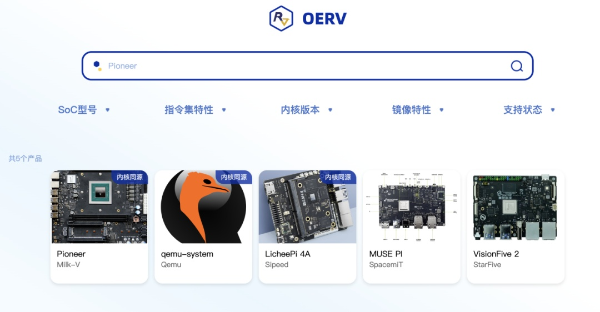

**概述**

2025年2月21日，2025-2026年OpenAtom openEuler(简称:
openEuler)委员会第一次会议在北京召开，本次会议任命胡欣蔚为2025-2026年openEuler技术委员会主席、梁冰为品牌委员会主席，并就社区未来发展方向提出了指导建议。

在近期技术发展方面，openEuler成功完成了意法半导体STM32MP257硬件适配，推动嵌入式生态扩展，并计划进一步完善ROS2镜像、混合关键性系统镜像等；AI推理网关服务Chatig正式支持公有云部署，支持DeepSeek-R1、DeepSeek-V3等13种大模型，提供多模型切换、数据隐私保护、内容审核、QoS限流和用户鉴权等功能，并通过统一API对外提供服务；RISC-V
SIG完成了Kata-Containers相关基础软件的RISC-V架构支持工作，并推出了第三方镜像网站，为开发者提供统一的OERV板卡镜像索引。

openEuler社区积极推动开源生态繁荣，在FOSDEM
2025、中国RISC-V生态大会及RISC-V Tokyo
Day等活动上分享近期技术成果，推动RISC-V生态发展。

本月报阅读时长10分钟。

**社区规模**

截至2025年2月28日，openEuler
社区用户累计超过395万。超过2万名开发者在社区持续贡献。社区累计产生
208.4K个PRs、111.4K条Issues。目前，加入openEuler社区的单位成员1992家，2月新增21家。

社区贡献看板（截至2025/02/28）

**社区事件**

**openEuler on RISC-V SIG**

**持续在各大技术大会中分享其生态建设新进展**

**FOSDEM 2025**

-   2025年2月1日，RISC-V SIG 在 FOSDEM 2025 大会分享 RISC-V
    虚拟化方向、以及在 RustVMM、Cloud-hypervisor、Kata-Containers
    等上游社区取得的最新进展。RISC-V SIG 已经完成了 Kata-Containers
    依赖的相关基础软件的 RISC-V 架构支持工作，并在 openEuler on RISC-V
    平台上完成了首次验证。

**中国RISC-V生态大会和RISC-V Tokyo Day**

-   2025年2月27日至2月28日，RISC-V SIG 分别参加 RISC-V Tokyo Day 与中国
    RISC-V 生态大会，介绍了 openEuler 在 RISC-V 上过去的进展，分析当前的
    RISC-V
    生态发展阶段并与对未来在标准服务器发行版上的开发工作进行了分享。

**社区治理**

**2025-2026年openEuler委员会第一次会议在北京召开**

2025年2月21日，2025-2026年openEuler委员会第一次会议在北京中科院软件所召开。

本次会议openEuler委员会任命胡欣蔚为2025-2026年openEuler技术委员会主席、梁冰为品牌委员会主席，审议了技术委员会、品牌委员会、项目群办公室等各部门的2025年度规划，并就社区未来发展方向提出了指导建议。

会议感谢环节，openEuler委员会熊伟主席回顾了openEuler开源五年所取得的成绩，并向2023-2024年openEuler委员会江大勇主席颁发感谢信。

**技术进展**

**openEuler成功完成了意法半导体STM32MP257硬件适配，推动嵌入式生态扩展**

近期，openEuler携手意法半导体和米尔科技，成功完成了2025年"openEuler
Embedded的生态扩展计划"的首款硬件适配。此次适配的SoC型号为STM32MP257，开发板型号为MYD-LD-25x。STM32MP257是一款面向工业应用的高性能微处理器，具备双核Cortex-A35
64位核心，主频高达1.5GHz，还集成了400MHz的Cortex-M33核心。此外，它还配备了1.35
TOPS的神经处理单元（NPU）和3D图形处理单元（GPU），支持H.264编码/解码。

目前，该硬件适配已经完成了基本系统和框架的适配工作。后续，openEuler社区将致力于持续完善ROS2镜像、混合关键性系统镜像，嵌入式图形镜像，嵌入式AI镜像等的适配，并规划了TSN的支持。

**联通云AI推理网关服务Chatig支持公有云部署**

自去年11月AI推理网关服务Chatig纳入openEuler社区孵化以来，经过持续的开发和演进，联通云AI推理网关服务Chatig已正式支持公有云部署。该服务目前支持包括DeepSeek-R1、DeepSeek-V3在内的13种大模型，提供多模型切换、数据隐私保护、内容审核、QoS限流和用户鉴权等功能，并通过统一API对外提供服务，用户可按需使用大模型能力。

项目地址：

https://gitee.com/openeuler/chatig

**openEuler on RISC-V SIG 推出第三方镜像网站**

RISC-V SIG 发布基于 openEuler on RISC-V
的第三方镜像网站，旨在建立一个易于使用的 OERV
板卡镜像统一的索引。网站上主要用于发布 OERV
的开发者镜像，同时也提供部分基于 OERV 的下游发行版镜像，提供了包括
QEMU、Pioneer Box、Licheepi4a  和 MusePi
等主流开发版选择。目前网站还在持续更新中，欢迎大家提供建议。

镜像地址：https://images.oerv.ac.cn/home

**软硬件兼容性测评**

截至2025年2月28日，openEuler软硬件兼容性测评新增19个，其中北向（ISV）新增11个，南向（IHV）新增6个，OSV新增2个。

兼容性列表：\
https://www.openeuler.org/zh/compatibility/\
OSV技术测评列表\
https://www.openeuler.org/zh/approve/

**安全公告**

2025年2月，社区共发布安全公告149个，修复漏洞404个（其中 Critical
10个，High 96个，其它 298个）。

**重点漏洞提醒**

如下漏洞评估影响较大，请重点关注。

Apache Tomcat
中存在检查时间与使用时间（TOCTOU）竞争条件漏洞。此问题影响以下版本的
Apache Tomcat：11.0.0-M1 至 11.0.1，10.1.0-M1 至 10.1.33，9.0.0.M1 至
9.0.97。**（CVE-2024-56337）**

CVSS评分为9.8分

公告链接：

https://www.openeuler.org/zh/security/cve/detail/?cveId=CVE-2024-56337&packageName=tomcat

影响范围：

openEuler-20.03-LTS-SP4

openEuler-22.03-LTS-SP3

openEuler-22.03-LTS-SP4

openEuler-24.03-LTS

openEuler-24.03-LTS-SP1

在Etcd-io版本3.4.10中发现了一个认证漏洞，该漏洞允许远程攻击者通过调试功能提升权限。这种类型的漏洞可能使得未经授权的用户能够访问或修改他们本不应有权访问的数据或设置，从而对系统的安全性和稳定性构成威胁。**（CVE-2021-28235）**

CVSS评分为9.8分

公告链接：

https://www.openeuler.org/zh/security/cve/detail/?cveId=CVE-2021-28235&packageName=etcd

影响范围： 

openEuler-20.03-LTS-SP4

openEuler-22.03-LTS-SP3

openEuler-22.03-LTS-SP4

**漏洞防护**

openEuler社区针对在维版本例行修复漏洞，发布安全补丁。建议用户关注openEuler官网安全公告，及时安装漏洞补丁进行防护。

openEuler 安全公告：

https://www.openeuler.org/zh/security/security-bulletins/

**感谢每一位朋友、开发者的支持**

因为大家的辛勤贡献，openEuler
的每一天都发生着好的事情。小编限于视野和能力，难免有所遗漏，在此表示歉意。同时，衷心感谢社区成员单位、SIG组和开发者朋友们的贡献：

\* 以上不分先后顺序

如果您希望在月报中增加您的工作内容，或对内容有任何改进建议，请联系wengqiaozhen@openeuler.sh。
