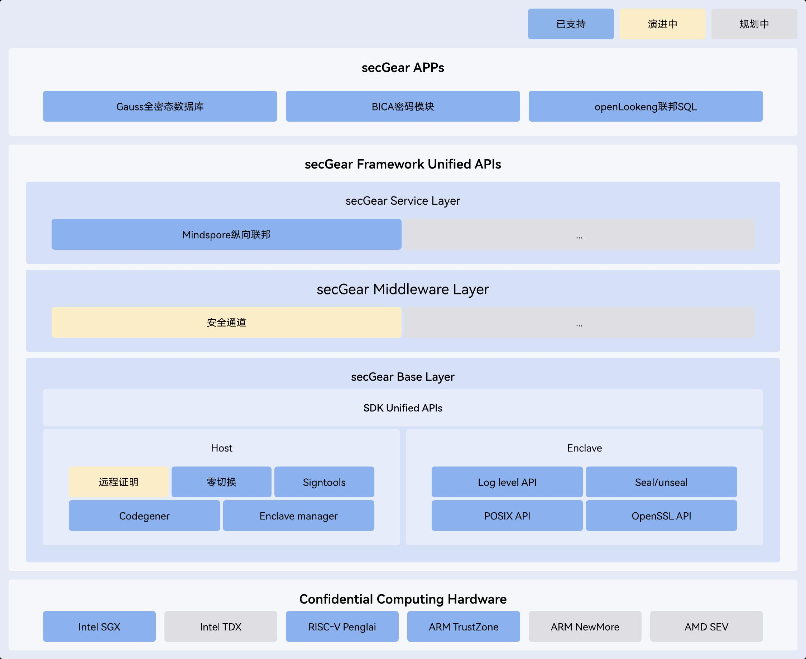

<MarkdownLayout>

# StratoVirt

## 面向云数据中心的企业级虚拟化VMM

[开启StratoVirt之旅](https://atomgit.com/openeuler/stratovirt)

[想对StratoVirt说](https://atomgit.com/openeuler/stratovirt/issues)

</MarkdownLayout>

<MarkdownLayout class="first-section">

# 简介

## 

- StratoVirt是面向云数据中心的企业级虚拟化VMM (Virtual Machine Monitor)，实现一套架构对虚拟机、容器、Serverless三种场景的统一支持。在轻量低噪、软硬协同、Rust语言级安全等方面具备关键技术竞争优势。
- StratoVirt在架构设计上预留了组件化拼装的能力和接口，可以按需灵活组装高级特性直至演化到支持标准虚拟化，在特性需求、应用场景和轻快灵巧之间找到最佳的平衡点。

</MarkdownLayout>

<MarkdownLayout>

# 特征

## 强安全性

采用Rust语言，支持seccomp，实现多租户安全隔离

## 轻量低噪

采用极简设备模型时，启动时间<50ms，内存底噪<4M，支持Serverless负载

## 极速伸缩

毫秒级设备扩缩能力，为轻量化负载提供灵活的资源伸缩能力

## 软硬协同

同时支持x86的VT和鲲鹏的Kunpeng-V，实现多体系硬件加速

## 高扩展性

设备模型可扩展，支持PCI等复杂设备规范，实现标准虚拟机

## 异构增强

除支持常用的硬件SR-IOV直通方案，结合昇腾软件定义能力，实现更灵活异构算力分配

</MarkdownLayout>

<MarkdownLayout>

# 架构

## 

**StratoVirt核心架构自顶向下分为三层：**

- 1、OCI兼容接口：兼容QMP（QEMU Machine Protocol）协议，具有完备的OCI兼容能力。
- 2、BootLoader：抛弃传统BIOS+GRUB的启动模式，实现了更轻更快的启动流程。
- 3、MicroVM：虚拟化层，充分利用软硬协同能力，精简化设备模型；低时延资源伸缩能力。

</MarkdownLayout>

<MarkdownLayout>

# 文档

## StratoVirt介绍

学习StratoVirt介绍

[了解更多](https://gitee.com/openeuler/Virt-docs/blob/master/docs/zh/virtualization_platform/stratovirt/stratovirt_introduction.md)

## 安装StratoVirt

学习安装StratoVirt

[了解更多](https://gitee.com/openeuler/Virt-docs/blob/master/docs/zh/virtualization_platform/stratovirt/install_stratovirt.md)

## 准备使用环境

阅读准备使用环境文档

[了解更多](https://gitee.com/openeuler/Virt-docs/blob/master/docs/zh/virtualization_platform/stratovirt/prepare_env.md)

## 虚拟机配置

查看虚拟机配置

[了解更多](https://gitee.com/openeuler/Virt-docs/blob/master/docs/zh/virtualization_platform/stratovirt/vm_configuration.md)

## 管理虚拟机

学习如何管理虚拟机

[了解更多](https://gitee.com/openeuler/Virt-docs/blob/master/docs/zh/virtualization_platform/stratovirt/vm_management.md)

## 对接iSula安全容器

查看对接iSula安全容器文档

[了解更多](https://gitee.com/openeuler/Virt-docs/blob/master/docs/zh/virtualization_platform/stratovirt/interconnect_isula.md)

</MarkdownLayout>

<MarkdownLayout>

# 相关链接

## 加入StratoVirt大家庭

&nbsp;

[查看详情](https://gitee.com/openeuler/community/tree/master/sig/Virt)

## 获取logo

&nbsp;

[点击下载/download](/img/other/brand/StratoVirt-logo-png.png)

</MarkdownLayout>

