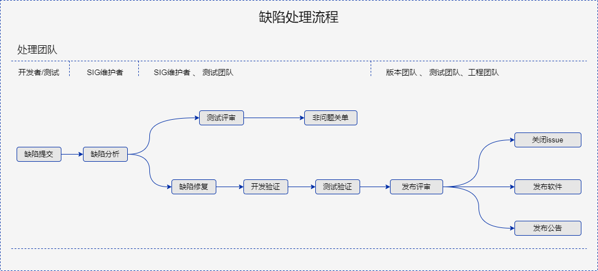

<script setup lang="ts">
import BannerLevel2 from '@/components/BannerLevel2.vue'
import banner from '@/assets/banner/banner-security.png';
import illustration from '@/assets/illustrations/support/vulnerability-reporting.png';
</script>

<ClientOnly>
  <BannerLevel2
    :background-image="banner"
    title="缺陷管理"
    :illustration="illustration"
/>
</ClientOnly>

<div class='markdown'>

# 缺陷管理

## 缺陷响应

openEuler 社区由 openEuler Release SIG 与 openEuler QA SIG 联合负责openEuler 版本质量。 openEuler QA SIG会负责把控社区软件质量和制定缺陷管理策略，并联合社区各伙伴测试团队进行测试活动保障openEuler版本质量。Release SIG 从版本管理的角度协调openEuler 社区和版本开发人员及测试团队，保障openEuler 开发版本各里程碑及维护版本每次迭代都能高质量交付。openEuler 欢迎和鼓励社区开发者能主动识别或修复CVE， 不断提升openEuler 社区的软件使用体验，基于社区反馈我们会快速的响应、分析和解决上报的缺陷并及时发布。


## 支持版本

漏洞响应流程主要支持 openEuler 社区的 LTS 发行版和其分支版本。


## 缺陷处理流程

版本缺陷是由社区开发者、测试团队或用户等提出的关联版本里程碑的特定种类issue，当issue被提交到openEuler社区后对应领域SIG 组miantainer or committer 作为第一责任人负责分析和处理对应issue，openEuler 社区 QA SIG 和 Release SIG 会定期审视社区中版本缺陷的情况，依照优先级推动社区问题尽快修复，端到端社区缺陷处理流程如下图。




## 缺陷提交

### 缺陷上报方式

openEuler社区主要依赖gitee issue 进行缺陷管理，为提高openEuler社区版本缺陷的感知效率，openEuler在社区提供了专门的issue反馈模板用于对接社区感知工具，社区开发者建议通过此模板提交issue反馈至src-openEuler对应软件仓库，以便能尽快被社区SIG感知并处理。issue模板如下图所示：

```markdown
**【标题描述】能够简要描述问题：说明什么场景下，做了什么操作，出现什么问题（尽量使用正向表达方式）**

**一、缺陷信息**

**内核信息：**

**缺陷归属组件：**

**缺陷归属的版本：**

**缺陷简述：**

**【环境信息】**
硬件信息
- 裸机场景请提供问题的硬件信息
- 虚拟机场景请提供虚拟机的XML文件或配置信息
软件信息
- OS版本及分支信息
- 内核信息
- 发现问题的组件版本信息
网络信息
- 如果有特殊组网，请提供网络拓扑信息

**【问题复现步骤】**，请描述具体的操作步骤
**【实际结果】**，请描述出问题的结果和影响
**【其他相关附件信息】**
比如系统message日志/组件日志、dump信息、图片等

**缺陷详情参考链接：**

**缺陷分析指导链接：**
https：xxx


**二、缺陷分析结构反馈**
**影响性分析说明：**

**缺陷严重等级: （Crtical/High/Medorate/Low）**

**受影响版本排查(受影响/不受影响)：**
openEuler-xxxx-xxxx:是/否

**abi 变化(受影响/不受影响)：**
openEuler-xxxx-xxxx:是/否
```


#### 缺陷上报字段说明（由提交issue者明确）

| 字段             | 描述                       | 示例                        | 是否必填 |
| ---------------- | -------------------------- | --------------------------- | -------- |
| 内核信息         | 缺陷发生环境对应kernel版本 | 4.19.0.20230601.5.0         | 是       |
| 缺陷归属组件     | 缺陷对应组件               | kernel-4.19.0.20230601.5.0  | 是       |
| 缺陷归属的版本   | 发现缺陷的openEuler版本    | openEuler-22.03-LTS-SP1     | 是       |
| 缺陷简述         | 缺陷描述                   |                             | 是       |
| 缺陷详情参考链接 | 缺陷的参考链接             | github or 其他社区issue链接 | 建议填写 |


#### 缺陷分析字段说明（由SIG维护者分析）

| 字段                | 描述                            | 示例                                 | 是否必填 |
| ------------------- | ------------------------------- | ------------------------------------ | -------- |
| 影响性分析说明      | SIG组分析该缺陷影响             | 该缺陷功能、安全及上层依赖等方面影响 | 是       |
| 缺陷严重等级        | 缺陷评估影响等级                | Crtical/High/Medorate/Low            | 是       |
| 受影响版本排查      | 所有在维护openEuler版本缺陷排查 | openEuler 20.03/22.03 系列           | 是       |
| 修复对abi变化的影响 | 所有在维护openEuler版本影响排查 | openEuler 20.03/22.03 系列           | 是       |


## 缺陷严重性评估标准

[缺陷定级原则](https://gitee.com/openeuler/QA/blob/396643bd84adaedefe2ad456e1c8adb80e7be75e/%E7%A4%BE%E5%8C%BA%E7%89%88%E6%9C%ACissue%E5%88%9B%E5%BB%BA%E5%A4%84%E7%90%86%E6%B5%81%E7%A8%8B%E4%B8%8E%E8%A7%84%E8%8C%83/%E7%A4%BE%E5%8C%BA%E7%89%88%E6%9C%ACissue%E5%88%9B%E5%BB%BA%E5%A4%84%E7%90%86%E6%B5%81%E7%A8%8B%E4%B8%8E%E8%A7%84%E8%8C%83.md#issue%E5%AE%9A%E7%BA%A7%E5%8F%82%E8%80%83)由openEuler社区 QA SIG团队制定，如有问题可在联系QA SIG maintianer讨论解决。

| 参考维度 | 严重                                                         | 主要                                                         | 次要                                                         | 不重要                                                       | 参考                                                         |
| -------- | ------------------------------------------------------------ | ------------------------------------------------------------ | ------------------------------------------------------------ | ------------------------------------------------------------ | ------------------------------------------------------------ |
| 功能     | 1. 存在阻塞OS基础测试的问题，并且导致其他服务器、操作系统等不能提供正常服务（包括客户端）。 | 1、需求中明确要去的需求没有实现或者实现不正确，造成特性无法满足需求 2、存在阻塞组件基础测试的问题，但不影响OS及其他程序正常运行。 | 1、规格实现有问题，但未造成整个特性失效； 2、存在阻塞组件模块功能测试的问题，但不影响该组件基础功能及其他程序正常运行。 | 1、拼写等UCD错误；2、易用性问题； 3、功能需要增加、优化的建议 | NA                                                           |
| 性能     | 1. 性能测试结果低于规格[30%,)                                | 1. 性能测试结果低于规格[20%, 30%) 2. 长时间测试性能下降趋势明显（下降幅度[5%,） | 1. 性能测试结果低于规格[10%, 20%) 2. 长时间测试性能下降（下降幅度[0%,5%） | 1. 性能测试结果低于规格[0%, 10%)                             | NA                                                           |
| 安全     | 1. 存在 CVSS [9，） 分的CVE漏洞未修复                        | 1. 存在 CVSS [7，9） 分的CVE漏洞未修复 2. 存在 病毒、木马 等恶意文件 3. 存在安全测试基线用例未通过 4. 存在开源片段引用问题 5. 存在License使用不合规问题 | 1. 存在 CVSS [4，7） 分的CVE漏洞未修复 2. 存在未使用的安全编译选项 3. 存在安全编码问题 | 1. 存在 CVSS [0，4） 分的CVE漏洞未修复                       | [SecureRelease.md](https://gitee.com/openeuler/security-committee/blob/master/guide/SecureRelease.md) |


## 联系方式


### 缺陷管理团队联系方式(QA SIG):

| gitee id      | 名称          | 邮箱                     |
| ------------- | ------------- | ------------------------ |
| wu_fengguang  | wufengguang   | wufengguang@huawei.com   |
| walkingwalk   | wubodong      | wubodong@huawei.com      |
| lemon-higgins | lemon.higgins | lemon.higgins@aliyun.com |
| lutianxiong   | lutianxiong   | lutianxiong@huawei.com   |
| rigorous      | yanjin        | yanjin.yan@huawei.com    |
| SupMario      | tangjie       | tangjie18@huawei.com     |
| charlie_li    | liyongqiang   | liyongqiang329@163.com   |
| disnight      | fanjiachen    | fanjiachen3@huawei.com   |
| Ethan-Zhang   | zhangyizheng  | ethanzhang55@outlook.com |


### 版本运作团队(Release SIG) 联系方式

| gitee id    | 名称           | 邮箱                      |
| ----------- | -------------- | ------------------------- |
| yaqiangchen | chenyaqiang    | chenyaqiang@huawei.com    |
| solarhu     | Hufeng         | solar.hu@huawei.com       |
| paul-huang  | Huangchengpiao | huangchengpiao@huawei.com |
| gitee-cmd   | chemingdao     | chemingdao@huawei.com     |

</div>

<style lang="scss" scoped>

</style>
