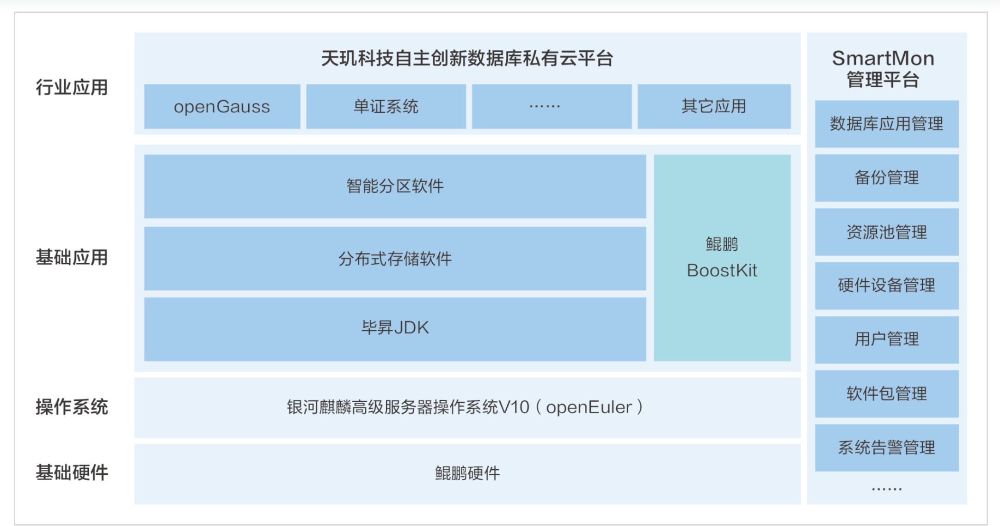

**应用场景**

随着企业对数据管理和分析需求的增长，构建高效、可靠的数据库私有云成为关键。上海天玑科技股份有限公司推出的自主创新数据库私有云平台，基于openEuler系操作系统，为企业提供了\"一云多芯\"、\"一云多库\"的解决方案。

**解决方案**

天玑科技的数据库私有云平台解决方案包括：

-   **openEuler系操作系统**：作为平台的操作系统基础，银河麒麟高级服务器操作系统V10（openEuler商业发行版）提供了稳定和安全的运行环境。

-   **全栈优化**：使用鲲鹏应用使能套件BoostKit和银河麒麟高级服务器操作系统进行全栈调优，确保了高性能的企业级存储产品。

-   **分布式存储系统**：为数据库基础架构建设、关键应用数据库、大数据分析和数据库容灾等提供存储和管理服务。

-   **智能可视化运维**：实现资源安全隔离和数据库云化部署，通过智能分区技术优于传统虚拟化技术。

**客户价值**

-   **自主创新**：全栈自主创新的软硬件开放兼容，提供统一集成交付和智能可视化运维。

-   **资源安全隔离**：智能分区技术实现资源的安全隔离，优化了数据库云化部署。

-   **数据保护**：通过分布式存储构建高可靠高性能的存储资源池，利用副本和EC（Erasure
    Coding）技术实现数据保护。

-   **转型升级支持**：支持企业进行数据库云化的转型升级，满足金融保险等行业的需求。

该平台已经在金融保险行业中得到应用，帮助企业实现了数据库的云化转型升级。
