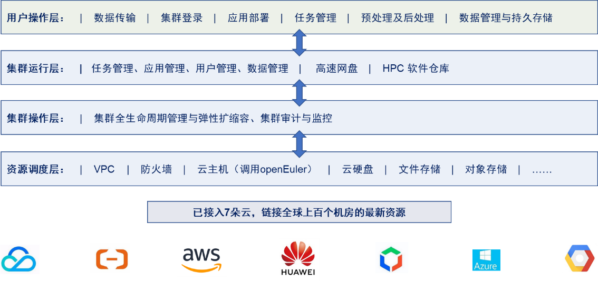

## 应用场景

上海即算科技有限公司（“即算科技”）是一家专注于科研工程高性能计算（HPC）的创新企业。秉持客户至上、服务为先的核心理念，公司自主研发HPC管理平台、AI 服务平台等一系列产品，并深入了解教育、科研、工程在不同场景下的业务需求，提供公有云、混合云在内的一站式高性能计算解决方案。并服务了清华大学、哈尔滨工业大学、浙江大学、北京航空航天大学、哈尔滨工程大学、中国科学院等多家高校和机构的科技创新团队。

以算力互联、超算上云作为着眼点，即算科技开发并开源了Cloud HPC 管理平台（“HPC-NOW”），充分利用云计算的弹性规模、高性能、灵活性、稳定性等诸多优势，帮助超算用户打破计算边界、提升研究效率、提升技术探索的深度和广度。

## 业务挑战

HPC-NOW 平台依托于云计算平台，弹性调度和管理基于Linux操作系统的超算集群，对操作系统有多方面要求。主要包括：

- 运行稳定：HPC节点往往全天候运行于 100% 的高负荷之下，对于长周期的计算任务，需要连续运行长达数天至数月，这就对操作系统的运行稳定性提出了极高的要求。作为HPC应用的底座，操作系统的任何不稳定都会影响到所有正在运行的相关任务，致使任务异常或者性能波动。

- 软件支持：HPC应用从编译到运行，往往需要依赖于基础或第三方的软件/库，例如编译器、数值运算库、并行库、集群管理软件、数据处理组件等。因此，易于使用的包管理器、丰富的软件仓库就成为HPC开发者和用户的重要需求。

- 	桌面环境：除了数值计算之外，HPC用户依赖于图形界面进行数据分析/处理/可视化等各项工作。HPC-NOW 旨在为用户提供从计算到处理的一站式环境和便捷体验，就需要在HPC集群中内置图形桌面，且要保证界面美观、操作便捷、运行流畅。

- 	易于部署：HPC-NOW在云端的各个区域为用户自动化的启动和管理超算集群服务，也就需要在操作系统提供云镜像功能，并提供响应的API接口，确保HPC-NOW能够高效、快速、批量化、自动化的拉取镜像和创建主机。

## 解决方案

HPC-NOW方案架构图

1.	HPC-NOW方案将集群默认操作系统切换为openEuler。

2.	配合openEuler丰富的软件包和桌面化组件，HPC-NOW切换为openEuler后，在功能和体验上满足了用户的业务需求。

3.	openEuler社区积极推动openEuler镜像覆盖主流公有云平台，方便HPC-NOW一键拉起openEuler集群。

## 客户价值

-  稳定：基于openEuler 22.03 LTS构建的超算集群在接近满负荷的情况下，持续保持稳定运行，其上的HPC负载运行无异常。
-	易用：基于openEuler部署的桌面环境，具备丰富的可扩展性，通过一系列扩展组件进一步提升了桌面环境的用户友好度。
-	便捷：openEuler内置主流的包管理器，且软件仓库丰富、连接速度快，HPC常用的基础包和第三方软件都可以高速拉取、快速部署，使用便捷。

## 为什么选择openEuler或其发行版？

选择openEuler 22.03 LTS版本作为解决方案，主要考虑：

-   全场景适应性、高性能、高可靠性、多样化的算力支持；
-  	产业生态支持及覆盖的行业广泛；
-  	版本稳定、长期演进和技术支持。

## 未来规划
-  	持续关注 openEuler 在各个云平台的上线情况，第一时间提供HPC-NOW集群默认选项。
-  	在HPC-NOW混合云方案中优先采用 openEuler 作为主力操作系统。

