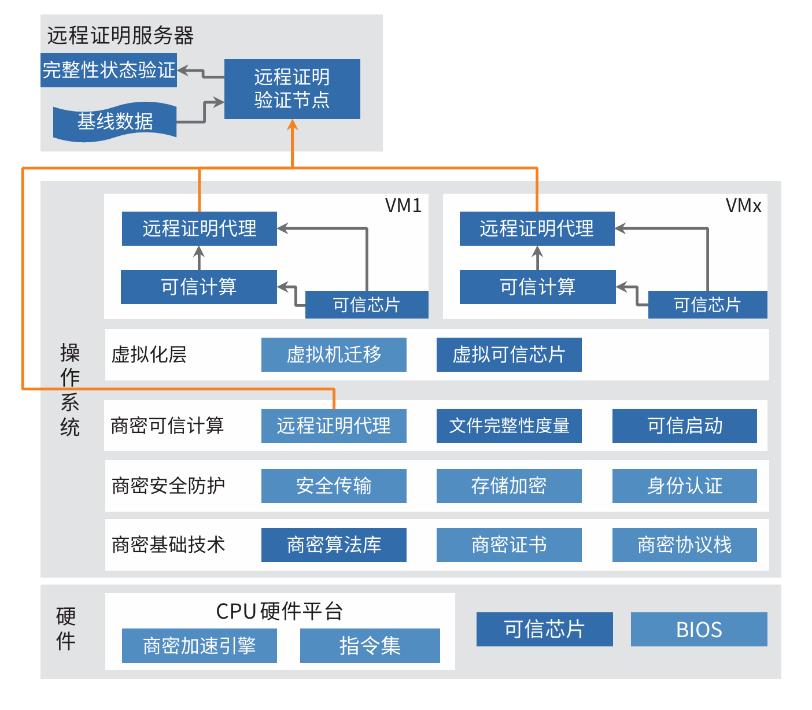

## 应用背景

随着网络安全形势日益严峻，各行业越来越关注自己在云上业务与数据的安全。在云场景下，将可信计算能力引导至云主
机实例，并与中国商用密码算法体系相结合，通过远程证明对启动和运行阶段的度量进行验证。实现从底层安全芯片到云
主机关键应用的安全可信，使云主机更加适应于银行、券商、保险、互联网金融等业务领域。

## 解决方案

 
 » 主机安全，全面使能基础安全技术，提升安全等级；

 » 可信计算，全面使能完整性静态度量与动态度量，进一
步延长信任链，将宿主机信任链扩展到云主机内部；

 » 基于商密算法实现系统真实性、机密性、完整性等基础
安全保护；

 » 将可信计算技术与商密结合，建立完整的云主机商密信
任链。

## 客户价值

 » 实现从底层安全芯片到云主机关键应用的安全可信，为用户提供针对系统启动和运行阶段的全方位可信保障；

 » 基于商密算法实现系统真实性、机密性、完整性等基础安全保护；

 » 添加对商密算法的支持，避免使用国外密码算法带来的安全风险，促进信息系统商密的应用。

## 合作伙伴

