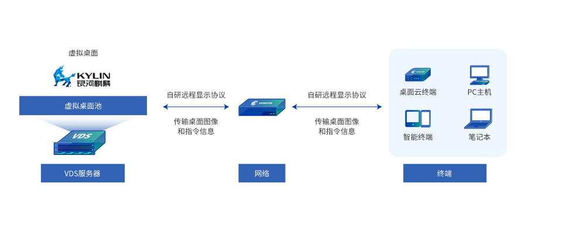

## 用户背景

深信服介绍：深信服科技股份有限公司是一家专注于企业级网络安全、云计算、IT基础设施与物联网的产品和服务供应商，为超过10万家企业级用户的数字化转型构筑稳固基石。拥有深信服智安全、信服云两大业务品牌，致力于承载各行业用户数字化转型过程中的基石性工作，从而让每个用户的数字化更简单、更安全。

云桌面介绍：深信服桌面虚拟化方案通过虚拟化技术，将原本在传统 PC 本地运行存储的桌面、应用和数据全部迁移至数据中心统一承载管理，并在数据中心部署桌面云一体机，以超融合技术将服务器的 CPU、内存、存储资源根据不同用户的需求虚拟成一个个桌面虚拟机，通过桌面交付协议将操作系统界面以图像的方式传送到用户的接入设备，为用户提供与 PC 使用方式相同的桌面环境，广泛应用于政府、安平、金融、教育、企业等行业。

## 业务挑战

相对于传统PC，云桌面具有部署灵活、接入安全、维护方便、简化办公环境等显著优点。但云桌面解决方案涉及后台服务器、前台终端、虚拟化软件、云桌面软件等，综合成本相对较高。如何降低云桌面解决方案整体成本，提升单台云桌面性价比，成为提升云桌面竞争力的关键挑战。当前单物理机能虚拟出35套云桌面，单套云桌面成本较高，挑战优化到42套/物理机。

## 解决方案

经分析，在满足桌面云用户办公体验指标的前提下，桌面云部署密度提升到极限的情况下服务器算力并没有充分释放，体现在：
a、CPU存在一定空闲；
b、前后台服务是基于X86架构开发，在ARM体系下开销高；
c、当前调度策略未能充分发挥硬件优势。
如何针对桌面云的调度和资源管控策略、提升资源有效利用率是进一步提升云桌面虚机密度，成为提升产品性价比的关键。
最终通过鲲鹏服务器、openEuler操作系统、毕昇编译器和深信服桌面云平台软件垂直优化，实现了部署密度的大幅提升。如下图所示：

具体优化技术包括：

1、openEuler操作系统优化(开箱即用——负载算力协同技术

a) task-steal：多核场景下空闲CPU主动拉取系统中runable的任务到本核执行，实现物理cpu空闲算力全系统us级均衡；
b) 低优业务绝对压制：实现高优任务对低优先任务快速抢占和时域的绝对压制，资源优先供给前台业务，提升前台业务QoS；
c) vcpu负载聚合：guest内vcpu负载低的时候，把任务聚合到一个vcpu上，减少vcpu切换的开销和时延，实现vcpu低负载算力智能集合；
2、鲲鹏服务器优化

基于鲲鹏DevKit加速套件，提升内存、CPU运算效率，充分释放鲲鹏硬件算力。

3、毕昇编译器编译优化

使用bisheng编译器及lto编译选项对qemu进行编译优化，如优化内联函数、去除无用代码、合并程序文件等。

4、深信服桌面云平台软件优化

通过深信服的智能AI调度算法，提升桌面云平台组件间交互效率。同时使用neon指令对spice等组件中的热点函数进行重构优化，提升关键组件执行效率。

## 客户价值

在业务满载情况下，基于鲲鹏920服务器测试结果：
单物理机云桌面台数从35台提升到46台，同时业务性能指标还有5%左右提升。
实现云桌面解决方案整体成本下降约30%。

