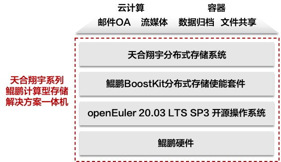

## 应用场景

天合翔宇分布式存储系统是 XSKY星辰天合公司拥有自主知识产权、独立开发的面向信创生态的企业级软件定义存储产品；其基于信创生态的 CPU 、操作系统以及应用进行了深度的适配及优化，在稳定性、性能、可靠性、易用性等方面能够满足复杂的企业级应用需求，实现自主可控，为大规模信创云环境提供了可靠的存储基础架构支撑。

## 解决方案

- **一池多芯：** 同一个集群或者存储池可异构支持多种架构 CPU 和 OS
- **全场景一体化：** 支持虚拟化，本地应用，非结构化等；支持块，文件和对象共池，支持全场景 EC 和压缩；支持全协议同城双活，多站点，上下云，数据归档
- **关键业务可用：** 支持块、文件和对象，全协议双活；对象生命周期管理，多站点同步，小文件归并；文件异地灾备，目录快照，目录 QoS、负载均衡，整池扩容；块云备份、异步复制、VAAI 、在线迁移等高级功能，保证关键业务可用
- **数据自由流动：** 解耦底层硬件，统一支持信创生态和非信创生态，实现业务无感知的平滑生态融合、生态过渡和生态迁移

## 客户价值

- **极简部署:**  一体化设计和交付,开箱即用,助力业务30分钟极速上线；

基于openEuler及鲲鹏算法优化，实现读写性能提升10%以上，且CPU利用率和可用存储容量更高；

- **开放融合：** “一池多芯”技术，支持全协议、全业务场景适配和跨数据生命周期管理

## 伙伴

