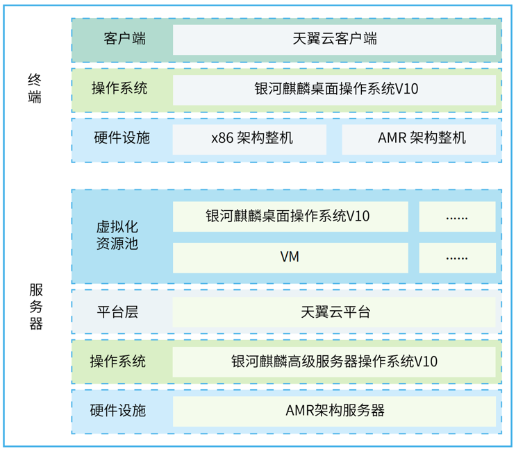
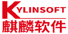

## 应用背景

数字生产力正以前所未有的速度促进新质生产力的产生发展。天翼云作为云计算国家队、数字生产力的促进者，本次对银河麒麟操作系统进行全面适配，并根据云业务使用场景定制化需求，满足客户对云场景下的操作系统便捷式使用。此次定制项目包括对天翼云平台不同架构以及多个云业务功能的适配，确保国产麒麟操作系统在天翼云平台上稳定运行。

## 方案介绍

部署规模：
桌面操作系统：
版本：银河麒麟桌面操作系统 V10
数量：1000 套（x86 架构 500 套，海思麒麟 ARM 架构 500 套） 
服务器操作系统：
版本：银河麒麟高级服务器操作系统 V10

该项目对现有平台进行完全改造，支持多种主流CPU架构硬件，利用国产基础软硬件构建天翼云业务系统，为其赋能千行百业数字化转型提供了安全、稳定的基础。银河麒麟操作系统沉淀“千行百业”最佳实践，提供多元场景智慧解决方案，助力客户高效上云。

## 方案架构图

## 客户价值

-对客户的经济效益：实现了客户在国产软硬件体系中支持多种主流芯片架构硬件，为客户提供了安全创新，稳定可靠的底层运行环境，助力天翼云平台核心业务系统稳定运行，惠及众多用户；

-对行业的推广或示范价值：麒麟软件作为中国电信天翼云计算共同体成员单位之一，大力度协助天翼云向自主创新方向发展，在桌面管理、内生安全、灵活配置、便捷访问等方面完成了与天翼云的近百项适配认证。同时积极落实“一城一池”项目建设，为中国电信建设的多省云服务平台提供操作系统，实现每分钟数万次、每天上千万次的算力统筹、储存和调度。

## 合作伙伴

