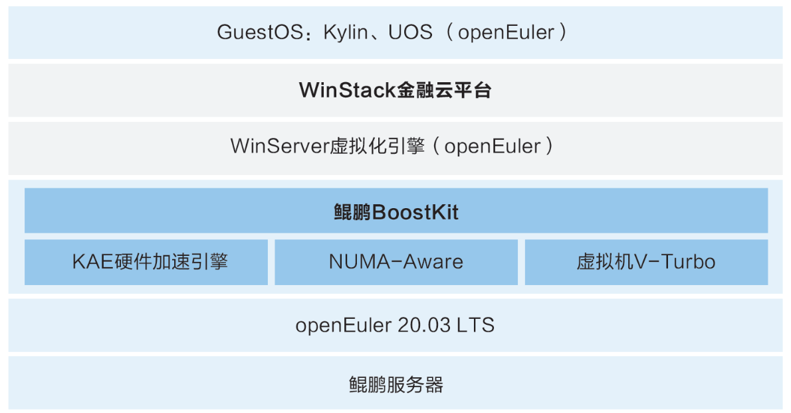

## 用户背景

云宏信息科技股份有限公司成立于2010年，是国内的云科技服务商，国家级专精特新重点“小巨人”企业，专注云计算底层关键技术自主研发12年。云计算底层关键技术虚拟化是支撑云计算、大数据、人工智能等新兴产业发展的基石和纽带，云宏坚持走国产、自主、可控的发展道路，具备全面兼容国产主流软硬件厂商和全面替换国际行业的技术实力。

## 方案介绍

云宏基于openEuler+鲲鹏底座推出WinStack金融云平台，提供了弹性虚拟化资源池以及虚拟实例的全生命周期管理、资源策略调度、高可用保护、故障检测等能力。 WinStack金融云平台使用鲲鹏应用使能套件BoostKit进行全栈调优，基于openEuler、KAE硬件加速引擎、虚拟机V-Turbo、NUMA-Aware特性进行全面性能优化。

## 方案架构图

## 优势亮点

-   提高了金融行业用户的上云效率；

-   整机的计算性能提升10%+，同比例虚拟机计算性能翻倍；

-   虚拟机密度提升30%，Web应用单位时间签名校验效率提升7.5倍。

## 合作伙伴

