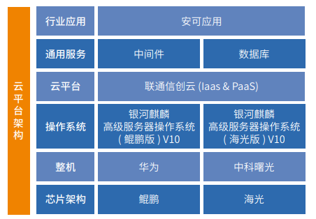

## 应用场景

沃云信创云基于云原生进行了定制化改造适配 ，以开源软件 OpenStack+KVM 为基础打造自主、安全可靠的强大云平台，在核心代码进行了全面把控，自主开发了计算、存储、网络、中间件等组件全面适配国内服务器和操作系统，提供云服务器、云硬盘、裸金属、负载均衡、虚拟私有云等多个 IaaS 和 PaaS 产品，为致力于国内信息化生态建设适配了多家国内主流软件，完美契合对安可要求极高行业的需求。

## 解决方案

-   基于 OpenStack、Kubernetes 等开源代码自主研发，核心
基础硬件适配鲲鹏、海光等国内主流芯片，操作系统选用
银河麒麟操作系统，向上支撑国内主流数据库、中间件与
应用软件。

## 客户价值

-   适配问题：解决银河麒麟高级服务器操作系统 V10 适配 OpenStack S 版缺少依赖包的问题。
-   项目价值：银河麒麟高级服务器操作系统（鲲鹏版）V10 和（海光版）V10 分别与联通沃云信创云 V6.2 保持一致的认证要求，通过麒麟软件认证测试伙伴。

## 伙伴

