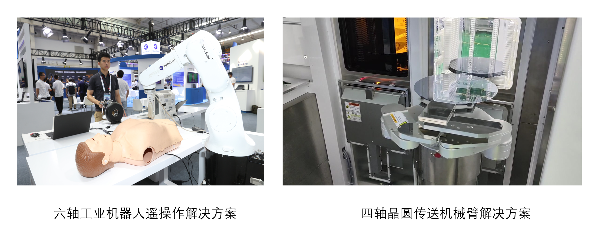

## 应用场景

北航是国家“双一流”建设高校，以建设扎根中国大地的世界一流大学为发展目标。北航在机器人领域一直处于行业前沿，以其亮眼的成果和优秀的师资力量，成为国内机器人领域的重要参与者和建设者。

机器人操作系统是机器人的核心基础软件，支撑着机器人应用对系统实时性、安全性及智能化等方面的共性诉求。面向智能工业机器人领域，突破开放式体系架构，在实时系统内核、通信协议栈、运动控制库、集成开发工具等方面进行研究，打造“开箱即用”的机器人基础软件平台，推进机器人软件生态体系建设。

## 解决方案

-   操作系统基于openEuler LTS 22.03内核，支持x86系列平台，并将支持ARM平台等

-   面向智能工业机器人领域，提供优秀的操作系统内核实时性性，研发EtherCAT通信协议栈、运动控制核心组件、智能算法库以及集成开发环境，建立机器人基础软件平台

-   面向具体典型应用场景提供复杂场景识别、智能化人机交互等功能拓展

## 客户价值

-   操作系统内核实现良好的实时性，7*24小时不间断运行最大中断时延≤10μs，满足EtherCAT的≤1ms的通信周期需求；

-   基于openEuler建立开放式嵌入式控制系统架构，驱动六轴工业机械臂正常运行，具有良好的兼容性和易用性；

-   面向典型行业应用已完成案例实施，系统可靠性在工业领域应用得到验证

## 伙伴

