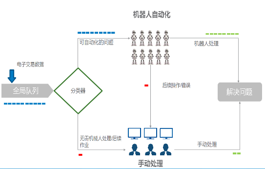

# 应用场景

北京交通大学（Beijing Jiaotong
University）是教育部直属的全国重点大学，是教育部、交通运输部、北京市人民政府、中国国家铁路集团有限公司共建高校，位列"211工程"、"985工程优势学科创新平台"、"世界一流学科建设高校"，入选高等学校创新能力提升计划、高等学校学科创新引智计划、卓越工程师教育培养计划"一带一路"铁路国际人才教育联盟理事单位。

北京交通大学致力于低碳经济与绿色大学，开启了全国高校"节约型校园"建设，建设方案包括校园节能监管平台建设，信息化建设及教育管理平台等。其中，通过在各平台中使用RPA智能人工系统，解决了大量人工的重复单一操作，实现低碳绿色的快速开发，节省了大量人力投入。

# 解决方案

-   系统使用新纽 RPA 一体机解决方案

-   新纽 RPA 一体机解决方案结合 NewLink RPA 机器人流程自动化平台 V3.1应用系统，华鲲振宇天宫鲲鹏 CPU 服务器及基于openEluer的发行版普华太极服务器操作系统，联合形成算力底座支撑。

-   普华太极服务器操作系统集成开源的数据库TiDB，对整体系统进行了优化，保证了RPA应用系统在天宫鲲鹏服务器上性能最大化。

# 客户价值

-   RPA一体化解决方案能够比人工更快速、更精确地实行重复性任务，支持7\*24小时不间断运行，员工可以将时间和精力投入到更有价值的工作中；

-   降低人力资源成本：少量的人工投入结合数字员工队伍，带来人力成本节省50%；

-   为客户建设 COE完成知识转移：解决客户复杂的业务逻辑和运行，为客户提供专业化咨询服务；数字员工的部署和应用，可以有效降低人工的不确定性带来的风险。

# 伙伴

