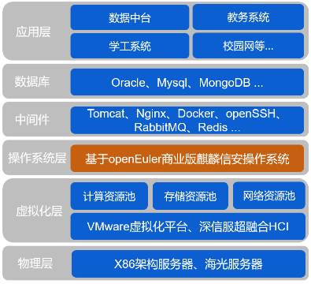
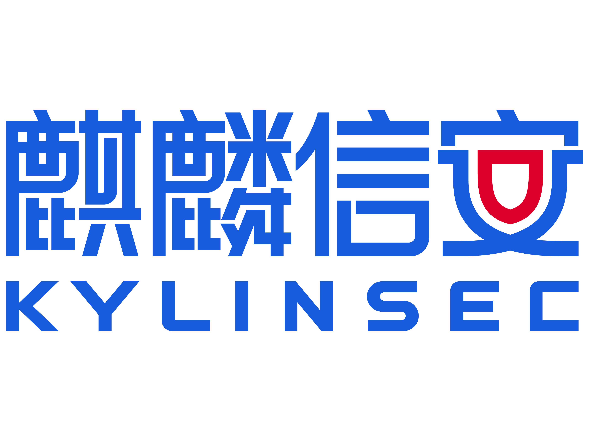

****

**应用背景**

长沙职业技术学院部署的VMware虚拟化平台，运行着该校数据中台、教务系统、学工系统以及学校官网等各类业务系统，在学校的管理、教学等信息服务中发挥着重要作用。

该校VMware平台上运行的各大业务系统都建立于CentOS之上，随着CentOS停服后，学校关键业务系统的运行岌岌可危，为了保障业务系统的稳定和响应国家自主创新要求，将现有系统迁移为国内操作系统，成为该校教育信息化工作的当务之急。麒麟信安服务器操作系统率先且连续8次通过公安部信息安全产品检测中心结构化保护等级（四级）安全认证，凭借高稳定性和高安全性的优势性，麒麟信安服务器操作系统成为学院操作系统迁移首选。

**解决方案**

-   根据数据中台、教务系统、学工系统、学校官网等业务的特点和需求，对麒麟信安服务器操作系统进行定制化适配和优化。

-   结合深信服超融合HCI平台，对麒麟信安服务器操作系统进行深度整合和调优，提升虚拟化环境的整体性能和资源利用率。

-   利用麒麟信安提供的迁移工具，将现有VMware虚拟化平台上的CentOS系统无缝迁移到麒麟信安服务器操作系统上。

-   操作系统内置多重安全机制和防护措施，能够有效防范外部攻击和数据泄露。

**客户价值**

-   学院通过将关键业务系统迁移到麒麟信安服务器操作系统，保障了学院日常业务的稳定运行，同时麒麟信安提供长期的技术支持与系统更新，避免了CentOS停服带来的运维困扰。

-   麒麟信安服务器操作系统的高安全性能够保障长沙职院业务数据安全，内置的安全机制和防护措施能够有效防范外部攻击和数据泄露的风险。

-   积极响应国家信息技术自主创新要求，将CentOS升级为麒麟信安服务器操作系统，有助于提升学院的信息化水平和竞争力，促进产教融合与人才培养。

**合作伙伴**

