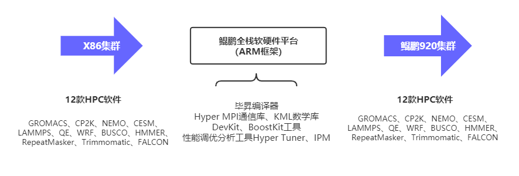

## 应用场景

兰州大学是教育部直属全国重点综合性大学，兰州大学超算中心拥有1.2P的高性能计算平台，为学校师生开展高水平科研提供计算支撑。针对学校拥有开展大规模分子动力学、气象学和生命科学模拟需求的群体，本团队基于华为鲲鹏全栈软硬件，移植优化生命、气象、分子动力学三大应用领域的 GROMACS、CP2K、NEMO 等12款软件。利用开放原子开源基金会的openEuler操作系统、毕昇编译器、以及鲲鹏开发套件中的Hyper MPI 通信库以及 KML 数学库，充分展示了这些应用软件在ARM 架构体系下的计算性能，旨在为生命、医学、气象领域国产化的鲲鹏全栈计算架构提供自主可控的解决方案。

现阶段，本团队基于鲲鹏高性能计算集群及openEuler操作系统，实现分子动力学、气象学和生命科学软件向鲲鹏集群的迁移和优化。后续，我们也将通过开源社区继续扩展相关开源项目。

## 解决方案

-   操作系统版本：openEuler 21.03

-   本方案分子动力学模块基于鲲鹏软硬件平台如鲲鹏920平台、DevKit 迁移调优套件及openEuler毕昇编译器等对分子动力学应用软件 GROMACS，LAMMPS，CP2K，QE 完成迁移和优化。

-   本方案生命科学模块对生命科学学重要应用 BUSCO、Falcon、HMMER、RepeatMasker、Trimmomatic 完成从 x86 平台到鲲鹏 ARM 平台的迁移优化，获得了更好的可拓展性和计算效率的提升。

-   本方案气象学模块结合鲲鹏 HPC +openEuler 软硬件平台对气象学重要应用 WRF、CESM、NEMO 完成迁移适配，结合鲲鹏优化技术获得更高的计算效率，相比原有 x86 平台，提供更好的计算性能。

## 客户价值

-   实现openEuler+鲲鹏高性能计算集群部署，助力高校科研创新及人才培养，可以为用户提供多元化算力服务。

-   完成了openEuler+鲲鹏架构在HPC气象、生命等领域的生态应用，相较于原X86架构计算性能有较大提升。

## 伙伴

