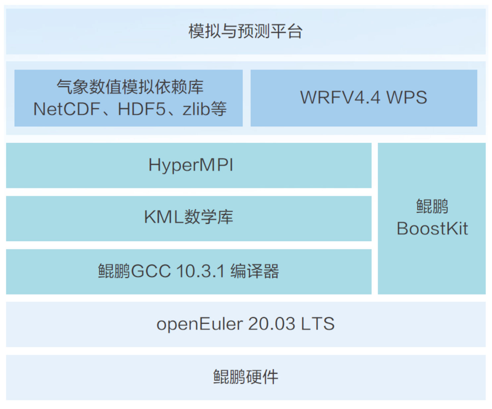

## 应用场景

气象应用是高性能计算的重要领域，算力是影响天气预警精确性的重要因素。气象灾害教育部重点实验室作为南京信息工程大学的重点实验室之一，其团队自主研发的极端高温干旱天气模拟与预测平台，采用自主创新开源操作系统及自主创新的组件部署，配合网页端展示平台可实时展示多种气象要素。同时也可用于区域气候、空气质量模拟等大气数值模拟实验等，可实现对过往极端天气事件的高精度模拟以及未来可能出现的极端事件的预报。

## 方案介绍

南京信息工程大学气象灾害重点实验室充分发挥openEuler多样性算力适配能力及鲲鹏多核架构的算力优势，基于鲲鹏底座推出极端高温干旱天气模拟与预测创新平台，通过自主创新的技术及软硬件设施实现极端天气有效预测的能力。极端高温干旱天气模拟与预测创新平台基于鲲鹏软硬件底座、openEuler开源操作系统，使用鲲鹏应用使能套件BoostKit从多个维度进行了深度调优工作。例如，为了提升编译效率，技术人员在编译过程中将之前的GNU-GCC更换为GCC for openEuler。GCC for openEuler提供了针对鲲鹏微架构处理器及指令优化，通过软硬协同相较GNU-GCC提供更强的性能，提升了WRF组件在鲲鹏架构上的编译效率，增强了组件间的耦合关系，从而使组件的性能得到了很大的提升。通过上述优化，实现了天气模拟与预测创新平台的全栈优化，性能提升58%。

## 方案架构图

## 优势亮点

-   平台基于鲲鹏硬件、openEuler开源操作系统、自研软件栈鲲鹏GCC、HMPI等，软硬件平台自主创新程度较高。

-   整体性能提升58%，较大地提升了预测平台的准确性。