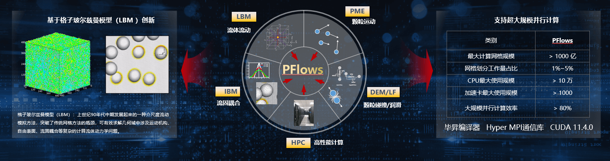

## 应用场景

PFlows是华中科技大学与武汉理工大学合作开发的可大规模高效并行计算的颗粒两相流直接数值模拟软件。在现代计算流体力学在强大算力发展的基础上，形成了大尺度、高精度和高效率的发展需求，超大规模计算量需求高并行效率的计算技术解决方案。

## 方案介绍

- 本方案采用银河麒麟高级服务器操作系统V10 Kylin V10 SP2（openEuler商业发行版）， 基于HMPI与CUDA，在鲲鹏 920+GPU异构计算平台完成了PFlows的迁移和优化，实现千卡级异构高效并行。

- PFlows定位于颗粒两相流的全解析直接数值模拟(FDNS)研究，其基础算法克服了早先模型处理颗粒移动边界时计算精度和计算效率上的矛盾，实现了流体流动、颗粒碰撞和颗粒流固耦合的高效并行，并初步实现了面向高Re数、复杂流固边界的通用CFD模拟计算。

## 客户价值

-   利用openEuler实现了PFlows软件在CPU-GPU异构体系上的超大规模高效并行计算，最大计算网格规模1000亿以上，最高GPU卡使用规模千卡以上，大规模并行效率80%以上。

-   目前已可支持基于OpenACC/CUDA/HIP等多种同构和异构MPI大规模并行加速计算，已在天河-3超算平台上实现了1.6万CPU核心上的高效并行，未来可以广泛应用于能源、化工、水利、医药、生物、环境等众多领域