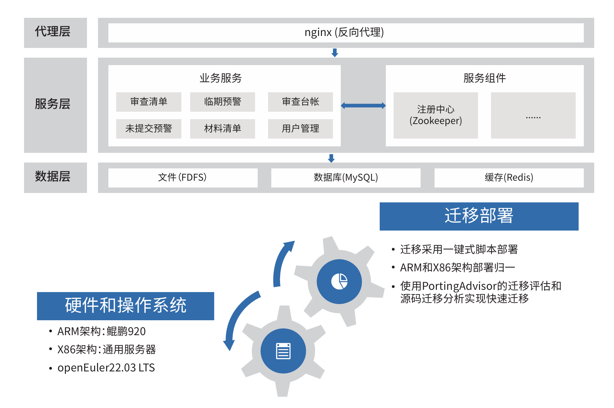

## 应用场景

依托成品油资质管理平台，对加油站的资质信息、管理制度、设施设备情况进行统一管理，实现加油站安全生产的信息化。
实现创新完善商务局在成品油流通领域的管理手段，同时加强信息的归集共享，是落实“放管服”和“一网通办”的有力体现，
充分满足国家商务部的“互联网+监管”要求。

## 解决方案

 » 操作系统采用openEuler»22.03»LTS版本

 » 硬件采用鲲鹏920»+»Intel服务器作为算力底座

 » 迁移适配后同步支持ARM64服务器和通用X86_64服务器»
 
 » 应用鲲鹏社区提供的迁移分析工具PortingAdvisor，在
完成国产化替代的同时，扩展产品的兼容性和适用性，
提升产品竞争力。

## 客户价值

 » 开源软件维护量减少35%，一键式多平台部署，时长降低50%。

 » 迁移人力投入减少50%，迁移后性能提升2%。

 » 迁移后部署实现了平台差异用户无感知，充分发挥了联合解决方案的优势，提升了产品的竞争力

## 伙伴

