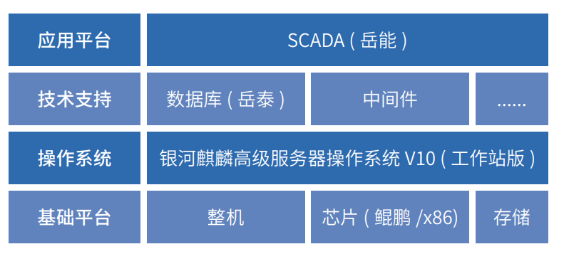

# 应用场景

SCADA 系统经过四代的发展，以其强大的数据采集能力和丰富的控制功能，被广泛用于发电厂和变电厂，而国内 SCADA 所使用的 CPU 和操作系统等软、硬件在供应链安全上，存 在着巨大安全隐患。为解决核心技术发展的难题，国有特大型 能源企业大唐集团联合麒麟软件等公司，积极推进新增扩容电厂设备及业务系统的全栈自主创新，基于国内主流芯片及操 作系统及操作系 统，建设全面安全创新的 SCADA 数据采集及监视控制系统。

# 解决方案

-   建设规模：在集控中心智能化机房和新增的站点及设备上，安装使用了服务器操作系统 60 余套，桌面操作系统 10 余套。 

-   软硬件适配优化：通过对集控中心数据接入的相关设备和系统的底层安全定制、批量适配和深入优化、顺利的 完成了业务系统的平滑迁移。

# 客户价值

-   战略合作：该项目是中国电子信息产业集团和大唐集团的合作示范工程项目，加深了双方的战略合作；

-   行业标杆：承载着风电厂数据采集与监视控制系统的关键应用的安全、稳定运行，系统具有高可靠性和稳定性

# 伙伴

