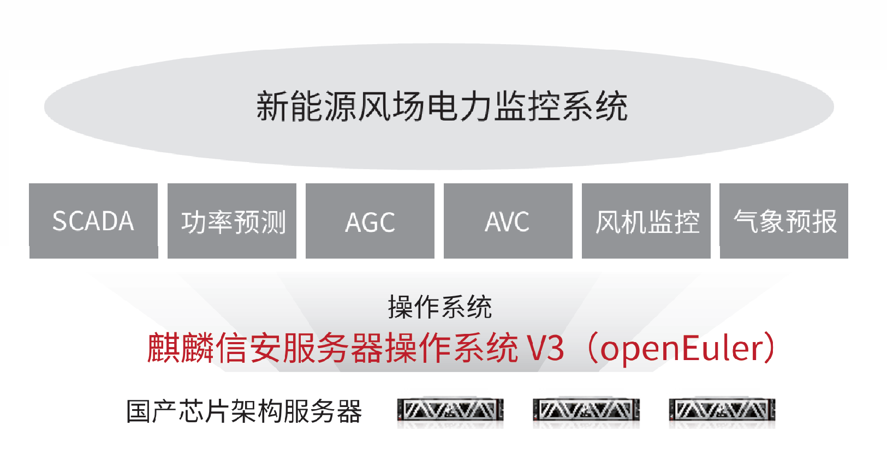

## 应用场景

新能源风场电力监控系统是风电场建设并网必备的软件，利用计算机软件技术、计算机网络技术、自动监测与远程控制技术、
通信技术和相关的风电专业技术，实现风机设备的运行状态监测，自由报表生成及数据统计、分析功能，是一套安全、高效、
稳定的风电场专业监控系统。
集成风机监控、功率控制系统功能，扩展智能健康管理、气象预报及功率预测等应用，实现了场站监控应用系统整合，全
面辅助场站的经营层完成新能源场站的管理量化。
将原有的»CentOS、Redhat»等»Linux»操作系统替换成国内主流四级安全操作系统。新能源风场电力监控系统全部采用国内
主流四级安全操作系统。

## 解决方案

» 操作系统采用基于»openEuler»LTS»20.03»SP1»发行的麒
麟信安服务器操作系统»V3»，硬件采用鲲鹏等国内主流芯
片架构的服务器。

» 联合金风科技、浙江运达、上海远景、东方电气等企业
完成新能源风场电力监控系统平台适配、验证、搬迁实施。

» 最小化裁剪、最小权限策略，实现无超级特权账户系统
的四级安全加固。支持多级阻断、应用白名单机制。

## 客户价值

» 完成»CentOS、Redhat»替换，实现新能源风场电力监控系统供应链安全；

» 为新能源风场电力监控系统提供等保四级安全防护能力；

» 解决新能源风场电力监控系统国内主流芯片架构软件适配问题，推动国内软硬件的成功应用；

» 为新能源风场电力监控系统提供定制化四级安全操作系统。

## 伙伴

