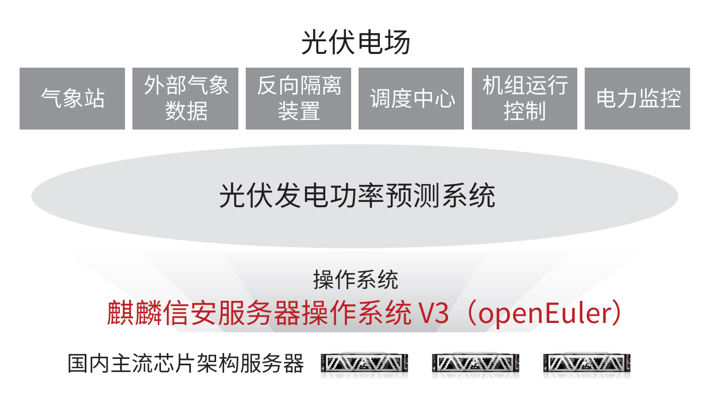

## 应用场景

光伏发电功率预测系统是在“双碳”目标下新型光伏能源发电中关键智慧大脑，能够指导调节光伏电站的发电出力情况。
该系统可以帮助电网调度合理安排常规电源发电计划，减少因光伏发电并网而增加的旋转备用容量，增加光伏发电上网小
时数，减少温室气体排放的同时也为光伏发电企业带来直接经济效益。
将现有光伏电场的光伏功率预测系统进行改造，将原有的»CentOS、Redhat»等»Linux»操作系统替换成国内四级安全操作系
统。新建光伏电场的光伏功率预测系统全部采用国内四级安全操作系统。通过光伏功率预测系统规模化应用来验证光伏应
用场景全面实现替换的可行性。

## 解决方案

 » 操作系统采用基于»openEuler»LTS»20.03»SP1»发行的麒
麟信安服务器操作系统»V3»，硬件采用鲲鹏等国内主流架
构服务器。

 » 联合东润环能、南瑞等企业完成光伏发电功率预测系统
平台适配、验证、搬迁实施。

 » 最小化裁剪、最小权限策略，实现无超级特权账户系统
的四级安全加固。支持多级阻断、应用白名单机制。

## 客户价值

 » 完成»CentOS、Redhat»替换，实现光伏发电功率预测系统供应链安全；

 » 为光伏发电功率预测系统提供等保四级安全防护能力；

 » 解决光伏发电功率预测系统国内主流芯片架构软件适配问题，推动国内硬件的成功应用；

 » 为光伏电力监控系统替换奠定良好的实践基础。

## 伙伴

