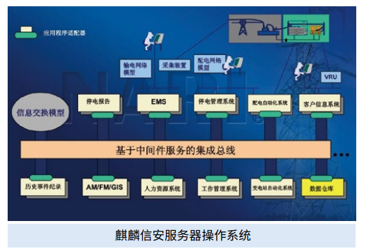

# 应用场景

新一代配电自动化系统主站以大运行与大检修为应用主体，遵循国网最新的配电主站系统架构规范，按照“地县一体化”部署， 依据分区采集的原则，强化边界防护，安全接入光纤 / 无线、专网 / 公网等通讯方式的三遥终端、二遥终端及故障定位装置， 具备横跨生产控制大区与管理信息大区一体化支撑能力，构建基于配电网分析模型中心和运行数据中心的新一代配电网调 度支撑平台，为运行控制与运维管理提供一体化的应用，满足配电网的运行监控与运行状态管控需求。 按照“三集五大”要求，进行集约化发展，标准化建设，采用地县一体化架构，地县配电终端可采用集中采集，或采用前 置分组进行分布式就地采集、远程上送的方式，实现地县数据的统一，在县公司部署远程应用工作站实现信息分流、分区 监控，大大降低了系统建设成本，提高了配电网运行监控效率。

# 解决方案

-   操作系统采用基于 openEuler 发行的麒麟信安服务器操 作系统 V3 ，硬件采用鲲鹏等国内主流芯片架构的服务器。

-   在国家电网调度中心、以及各省调度中心的指导下，联 合并支撑中国电力科学研究院、国网电力科学研究院、 南瑞科技、科东电力等单位与企业完成智能电网调度控 制系统 D5000 的开发、验证、试点、全面推广。

-   遵循《GB/T 20272-2019 信息安全技术 操作系统安全技 术要求》第四级标准，实现可信计算度量规模应用。

# 客户价值

-   新一代配电自动化系统全面遵循 IEC61968/61970 标准，实现与 EMS、PMS 等多系统的数据共享；
-   新一代配电自动化系统覆盖全部配电设备，形成配电网运行监控与调度作业的全过程闭环管理；
-   新一代配电自动化系统实现配电网调控运行、生产运维管理、状态检修、缺陷及隐患分析等精益化管理，并为配电网规 划建设提供数据支持。

# 伙伴

