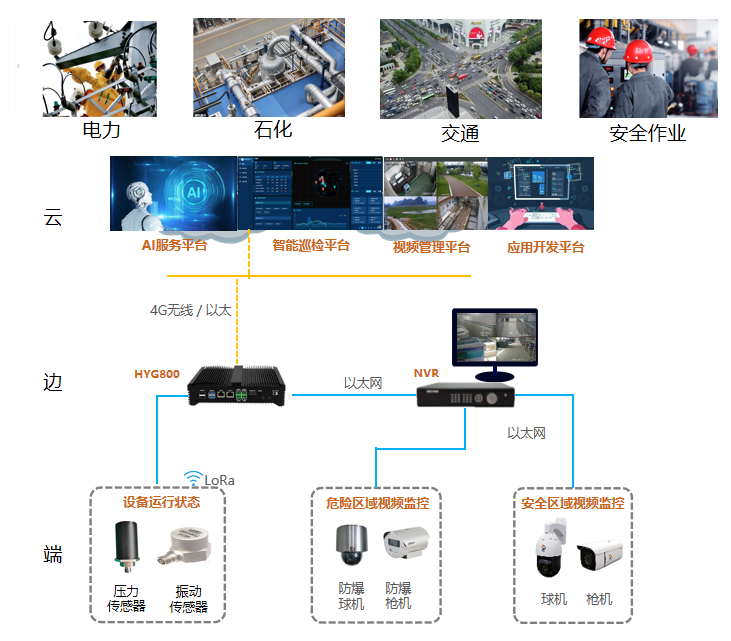
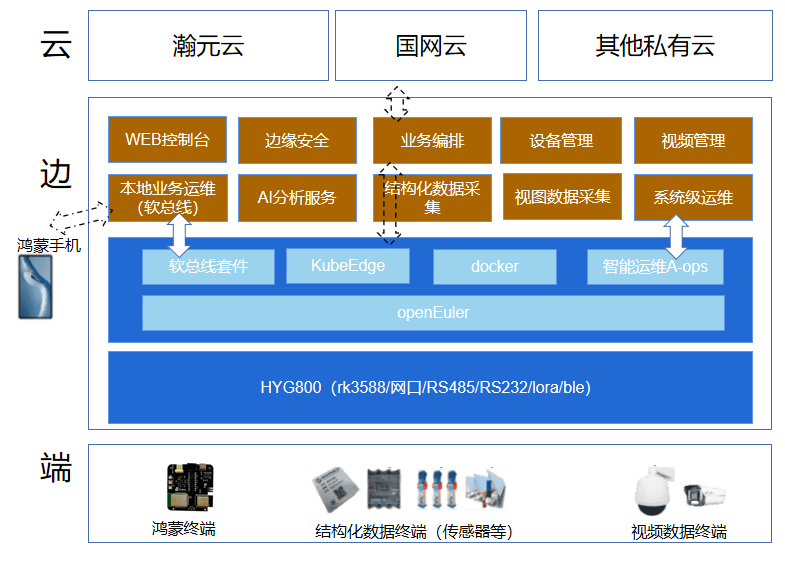

## 用户背景

南京瀚元科技有限公司成立于2019年，坐落于南京市江宁开发区，是业内领先的智能化、数字化解决方案供应商。瀚元科技一直秉承“科技先行、技术为重”的理念，重点着眼于数字电网及AIoT业务领域，以“AI+大数据”为核心，融合物联网、云计算、区块链等技术手段，打造端到端的产品和整体解决方案，以数字推进业务转型、以智能驱动产业升级，为能源、电力、石化、轨道交通、政府等行业发展提供助力。

## 应用场景

-   电力：配电站房智能辅助（边缘）系统解决方案，适用于无人值守的配电站房、开闭所等场景；

-   石化：针对石化行业采油，输油生产及管理过程不安全因素提供相关AI 算法，提升客户生产效率及安全；

## 业务挑战

边缘服务器系统运维比较困难，系统亚健康状态不能及时发现，现场偶现系统故障难以追踪定位。 南向接入端侧设备扩展不灵活，北向扩展不同云平台接入不方便；

## 解决方案

-   瀚元站房解决方案通过打造云边协同、边端联动、算力下沉、区域自治的智能模式，实现数据采集、终端控制、数据通讯、AI推断、场景联动等功能，构建配电站房智慧运维体系。 依托电力行业技术积累拓展到石化，交通行业；

-   瀚元边缘服务器 HYG800 基于openEuler的版本 openEuler22.03-LTS-SP1 ；

-   硬件架构：RK3588SOC，4GB内存、32GBEMMC存储，具备升级到8GB/16GB，内存、64GB/128GBEMMC存储的能力，2路RS485、2路RS232、4路DI和2路DO；

-   系统架构：

整体架构依托边缘智能服务器为主，云端为辅的解决方案； 我们智能边缘服务器基于openEuler系统为底座，吸纳openEuler操作系统 aops智能运维，软总线，docker，kubeedge以及ebpf 等组件搭建可视化边缘服务器；

边缘服务器集无线通讯、物联接入、AI识别、边缘计算、本地可视化等多种技术为一体，是整个智慧物联体系实现云边协同、边端联动、区域自治的重要组成部分。产品具备信息采集、数据通讯、就地计算、AI推断、场景联动、云边协同等功能，可实现全天24小时自动监测及异常情况智能识别，降低故障发生率，助力实现无人值守智慧运维：整体系统架构如下：

## 为什么选择 openEuler

openEuler为底座，利用其内核创新、场景创新能力、繁荣社区生态等特点增强场景化能力；引入鸿蒙分布式软总线，为设备间互通提供统一的分布式协同能力，实现设备无感发现和高效传输；

## 客户价值

-   从引入openEuler的A-ops 组件监测系统后，设备系统测试系统级及隐患故障发现数量多出接近30%，极大的方便了系统前期开发测试阶段稳定性测试及问题提前的发现，以及提升了后期系统发布后现场运维人员对系统的维护以及问题根因定位的效率。

-   通过软总线能力，解决了移动运维终端便捷的发现网关的问题，并且为网关南向提供了连接鸿蒙生态的机会。

## 未来规划

-   完善边端openEuler系统智能运维组件产品研发，进一步基于openEuler ebpf 来进行更深入的系统监测运维手段功能的研发；

-   基于我司产品以边缘系统为主，云端为辅，下一步同时将云端服务切换到欧拉系统；

## 伙伴

