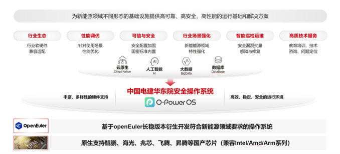

## 应用场景

中国电建集团华东勘测设计研究院有限公司（以下简称“华东院”）1954年建院， 是中国电力建设集团的特级企业。名列中国勘察设计综合实力百强单位（排名第7位）、中国工程设计企业60强（排名第8位）、中国承包商80强（排名第29位）、中国监理行业十大品牌企业。
为落实信息化系统的国产化要求，华东院基于openEuler 社区版定制研发了面向新能源领域的国产操作系统O-PowerOS（包含服务器与嵌入式），致力于提供安全、稳定、易用的新能源数字基础设施。

## 业务挑战

能源行业中业务可靠运行高于一切，尤其新能源行业自动化设备与控制技术应用程度高，监测运维面临挑战；
新型电力系统安全防护要求高，政策明确要求核心敏感数据分类分级且数据全生命周期保护措施，数据保护与密码应用需求迫切；
新能源场站的规模与容量较小、但创建部署数量较多，地域较为分散；硬件设备种类多且通信协议繁杂，互联互通问题突出；

## 解决方案

基于openEuler 2203 lts长稳版本衍生开发符合新能源领域要求的操作系统O-PowerOS，原生支持鲲鹏、海光、兆芯、飞腾、昇腾等国产芯片（兼容Intel/Amd/Arm系列），为新能源领域不同形态的基础设施提供高可靠、高安全、高性能的运行基础和解决方案。
针对新能源业务的突出问题，O-PowerOS具备如下特点：
基于高可靠、智能运维以及多维度更新升级等特色组件，支撑新能源领域系统与业务的高可用性；
在通用安全机制与可信度量的基础上，软件全栈内嵌密码应用能力，替代外挂式密码应用的现状；
改造优化分布式软总线、通过其异构组网、跨协议通信等特性构建下一代分布式安全PLC基础能力；

## 客户价值

新能源领域国产器操作系统O-PowerOS的研制提高了国内新能源领域的自主可控能力，满足了行业特殊安全需求，降低了系统平台的开发和维护成本，提高企业的经济效益。特别是探索和利用IT新技术支持分布式能源管理系统的建设，实现对分布式能源资源的集成和管理，提高能源利用效率。

## 未来规划

未来继续推动国产创新操作系统在新能源领域「真替真用」，孵化创新操作系统在新能源领域中的诸如集控与运维、谐波治理等「场景化应用」。

