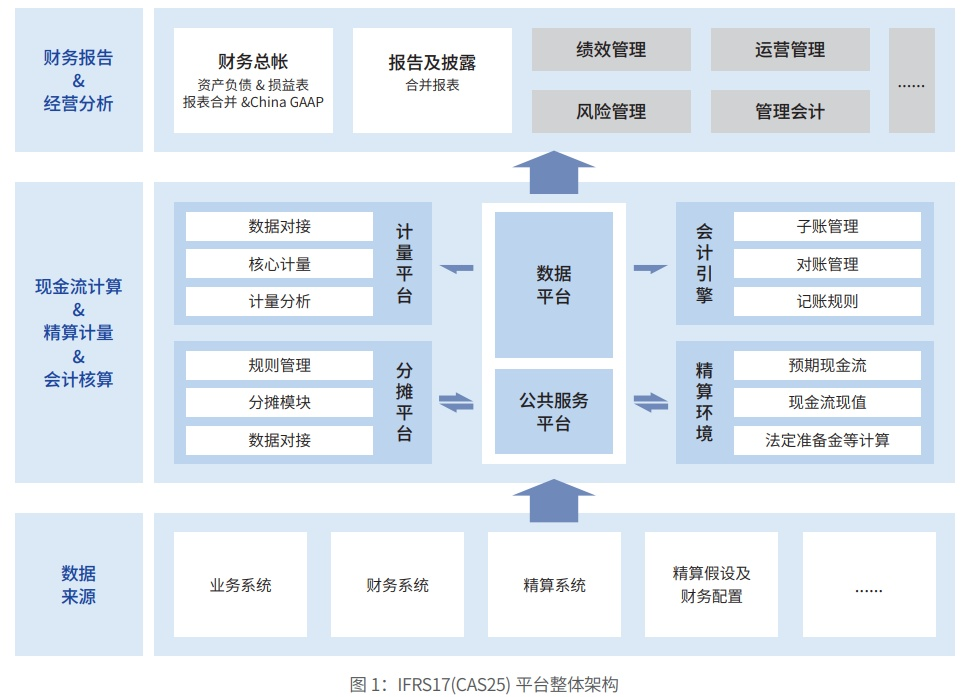
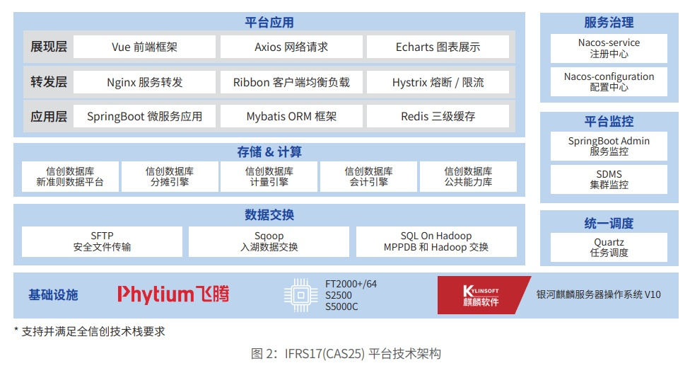

**应用背景**

IFRS 17
提供了统一的会计模型，适用于所有类型的保险合同，解决了各国和不同类型保险合同会计处理不一致的问题。
CAS25 则是在 IFRS17
全面实施的背景下，为完善中国企业会计准则体系、保持保险合同准则与国际接轨的产物，计划将
于 2026 年初起正式执行。它的实施从 2025 年初进入并行期，保司需在 2024
年底完成咨询、建设、改造等工作，基于国
产化环境对准则落地成为保险公司不二选择。

**解决方案**

方案遵循新保险合同会计准则要求，通过湖仓一体化 / 分层数据设计 /
功能架构，集成保险业务全域数据，生成符合准
则要求的财务报告，成功解决基于海量数据的模型处理和全流程任务监控和数据追溯等难题。

方案依托于飞腾腾云 S5000C 芯片、麒麟操作系统（基于
openEuler）的基础底座进行构建，核心能力包括数据平台、
计量平台和会计引擎三大板块。

**客户价值**

方案帮助险企高效率、低成本地解决行业挑战，快速释放可见的价值与收益。为险企赋能，解决准则建设时涉及的源系
统的数据同步、数据加工、会计核算及子账加工等一系列计算时效短、数据量大且数据一致性要求高等问题。同时，支持全
栈信创技术，助力险企实现信息技术应用创新发展。
方案可适用于人寿、养老、财险、再保寿险、再保财险等保险全业态，为保险行业提供示范性借鉴。
