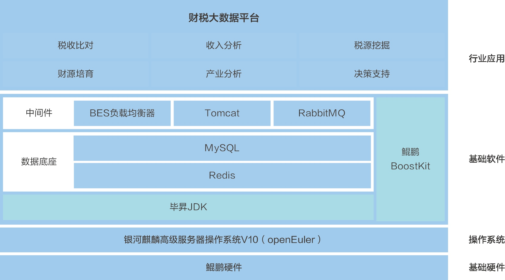

**应用场景**

财税管理领域对数据分析和处理的需求日益增长，需要高效、准确的工具来支撑决策制定。江苏运时数据软件股份有限公司开发的财税大数据平台，基于openEuler系操作系统，为政府部门提供了一个强大的财税数据分析和管理工具。

**解决方案**

财税大数据平台的解决方案要点：

-   **openEuler系操作系统**：作为平台的操作系统基础，银河麒麟高级服务器操作系统V10(openEuler商业发行版)
    提供了稳定、安全的环境，支持财税大数据平台的高效运行。

-   **全栈优化**：与江苏鲲鹏·昇腾生态创新中心合作，基于鲲鹏硬件和鲲鹏应用使能套件BoostKit，对方案进行全栈优化，显著提升了数据治理和分析的性能。

-   **大数据分析应用**：综合运用数理统计、联机分析处理、数据挖掘等方法，构建大数据分析应用平台，实现对财税业务活动的全面监控和分析。

**客户价值**

-   **性能显著提升**：通过调优，平台在数据治理、数据分析等方面的性能较业界主流架构有显著提升，满足企业对性能的高要求。

-   **安全稳定运行**：确保了财税大数据平台的安全性和稳定性，为财税管理决策提供更可靠的信息支撑。

-   **财政收入增加**：项目能够帮助政府增加财政收入，按照全国经验，增幅比例约为当地税收的3-5%。

-   **数据支撑决策**：通过大数据平台帮助财政部门掌握辖区内企业的真实经营情况，为财政收支和决策提供数据支撑。

**客户应用**

该平台已经在四川资阳财政局和成都双流财政局等项目中得到应用，有效提升了财税管理的效率和决策的质量。
