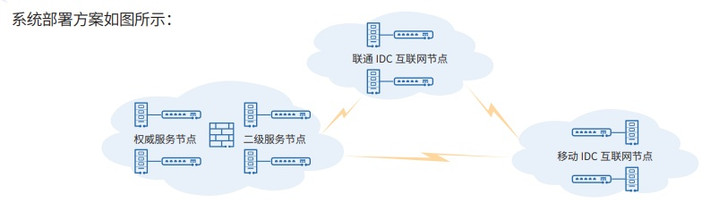

**应用背景**

按照公司信息化建设的要求，公司的域名系统将进行信创改造，要求使用国产或开源的系统重新构建公司整个的域名
系统，同时适配两地三中心的数据中心的建设，实现公司集中式信息系统的建设，实现信息系统数据的集中、异地实施备份。
本⽅案的服务器硬件基于国产海光 x86
服务器，云平台基于国产的易捷行云平台，选用 openEuler22.03 LTS 作为基
础服务操作系统，域名服务使用 Bind9，高可用服务使用
Keepalive，管理工具使用 Python 和 Shell 自研开发。全部软件 均来源于
openEuler 官方发布版，符合信创的自主可控要求。

**解决方案**

⼭⻄证券域名服务系统由几个大的组件构成：权威服务节点，由域名权威服务器和备份服务器组成，主要提供域名权威
数据和管理工具；二级服务节点，由两台配置配有高可用的服务器组成，主要用来向其他互联网服务节点提供域名数据同步；
互联网节点，主要为客户提供域名解析服务，这个节点可以根据需要线性扩展；内部解析服务器，可以部署在几个数据中心内部，
为数据中心的内网应用提供解析服务。

**客户价值**

系统实施后，实现了域名系统的多地和多运营商的互联网接⼊；⽀持权威域名服务的域名变更⾃动分发；支持域名数据
的统⼀管理和内 /
外网域名服务在系统服务层面的分离；支持云上部署和迁移；系统部署方案支持多节点的
IP v4 和 IPv6 的 接⼊；⽀持在测试环境的快速部署和迁移；

同时，由于采用 openEuler 的开源社区版本，还配套建设了 openEuler
各公开发布版的系统镜像服务，作为数据中心内 部的基础服务，为其它系统使用
openEuler 提供了部署和升级的便利。
