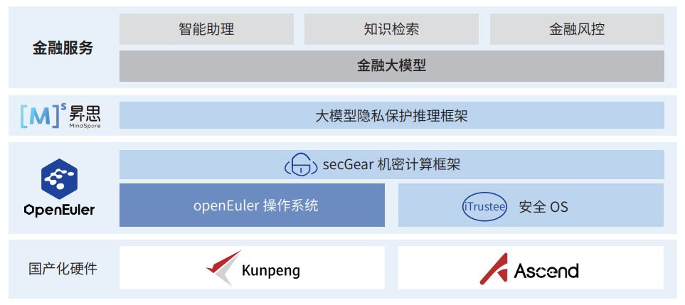

**应用背景**

随着《中华人民共和国网络安全法》、《中华人民共和国数据安全法》和《中华人民共和国个人信息保护法》的颁布
实施和 AI 应用的迅猛发展，如何在 AI
服务的过程中保护数据和模型的机密性和完整性成为业务落地面临的关键挑战之一。
作为长期推动数字化转型、持续关注 AI
技术在实际业务中的落地应用的国有大行，工商银行敏锐识别到了这一难题，并
联合复旦大学、华为积极探索大模型机密计算解决方案。产学研通力合作，基于鲲鹏、昇腾安全可控硬件和
openEuler、 iTrustee、 MindSpore
等创新软件，共建数据安全和隐私保护增强的自主创新 AI 云服务平台。

**解决方案**

-   secGear：openEuler
    机密计算框架，提供远程证明统一框架，屏蔽鲲鹏代际差异，兼容
    iTrustee、virtCCA 远程证明报 告验证，支持一键部署证明服务，实现不同
    TEE 之间相互认证；构建跨 TEE 加密通道技术，实现 TEE 之间互联互通；

-   iTrustee：使能硬件安全可信执行环境。提供远程证明技术，用户可实时评估安全应用的可信性；提供机密容器技术，
    让应用迅速地迁移到机密环境中，低成本提升业务的安全性；

-   MindSpore：基于 MindSpore 支持融合 CPU、NPU
    异构机密计算算力，提供高性能模型安全并行与模型完整性保护能力，
    防止用户机密数据上云推理时被云侧特权用户或攻击者窃取

**客户价值**

-   全栈自主创新：基于安全可控软、硬件，提供技术自主、供应链安全的自主创新大模型机密计算解决方案；

-   高安全：基于 openEuler
    机密计算技术，增强现有大模型业务系统的数据安全和隐私保护，在工商银行金融智能助理和
    知识检索场景开展试点；

-   高性能：基于鲲鹏 + 昇腾异构机密计算技术，算力安全卸载到昇腾
    NPU，实现极致的安全和性能。
