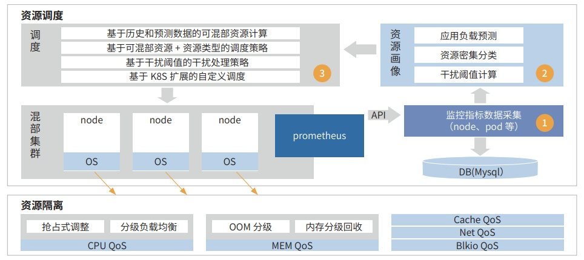

**应用背景**

工商银行自研的 paas
云平台承载行内核心业务，集群规模庞大，不同应用对性能容量需求各异，除数据库、大数据
以外的联机、批量等各类应用负载，均在同一类计算资源池中进行调度部署，存在资源配额配置普遍偏高、资源利用率较
低等情况。

**解决方案**

为提升生产的资源利用率，工商银行结合业界通用的混部方案，实现基于工商银行场景的资源混部技术，从资源调度
和资源隔离两个大的方面进行规划建设。

资源调度主要包括：

-   资源画像，基于
    CPU、内存等指标数据，通过统计分析、机器学习等手段对应用资源使用进行画像，为资源调度
    系统提供混部调度所需的关键信息；

-   混部调度，基于高优先级的空闲资源和应用负载类型，根据调度策略完成高低优先级应用的混合部署调度；实时
    判断高优先级应用的受干扰程度并及时进行规避处理，保证高优先级应用的服务质量不受影响。
    
-   资源隔离，工商银行云计算实验室通过与华为联创实现基于 openEuler
的内核隔离技术，内核资源分级管控从物理核、缓存、
内存带宽、网络带宽、IO
带宽五种共享资源入手，提供了一套共享资源隔离复用机制，实现了
CPU、MEM、Disk、Net 等资源
的分级抢占能力。通过开启隔离特性，在提升资源使用率的同时，保证高优先级应用服务质量不受影响，提升云服务质量。

**客户价值**

落地混合部署技术，实现个人电子银行、量化投资交易、资产管理估值核算等多个不同优先级业务的混部部署，单节
点部署密度提升 50% 以上，对于低优先级应用为 CPU
消耗型的场景，节点的资源利用率可提升到 35% 以上，同时通过资
源隔离、干扰检测和驱逐等保障手段，高优先级应用的 QoS 影响可以控制在 5%
范围之内
